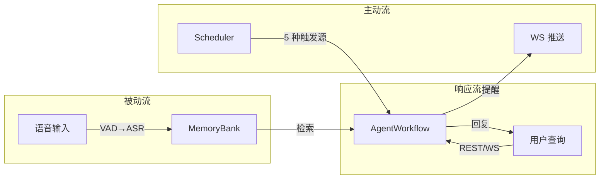
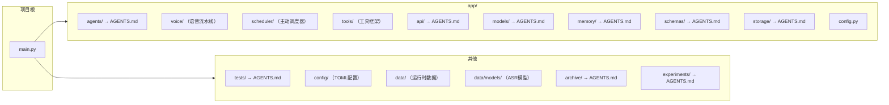

# 知行车秘

本科毕设。车载AI智能体原型。

> 各模块详文见子目录 `AGENTS.md`。

## 系统设计

### 核心理念

系统围绕三条数据流构建，覆盖从感知到行动的全链路：

```
感知层（语音/上下文） → 决策层（AgentWorkflow + 规则引擎） → 行动层（输出/工具/提醒）
```

三条数据流共享同一决策核心，但在触发方式上解耦：



### 架构原则

| 原则 | 体现 |
|------|------|
| **安全不可绕过** | 规则引擎后处理 `postprocess_decision()` 在 LLM 输出后强制执行，所有输出路径必经 |
| **异常不跨层** | 下层抛特定异常，上层 catch 兜底。scheduler tick 内各步骤独立 try/except |
| **配置数据驱动** | 规则/快捷指令/模型参数/语音/调度/工具均 TOML 配置，代码不耦合具体值 |
| **可观测性** | 三阶段工作流各节点输出独立审查；scheduler 每步日志；MemoryBank Metrics |
| **静默降级** | 语音模块/ASR 模型缺失时不阻塞系统，仅返回空文本 |

## 关键抽象关系

```
AgentWorkflow (决策核心)
  ├── 接收: user_query (响应流) | context_override (主动流) | ShortcutResolver (快捷指令)
  ├── 产出: MultiFormatContent + PendingReminder + tool_calls
  └── 依赖: MemoryModule / ChatModel / RuleEngine / ToolExecutor

ProactiveScheduler (主动调度)
  ├── 输入: VoicePipeline (语音队列) / ContextProvider (驾驶上下文)
  ├── 引擎: ContextMonitor → MemoryScanner → TriggerEvaluator
  └── 输出: AgentWorkflow.proactive_run() + WS broadcast

VoicePipeline (语音感知)
  ├── 输入: VoiceRecorder (麦克风) / 外部 audio frames
  ├── 处理: VADEngine → SherpaOnnxASREngine
  └── 输出: on_transcription 回调 → Scheduler.push_voice_text()

MemoryModule (记忆管理)
  ├── 写入: MemoryEvent (reminder/passive_voice/tool_call)
  ├── 读取: search(query) → SearchResult
  └── 后台: finalize() → 分层摘要 + Ebbinghaus 遗忘
```

## 环境

Python 3.14 + `uv`。

## 技术栈

| 类 | 术 |
|----|----|
| Web | FastAPI + Uvicorn |
| AI流水线 | 三Agent + 规则引擎 |
| LLM | DeepSeek |
| Embedding | BGE-M3 (OpenRouter, 远程) |
| 记忆 | MemoryBank (FAISS + Ebbinghaus) |
| 语音 | sherpa-onnx (SenseVoice) + webrtcvad |
| 存储 | TOML + JSONL |
| 开发 | uv, pytest(asyncio_mode=auto), ruff, ty |

## 结构



## 检查

改后：
1. `uv run ruff check --fix`
2. `uv run ruff format`
3. `uv run ty check`

任务完：
4. `uv run pytest`

Python 3.14：`except ValueError, TypeError:` 乃 PEP-758 新语法。

### ruff

`ruff.toml`，extend-select=ALL，忽略 D203/D211/D213/D400/D415/COM812/E501/RUF001-003。`tests/**` 豁免约25条。

### ty

`ty.toml`，rules all=error，faiss/docx → Any。

## 代码规范

- **注释**：中文，释 why 非 what
- **提交**：英文，Conventional Commits
- **内联抑制**：禁 `# noqa`/`# type:`/`# ty:`。修不了在 ruff.toml/ty.toml 忽略
- **函数**：一事一函数
- **嵌套**：小分支提前 return/continue/break
- **导入**：标准库→三方→内部→相对，空行分隔。禁通配
- **不可变**：const/final 优先
- **测试**：一事一测。Given→When→Then。名含场景+期望

## 设计文档

系统级设计文档存放于 `docs/superpowers/specs/`（仅本分支存在，合入 main 前移除）。包含完整的设计决策、方案权衡和实现计划。阅读顺序：

1. `2026-05-15-voice-memo-assistant-design.md` — 整体架构设计
2. `2026-05-15-voice-memo-implementation.md` — 分步实现计划

## 工作树

```bash
git worktree add .worktrees/<名> -b <名>
```

## 异常与阈值

- API层异常 → `app/api/AGENTS.md`
- MemoryBank异常与阈值 → `app/memory/AGENTS.md`
- 存储异常 → `app/storage/AGENTS.md`
- 模型异常与阈值 → `app/models/AGENTS.md`
- 环境变量全表 → `config/AGENTS.md`

原则：异常由上层处理，不跨层泄露。

## Benchmark

外部项目 MiyakoMeow/VehicleMemBench。50组数据集、23模块模拟器、五类记忆策略、A/B两组评测。本系统MemoryBank已与 VehicleMemBench 对齐。

参考文献 → `archive/AGENTS.md`。

## 未解决

### 功能缺口

1. **突发事件模块** — JointDecision + 规则引擎联合覆盖，无独立处理模块
2. **ASR Speaker ID / 唤醒词** — SenseVoice 支持情感/语言检测但未利用 Speaker Identification；无唤醒词检测，当前始终监听
3. **真实车辆 ContextProvider** — driving_context 由 WebUI/API 注入，无 CAN 总线/OBD 集成
4. **TTS 输出** — 输出层产出 `speakable_text` 但无 TTS 引擎接入，当前为文本展示
5. **多用户语音识别** — VoicePipeline 无 `user_id`，ASR 输出未关联驾驶员身份

### 架构待完善

6. **工具安全约束细化** — 当前 `postprocess_decision` 统一管辖所有工具，但未按工具类型差异化约束
7. **scheduler per-user 实例** — lifespan 仅初始化 default 用户，`_schedulers` dict 支持多用户但未实际启用
8. **voice config 自动加载** — `voice.toml` 中 `device_index/sample_rate/vad_mode` 等字段未被 `VoiceRecorder`/`VoicePipeline` 自动读取（当前硬编码默认值）
9. **集成测试** — voice/scheduler/tools 三模块单元测试覆盖不足，缺少集成测试

## 开发路线（建议）

| 阶段 | 内容 | 前置 |
|------|------|------|
| **短期** | TTS 引擎接入；集成测试补全；per-user scheduler 启用 | — |
| **中期** | 真实 ASR 模型优化（SenseVoice int8 量化已可用）；Wake Word 检测；工具安全约束细化 | 短期 |
| **长期** | 车辆 CAN 总线集成；OBD 数据接入；多模态（语音+视觉）输入 | 中期 |
