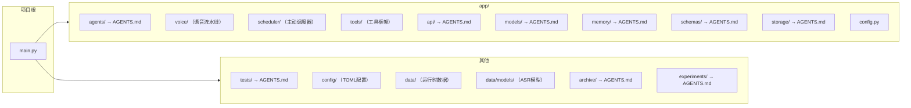

# 知行车秘

本科毕设。车载AI智能体原型。

> 各模块详文见子目录 `AGENTS.md`。

## 环境

Python 3.14 + `uv`。

## 技术栈

| 类 | 术 |
|----|----|
| Web | FastAPI + Uvicorn |
| AI流水线 | 三Agent + 规则引擎 |
| LLM | DeepSeek |
| Embedding | BGE-M3 (OpenRouter, 远程) |
| 记忆 | MemoryBank (FAISS + Ebbinghaus) |
| 语音 | sherpa-onnx (SenseVoice) + webrtcvad |
| 存储 | TOML + JSONL |
| 开发 | uv, pytest(asyncio_mode=auto), ruff, ty |

## 结构



## 检查

改后：
1. `uv run ruff check --fix`
2. `uv run ruff format`
3. `uv run ty check`

任务完：
4. `uv run pytest`

Python 3.14：`except ValueError, TypeError:` 乃 PEP-758 新语法。

### ruff

`ruff.toml`，extend-select=ALL，忽略 D203/D211/D213/D400/D415/COM812/E501/RUF001-003。`tests/**` 豁免约25条。

### ty

`ty.toml`，rules all=error，faiss/docx → Any。

## 代码规范

- **注释**：中文，释 why 非 what
- **提交**：英文，Conventional Commits
- **内联抑制**：禁 `# noqa`/`# type:`/`# ty:`。修不了在 ruff.toml/ty.toml 忽略
- **函数**：一事一函数
- **嵌套**：小分支提前 return/continue/break
- **导入**：标准库→三方→内部→相对，空行分隔。禁通配
- **不可变**：const/final 优先
- **测试**：一事一测。Given→When→Then。名含场景+期望

## 工作树

```bash
git worktree add .worktrees/<名> -b <名>
```

## 异常与阈值

- API层异常 → `app/api/AGENTS.md`
- MemoryBank异常与阈值 → `app/memory/AGENTS.md`
- 存储异常 → `app/storage/AGENTS.md`
- 模型异常与阈值 → `app/models/AGENTS.md`
- 环境变量全表 → `config/AGENTS.md`

原则：异常由上层处理，不跨层泄露。

## Benchmark

外部项目 MiyakoMeow/VehicleMemBench。50组数据集、23模块模拟器、五类记忆策略、A/B两组评测。本系统MemoryBank已与 VehicleMemBench 对齐。

参考文献 → `archive/AGENTS.md`。

## 未解决

1. 突发事件：JointDecision + 规则引擎联合覆盖，无独立模块
2. ASR 引擎（SherpaOnnxASREngine）当前为 SenseVoice 离线模式，Speaker Identification / 唤醒词尚未接入
3. 真实车辆 ContextProvider：driving_context 当前由 WebUI/API 注入，无车辆总线集成
