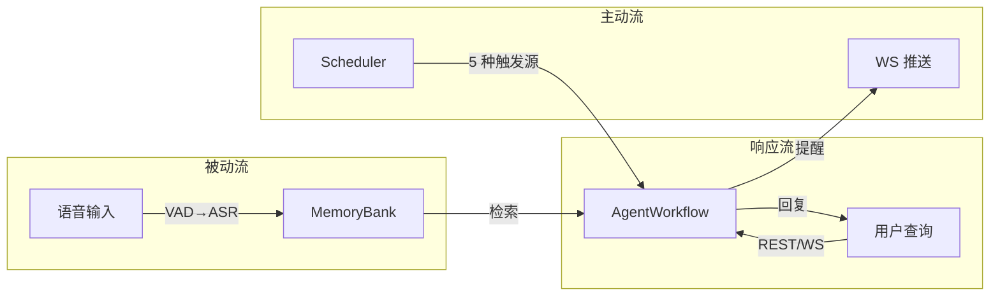
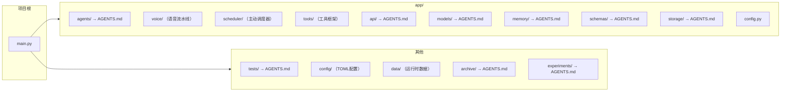

# 知行车秘

本科毕设。车载AI智能体原型。

> 各模块详文见子目录 `AGENTS.md`。

## 设计目标

### 核心问题

车载场景下，驾驶员需要在不分散注意力的情况下管理日程、接收提醒、查询信息。现有方案（纯语音助手/手机提醒）缺乏：

1. **驾驶情境感知** — 提醒内容和方式应随路况、疲劳度、乘客数动态调整
2. **长期记忆** — 能记住用户的偏好、历史事件和上下文相关关系
3. **被动记录** — 用户无需手动创建提醒，系统从语音中自动提取

### 设计目标

| 目标 | 说明 | 体现 |
|------|------|------|
| **驾驶安全优先** | 提醒方式受规则引擎约束，高速仅音频、疲劳时抑制非紧急提醒 | 7 条硬规则 + `postprocess_decision` 不可绕过 |
| **零配置记忆** | 语音自动转录 → MemoryBank，无需用户手动创建提醒 | `VoicePipeline` → `ProactiveScheduler` → `MemoryModule` |
| **情境感知** | 外部数据（位置/状态/路况）直接注入，跳过 LLM 编造 | `ProactiveScheduler.update_context()` / API 注入 `DrivingContext` |
| **可解释决策** | 三阶段工作流各节点输出可独立审查 | `WorkflowStages` 保留每阶段结果 |
| **遗忘曲线** | 记忆按 Ebbinghaus 曲线衰减，检索时按保留率加权 | `forgetting_retention()` |
| **静默降级** | 非核心模块（ASR/语音）缺失时系统继续运行 | 各模块 `try/except` + 空返回 |

## 系统设计

### 核心理念

系统围绕三条数据流构建，覆盖从感知到行动的全链路：

```
感知层（语音/上下文） → 决策层（AgentWorkflow + 规则引擎） → 行动层（输出/工具/提醒）
```

三条数据流共享同一决策核心，但在触发方式上解耦：



### 架构原则

| 原则 | 体现 |
|------|------|
| **安全不可绕过** | 规则引擎后处理 `postprocess_decision()` 在 LLM 输出后强制执行，所有输出路径必经 |
| **异常不跨层** | 下层抛特定异常，上层 catch 兜底。scheduler tick 内各步骤独立 try/except |
| **配置数据驱动** | 规则/快捷指令/模型参数/语音/调度/工具均 TOML 配置，代码不耦合具体值 |
| **可观测性** | 三阶段工作流各节点输出独立审查；scheduler 每步日志；MemoryBank Metrics |
| **静默降级** | 语音模块/ASR 模型缺失时不阻塞系统，仅返回空文本 |

## 关键抽象关系

```
AgentWorkflow (决策核心)
  ├── 接收: user_query (响应流) | context_override (主动流) | ShortcutResolver (快捷指令)
  ├── 产出: MultiFormatContent + PendingReminder + tool_calls
  └── 依赖: MemoryModule / ChatModel / RuleEngine / ToolExecutor

ProactiveScheduler (主动调度)
  ├── 输入: VoicePipeline (语音队列) / update_context() (驾驶上下文)
  ├── 引擎: ContextMonitor → MemoryScanner → TriggerEvaluator
  └── 输出: AgentWorkflow.proactive_run() + WS broadcast

VoicePipeline (语音感知)
  ├── 输入: VoiceRecorder (麦克风) / 外部 audio frames
  ├── 处理: VADEngine → SherpaOnnxASREngine
  └── 输出: on_transcription 回调 → Scheduler.push_voice_text()

MemoryModule (记忆管理)
  ├── 写入: MemoryEvent (reminder/passive_voice/tool_call)
  ├── 读取: search(query) → SearchResult
  └── 后台: finalize() → 分层摘要 + Ebbinghaus 遗忘
```

## 环境

Python 3.14 + `uv`。

## 技术栈

| 类 | 术 |
|----|----|
| Web | FastAPI + Uvicorn |
| AI流水线 | 三阶段工作流（Context → JointDecision → Execution）+ 规则引擎 |
| LLM | DeepSeek |
| Embedding | BGE-M3 (OpenRouter, 远程) |
| 记忆 | MemoryBank (FAISS + Ebbinghaus) |
| 语音 | sherpa-onnx (SenseVoice) + webrtcvad |
| 存储 | TOML + JSONL |
| 开发 | uv, pytest(asyncio_mode=auto), ruff, ty |

## 结构



## 检查

改后：
1. `uv run ruff check --fix`
2. `uv run ruff format`
3. `uv run ty check`

任务完：
4. `uv run pytest`

Python 3.14：`except ValueError, TypeError:` 乃 PEP-758 新语法。

### ruff

`ruff.toml`，extend-select=ALL，忽略 D203/D211/D213/D400/D415/COM812/E501/RUF001-003。`tests/**` 豁免24条。

### ty

`ty.toml`，rules all=error，faiss/docx → Any。

## 代码规范

- **注释**：中文，释 why 非 what
- **提交**：英文，Conventional Commits
- **内联抑制**：禁 `# noqa`/`# type:`/`# ty:`。修不了在 ruff.toml/ty.toml 忽略
- **函数**：一事一函数
- **嵌套**：小分支提前 return/continue/break
- **导入**：标准库→三方→内部→相对，空行分隔。禁通配
- **不可变**：const/final 优先
- **测试**：一事一测。Given→When→Then。名含场景+期望

## 工作树

```bash
git worktree add .worktrees/<名> -b <名>
```

## 异常处理范式

项目异常体系经统一重构后形成如下范式。所有新增模块应遵循此模式。

### 继承树

```
Exception
  └─ AppError                          # app/exceptions.py 全系统基类
       ├─ MemoryBankError               # app/memory/exceptions.py
       │    ├─ TransientError           #   可重试（网络/超时/限速）
       │    │    └─ LLMCallFailedError
       │    ├─ FatalError               #   不可恢复（配置/数据损坏）
       │    │    ├─ ConfigError
       │    │    └─ IndexIntegrityError
       │    └─ SummarizationEmpty       #   哨兵异常，非错误
       ├─ WorkflowError                 # app/agents/workflow.py
       ├─ ToolExecutionError            # app/tools/executor.py
       ├─ ChatError                     # app/models/chat.py
       │    ├─ NoProviderError
       │    └─ AllProviderFailedError
       ├─ NoLLMConfigurationError       # app/models/settings.py
       ├─ MissingModelFieldError
       ├─ NoDefaultModelGroupError
       ├─ NoJudgeModelConfiguredError
       └─ AppError(BaseAppError, HTTPException)  # app/api/errors.py 多重继承桥接

ValueError / TypeError / KeyError       # 独立异常，不入继承树
  ├─ AppendError(TypeError)             # app/storage/toml_store.py
  ├─ UpdateError(TypeError)
  ├─ InvalidActionError(ValueError)     # app/memory/schemas.py
  ├─ UnknownModeError(ValueError)       # app/memory/memory.py
  ├─ InvalidModelStringError(ValueError)# app/models/model_string.py
  ├─ ProviderNotFoundError(ValueError)  # app/models/exceptions.py
  └─ ModelGroupNotFoundError(KeyError)
```

### 核心模式

| 模式 | 载体 | 说明 |
|------|------|------|
| **统一基类** | `AppError(Exception)` | `code: str` + `message: str`，机器可读+人类可读。各模块异常继承之 |
| **可恢复性二分** | `TransientError` vs `FatalError` | MemoryBank 首创模式。瞬态（retry_after）→ 可重试；永久 → 不重试 |
| **多重继承桥接** | `api/errors.py:AppError(BaseAppError, HTTPException)` | `isinstance(e, BaseAppError)` 域内可 catch，`isinstance(e, HTTPException)` FastAPI handler 可 catch。域内域外统一 |
| **哨兵异常** | `SummarizationEmpty` | 非错误，控制流信号。调用方捕获后返 `None`，不上报 |
| **独立异常** | `ValueError`/`TypeError` 子类 | 非域内错误（类型校验/结构误用）不纳入 `AppError` 继承树。仅项目级 `AppError` 子类才走 API 映射路径 |
| **不跨层** | 各层 catch 后 reinterpret | 下层抛特定异常，上层 catch 后包装为本层类型再向上抛。scheduler tick 内各步骤独立 try/except |

### 各层 catch 模式

| 层 | 模式 | 文件 | 说明 |
|----|------|------|------|
| **API 边界** | `safe_call()` 精确映射 | `app/api/errors.py:95-142` | `TransientError`→503, `FatalError`→500, `ToolExecutionError`→500, `WorkflowError`→503, `ValueError`→422, `OSError`→503, `BaseAppError`(非HTTP)→500, 其余→500 |
| **Scheduler** | `except AppError` + log | `app/scheduler/scheduler.py` | tick 级 catch，防单步崩溃影响后续 tick。主循环 `except Exception` 兜底 |
| **内存/LLM** | `except ValueError, TypeError:` | memory_bank/*.py, agents/*.py | PEP-758 语法，内部数据校验。不跨模块边界 |
| **配置加载** | `except OSError, tomllib.TOMLDecodeError:` | voice/pipeline.py, scheduler/scheduler.py, tools/tools/*.py | 配置文件不存在/损坏时fallback默认值。静默降级 |
| **LLM 调用** | `except (openai.APIError, OSError, ValueError, TypeError, RuntimeError)` | `app/models/chat.py:237,299` | provider调用异常统一catch→`AllProviderFailedError` |
| **存储** | `except (json.JSONDecodeError, OSError, TypeError, ValueError)` | memory_bank/store.py, memory_bank/index.py | 读写corruption 恢复/重建 |
| **语音** | `except OSError, ImportError, TypeError` | `app/voice/asr.py` | 模型缺失静默降级 |
| **FAISS索引** | 逐类损坏恢复 | `memory_bank/index.py` | metadata 格式错/计数不匹配/索引类型不对均有对应恢复策略 |

### 关键原则

1. **新增异常先看继承树**：域内异常继承 `AppError`，类型校验/结构误用继承 Python 内置异常
2. **不要在 layer 间传播底层类型**：catch 后 reinterpret，抛上层类型
3. **Sentinel 模式走哨兵异常**：需在类型标注 + 文档显式说明"非错误"
4. **瞬态 vs 永久**：MemoryBank 中明确区分，新增持久化/网络模块同理
5. **阈值配置**（MemoryBank 具体值）→ `app/memory/AGENTS.md`

## Benchmark

外部项目 MiyakoMeow/VehicleMemBench。50组数据集、23模块模拟器、五类记忆策略、A/B两组评测。本系统MemoryBank已与 VehicleMemBench 对齐。

参考文献 → `archive/AGENTS.md`。

## 未解决

### 功能缺口

1. **突发事件模块** — JointDecision + 规则引擎联合覆盖，无独立处理模块
2. **ASR Speaker ID / 唤醒词** — SenseVoice 支持情感/语言检测但未利用 Speaker Identification；无唤醒词检测，当前始终监听
3. **真实车辆 ContextProvider** — driving_context 由 WebUI/API 注入，无 CAN 总线/OBD 集成
4. **TTS 输出** — 输出层产出 `speakable_text` 但无 TTS 引擎接入，当前为文本展示
5. **多用户语音识别** — VoicePipeline 无 `user_id`，ASR 输出未关联驾驶员身份

### 架构待完善

6. **工具安全约束细化** — 当前 `postprocess_decision` 统一管辖所有工具，但未按工具类型差异化约束
7. **scheduler per-user 实例** — lifespan 仅初始化 default 用户，`_schedulers` dict 支持多用户但未实际启用
8. **集成测试** — voice/scheduler/tools 三模块单元测试覆盖不足，缺少集成测试

## 开发路线（建议）

| 阶段 | 内容 | 前置 |
|------|------|------|
| **短期** | TTS 引擎接入；集成测试补全；per-user scheduler 启用 | — |
| **中期** | 真实 ASR 模型优化（SenseVoice int8 量化已可用）；Wake Word 检测；工具安全约束细化 | 短期 |
| **长期** | 车辆 CAN 总线集成；OBD 数据接入；多模态（语音+视觉）输入 | 中期 |
