# BENCHMARK-VehicleMemBench

## 1. 项目概述

**VehicleMemBench** 是一个用于评估车内智能体（In-Vehicle Agents）多用户长期记忆能力的可执行基准测试。

- **论文**：[arXiv:2603.23840](https://arxiv.org/abs/2603.23840)
- **GitHub**：[https://github.com/isyuhaochen/VehicleMemBench](https://github.com/isyuhaochen/VehicleMemBench)
- **数据集**：[HuggingFace](https://huggingface.co/datasets/callalilya/VehicleMemBench)

### 1.1 研究背景与动机

随着智能座舱的快速发展，车内助手需要服务多位用户，并记忆每位用户的偏好设置。传统的基准测试主要关注单用户或短期记忆场景，无法全面评估智能体在复杂多用户环境下的长期记忆能力。VehicleMemBench 正是为填补这一研究空白而设计。

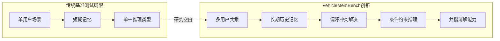

该基准测试评估智能体是否能够：
1. 从长期交互历史中恢复多用户偏好
2. 解决偏好冲突
3. 调用车辆工具达到正确的最终环境状态

### 1.2 核心挑战

多用户场景下的记忆挑战主要体现在以下四个方面：

| 挑战类型 | 描述 | 示例 |
|----------|------|------|
| **偏好冲突** | 不同用户对同一设置有不同的偏好 | Gary 喜欢绿色仪表盘，Patricia 认为夜间白色更安全 |
| **条件约束** | 偏好依赖于特定条件 | Patricia 在工业区行驶时开启内循环 |
| **错误纠正** | 用户曾调整并纠正过设置 | 通风速度先设为3，后纠正为2 |
| **共指消解** | 代词或描述性引用指代特定用户 | "他的侄子"需要正确解析 |

### 1.3 技术特点

- **可执行的评估环境**：基于 VehicleWorld 构建真实的车辆模拟器，支持 22 个车辆模块的约 140 个工具函数
- **多层次评估指标**：从字段级到值级的细粒度评估体系
- **多种记忆系统对比**：覆盖基线方法（none/gold/summary/kv）和主流商业记忆系统

---

## 2. 实验设计

### 2.1 整体架构

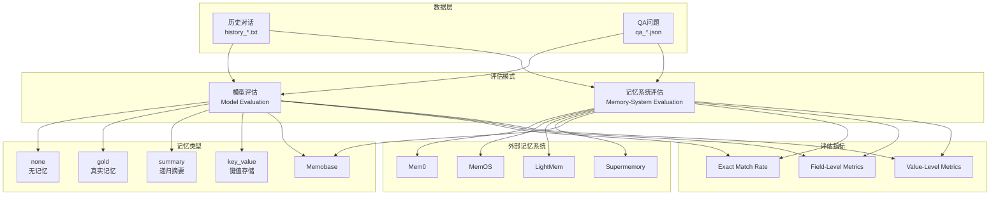

### 2.2 实验组（Evaluation Protocols）

#### A. 模型评估（Model Evaluation）

模型评估测试基础模型在不同记忆构建方式下的表现。评估者首先加载历史对话，然后根据选择的记忆类型构建上下文，最后模型基于该上下文回答问题。

| 实验组 | 内存类型 | 描述 | 理论意义 |
|--------|----------|------|----------|
| `none` | Raw History | 无历史信息，让模型直接预测 | 基线性能 |
| `gold` | Gold Memory | 直接提供真实最新用户偏好 | 理论性能上界 |
| `summary` | Recursive Summarization | 将历史压缩为层次化摘要 | 摘要推理能力 |
| `key_value` | Key-Value Store | 将偏好组织为结构化键值对 | 精确检索能力 |
| `memory_bank` | MemoryBank | 基于遗忘曲线的分层记忆（本项目实现） | 遗忘曲线检索能力 |

#### B. 记忆系统评估（Memory-System Evaluation）

记忆系统评估首先将对话历史摄入外部记忆系统，然后测试智能体能否通过该系统检索有用记忆并执行正确操作。

```mermaid
graph LR
    subgraph 阶段一：摄入
        A1[读取历史文件] --> A2[调用记忆系统API]
        A2 --> A3[系统提取偏好]
        A3 --> A4[存储记忆]
    end
    
    subgraph 阶段二：评估
        B1[加载QA问题] --> B2[智能体查询记忆]
        B2 --> B3[检索结果]
        B3 --> B4[调用车辆工具]
        B4 --> B5[评估状态匹配]
    end
```

评估的记忆系统：

| 记忆系统 | 描述 | API 类型 | 特点 |
|----------|------|----------|------|
| Gold Memory | 真实记忆 | - | 对照组，理论上限 |
| Recursive Summarization | 递归摘要 | 本地 | LLM 逐日摘要 |
| Key-Value Store | 键值存储 | 本地 | 结构化存储 |
| Memobase | 外部系统 | REST API | 云端服务 |
| LightMem | 外部系统 | REST API | 轻量级方案 |
| Mem0 | 外部系统 | REST API | 商业产品 |
| MemOS | 外部系统 | REST API | 多模态支持 |
| Supermemory | 外部系统 | REST API | AI 原生 |

---

### 2.3 实验对象

#### 2.3.1 用户角色

数据集中包含 **3 个主要用户**，每位用户拥有独立的职业背景、性格特点和车辆偏好：

| 用户 | 职业 | 性格特点 | 典型偏好 |
|------|------|----------|----------|
| **Gary Allen** | 林业手册作者 | 浪漫、热爱自然 | 喜欢绿色（象征森林）、简单导航语音 |
| **Justin Martinez** | 医生 | 谨慎、专业 | 需要安静驾驶环境、详细导航（怕错过路口） |
| **Patricia Garcia** | 工程师 | 精确、务实 | 以安全为导向、需要分区控制、在工业区开启内循环 |

**用户交互特征**：
- 三人经常共乘一车
- 对话自然流畅，车辆偏好嵌入日常交流
- 偏好表达隐式而非直接陈述

**多用户冲突示例**：
```text
[2025-03-10 08:00] Gary: I really love this green instrument panel. 
It reminds me of the forest canopy I write about.

[2025-03-25 17:30] Patricia: Green is too dark for me at night, 
I can't see the gauges clearly. I prefer white.
```

#### 2.3.2 车辆环境（VehicleWorld）

VehicleWorld 是一个可执行的车辆模拟环境，包含 22 个车辆模块，每个模块提供多个可控功能。该环境模拟真实车辆的各个子系统，智能体可以通过调用工具函数来查询和修改车辆状态。

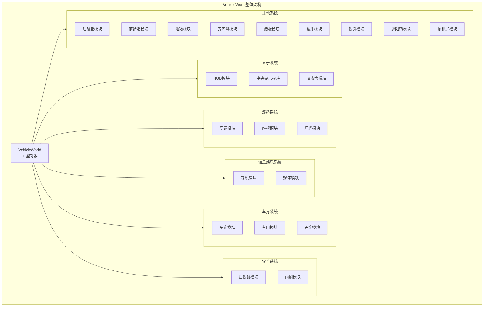

**模块功能统计**：

| 模块类别 | 模块数 | 工具函数数 | 功能范围 |
|----------|--------|------------|----------|
| 显示系统 | 3 | 17 | 亮度、颜色、模式、语言 |
| 舒适系统 | 3 | 51 | 温度、通风、按摩、氛围灯 |
| 信息娱乐 | 4 | 32 | 导航路线、媒体播放、电台 |
| 车身控制 | 5 | 27 | 门窗开合、座椅调节 |
| 安全系统 | 2 | 6 | 后视镜、雨刷控制 |
| 其他系统 | 7 | 27 | 后备箱、油箱、蓝牙等 |

**灯光模块详解**（工具数最多）：

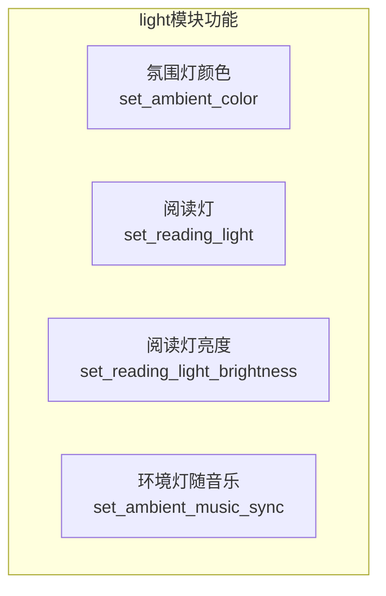

**座椅模块详解**（功能最复杂）：

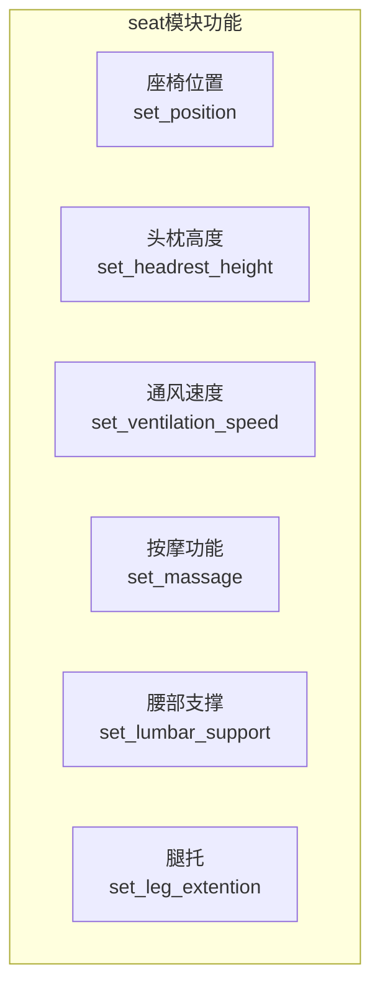

**导航模块详解**（配置最丰富）：

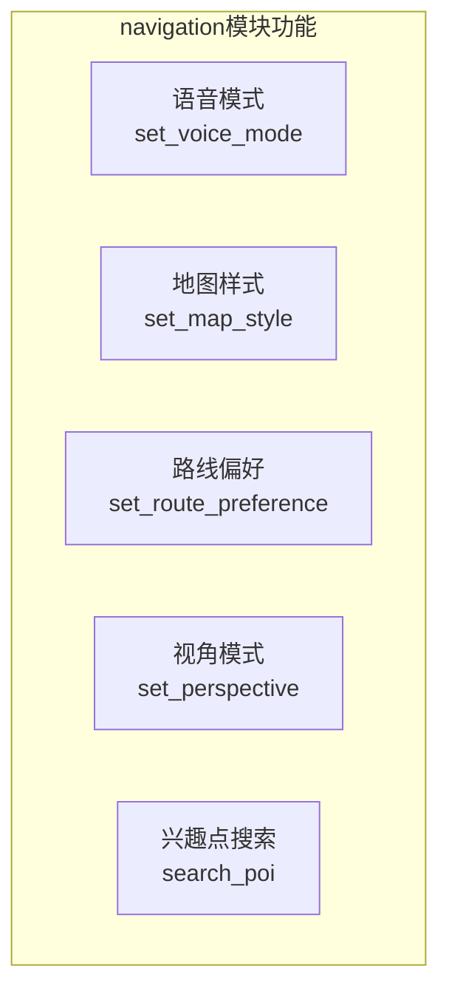

**共计约 140 个车辆控制工具函数。**

---

### 2.4 推理类型（Reasoning Types）

数据集问题涉及 **4 种推理类型**，每种类型测试不同的记忆和推理能力。这些推理类型共同构成了多用户长期记忆场景下的核心挑战。

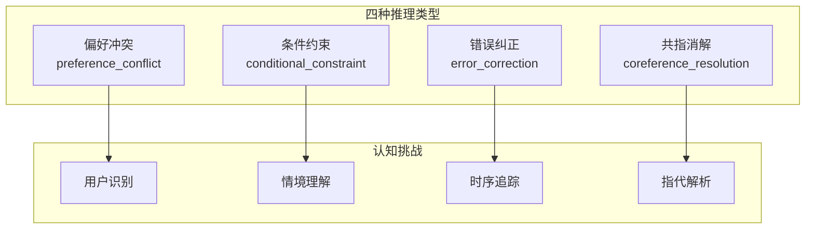

#### 2.4.1 偏好冲突（preference_conflict）

**定义**：多个用户对同一车辆设置有不同的偏好，智能体需要根据当前用户身份识别正确的偏好。

**认知过程**：

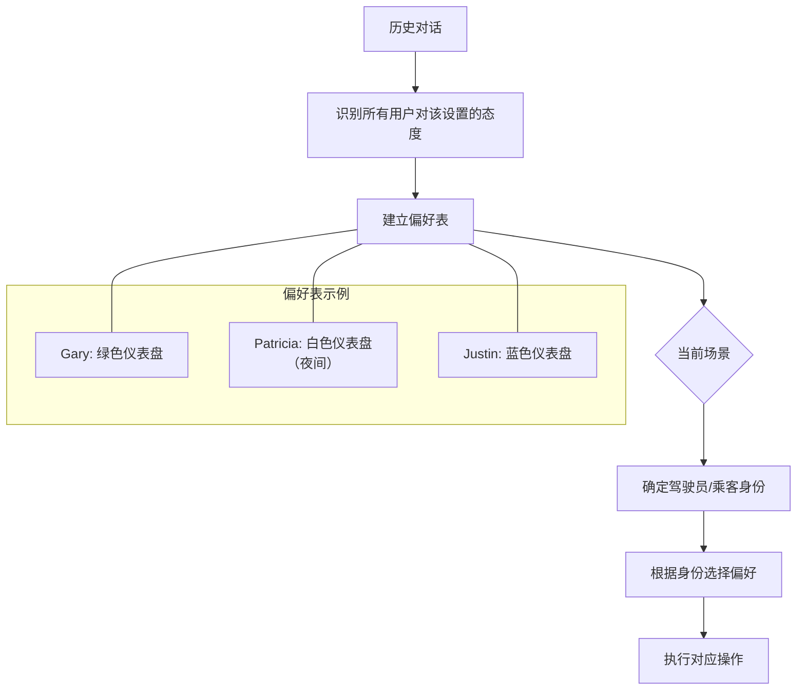

**判定逻辑**：
- 识别当前用户身份
- 识别当前场景（谁在开车）
- 匹配对应用户的偏好

**典型问题模板**：
```text
At [时间], [用户A] got into the driver's seat with [用户B] as a passenger.
[用户A] told [用户B]: '[需求描述]'
```

#### 2.4.2 条件约束（conditional_constraint）

**定义**：用户偏好取决于当前情境（时间、地点、天气等），智能体需要识别相关条件并应用对应偏好。

**认知过程**：

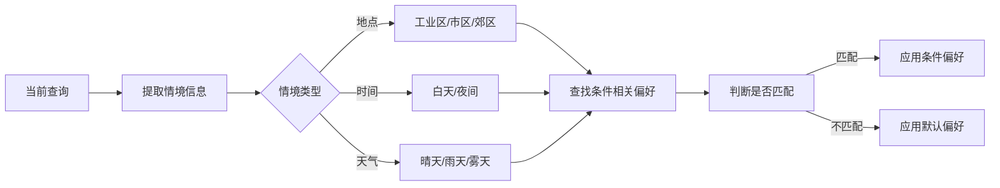

**条件类型**：

| 条件类型 | 触发场景 | 偏好示例 |
|----------|----------|----------|
| 地点条件 | 工业区 | 开启内循环 |
| 时间条件 | 夜间 | 白色仪表盘 |
| 天气条件 | 晴天 | 关闭天窗 |
| 状态条件 | 载客 | 开启后座空调 |

**典型问题模板**：
```text
At [时间], [用户] was driving [地点描述].
[用户] said: '[触发条件描述]'
```

#### 2.4.3 错误纠正（error_correction）

**定义**：用户之前调整过设置并进行了纠正，智能体需要记忆最终的正确值而非初始值。

**认知过程**：

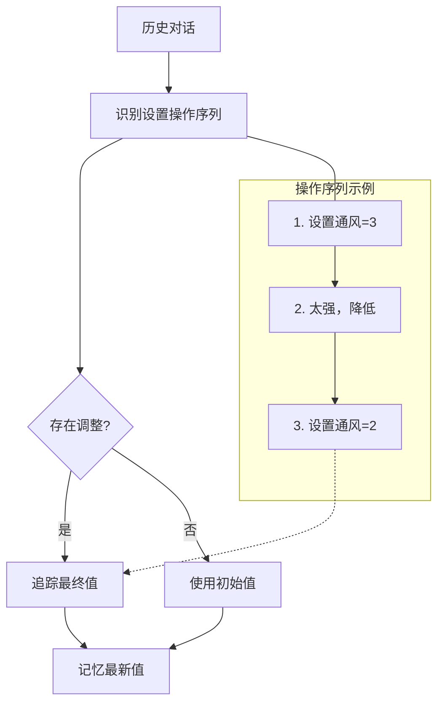

**关键特征**：
- 时间线上的多次调整
- 用户对设置的反馈（"太强"、"太暗"等）
- 最终值与初始值不同

**典型问题模板**：
```text
At [时间], [用户] got in the car.
[用户] told the car: '[参照历史描述]'
```

#### 2.4.4 共指消解（coreference_resolution）

**定义**：对话中使用代词或描述性引用指代特定用户，智能体需要正确解析指代对象。

**认知过程**：

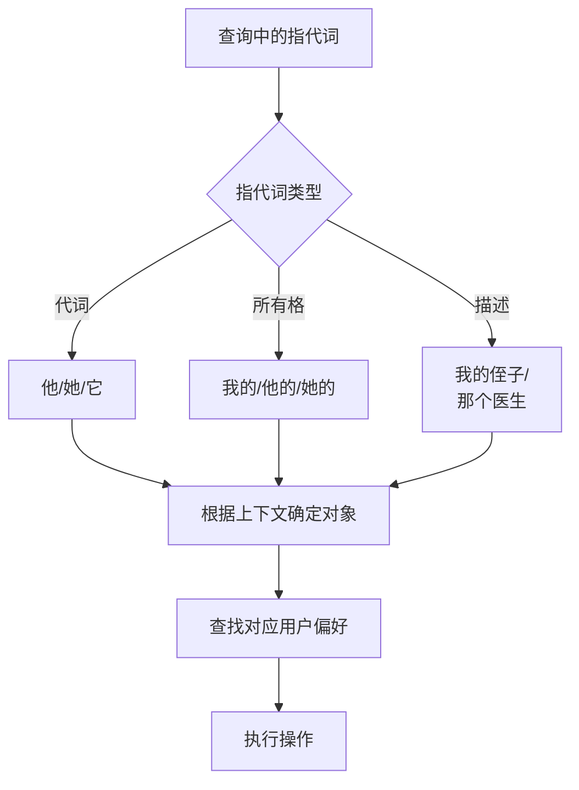

**指代消解规则**：

| 指代词 | 可能指代 | 消解依据 |
|--------|----------|----------|
| 他 | Gary/Justin/侄子 | 句法位置、性别 |
| 我的侄子 | Justin的侄子 | 关系声明 |
| 那个工程师 | Patricia | 职业描述 |
| 他侄子 | Gary的侄子/Justin的侄子 | 亲属关系 |

**典型问题模板**：
```text
At [时间], [用户] was driving [指代对象].
[用户] said: '[包含指代的请求]'
```

#### 2.4.5 推理类型分布

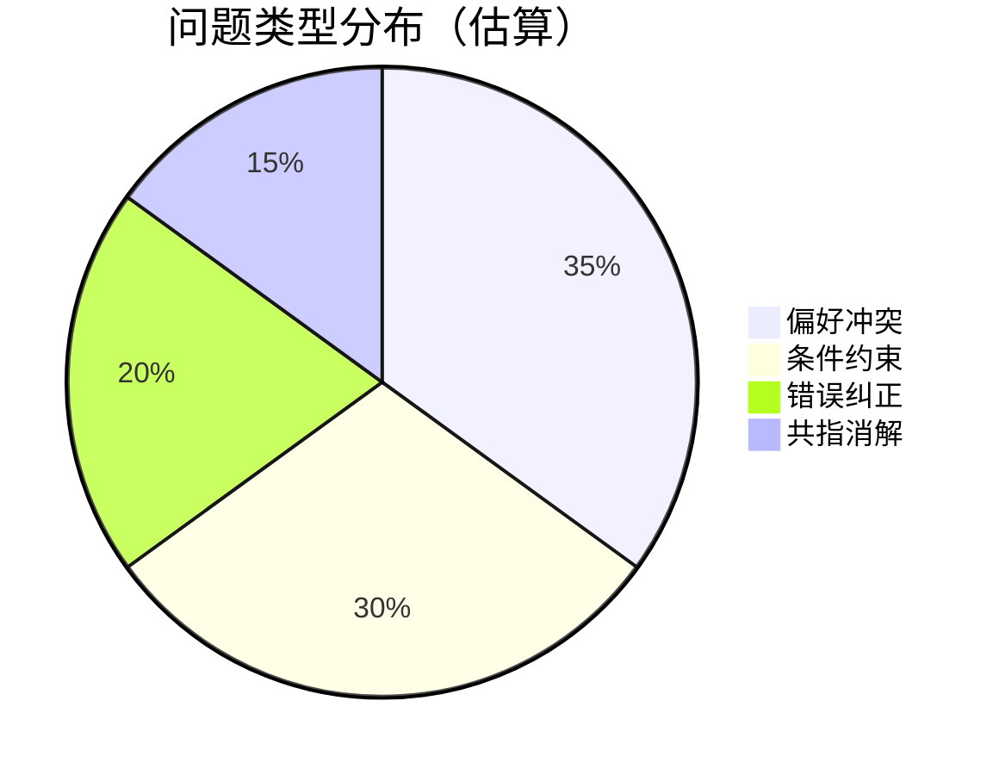

每种推理类型可能单独出现，也可能组合出现，增加问题的复杂性。

---

## 3. 实验数据

### 3.1 数据集概述

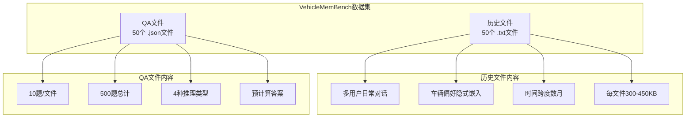

### 3.2 历史文件（History）

**文件数量**：50 个历史文件（`history_1.txt` ~ `history_50.txt`）

**内容特点**：
- 多用户间的自然对话，涵盖工作、家庭、车辆使用等场景
- 对话中车辆偏好信息自然嵌入，而非直接陈述
- 时间跨度覆盖多个月份
- 每个历史文件约 300-450KB，包含数千行对话

**文件格式**：
```text
[YYYY-MM-DD HH:MM] SpeakerName: Message content
```

**对话样例**：
```text
[2025-03-10 08:00] Gary Allen: ...I really love this green 
instrument panel. It reminds me of the forest canopy I write about.

[2025-03-10 08:00] Patricia Garcia: I prefer the navigation 
voice to be detailed. It helps me prepare for lane changes early.
```

### 3.3 QA 文件（Question-Answer）

**文件数量**：50 个 QA 文件（`qa_1.json` ~ `qa_50.json`）

**问题数量**：每文件 10 题，共 **500 个测试问题**

**问题分布**：4 种推理类型混合分布

**文件格式**：

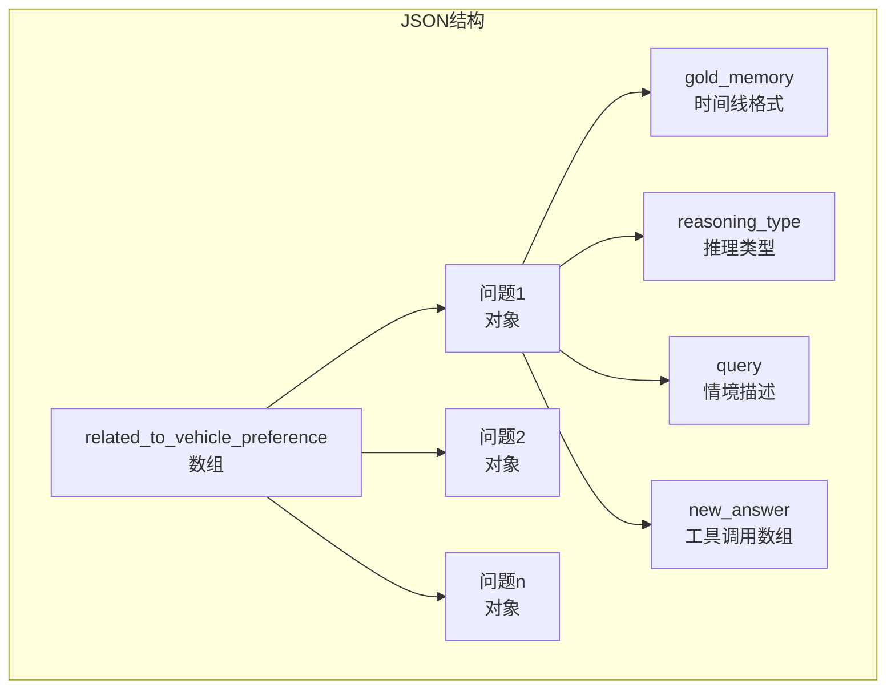

**字段说明**：

| 字段 | 类型 | 描述 | 示例 |
|------|------|------|------|
| `gold_memory` | string | 格式化的时间线 | `[April 15, 2025] At 9:00 AM, Justin...` |
| `reasoning_type` | string | 推理类型 | `preference_conflict` |
| `query` | string | 当前情境描述 | `At 10:00 AM, Gary got into...` |
| `new_answer` | array | 正确工具调用 | `["carcontrol_seat_set_..."]` |

**问题结构示例**：

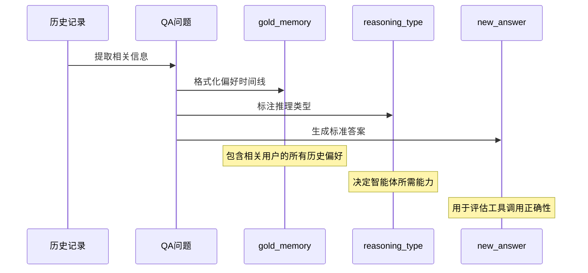

### 3.4 数据集统计

| 数据集 | 文件数 | 问题数 | 平均文件大小 | 总 token 数（估） |
|--------|--------|--------|-------------|-------------------|
| 历史记录 | 50 | - | ~350KB | ~15MB |
| QA 问题 | 50 | 500 | ~7KB | ~3.5MB |

---

## 4. 实验方式

### 4.1 模型评估流程

```mermaid
flowchart TB
    subgraph 阶段一：记忆构建
        A1[加载历史文件] --> A2{记忆类型选择}
        A2 -->|none| A3[跳过构建]
        A2 -->|gold| A4[注入gold_memory]
        A2 -->|summary| A5[逐日LLM摘要]
        A2 -->|key_value| A6[LLM构建键值存储]
        A5 --> A7[累积记忆]
        A6 --> A8[记忆存储]
    end
    
    subgraph 阶段二：评估执行
        B1[加载QA问题] --> B2[构建评估提示]
        A3 --> B2
        A4 --> B2
        A7 --> B2
        A8 --> B2
        B2 --> B3[模型生成响应]
        B3 --> B4[提取工具调用]
        B4 --> B5[执行工具调用]
        B5 --> B6[生成预测状态]
    end
    
    subgraph 阶段三：状态比较
        C1[执行参考工具] --> C2[生成参考状态]
        B6 --> C3[状态比较]
        C2 --> C3
        C3 --> C4[计算指标]
    end
```

#### 4.1.1 none 模式

模型只能依靠内置知识，无法访问任何历史上下文。这是最严格的基线测试，直接评估模型在没有任何记忆辅助下的表现。

#### 4.1.2 gold 模式

直接注入预格式化的 `gold_memory` 字段。由于 gold_memory 包含与问题直接相关的所有历史偏好，此模式代表理论性能上限。

#### 4.1.3 summary 模式

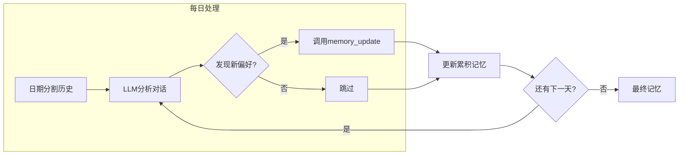

- 智能体逐日处理对话历史
- 每天调用 `memory_update` 工具更新累积记忆
- 最终记忆文本被注入评估提示
- 记忆构建受 2000 词限制

#### 4.1.4 key_value 模式

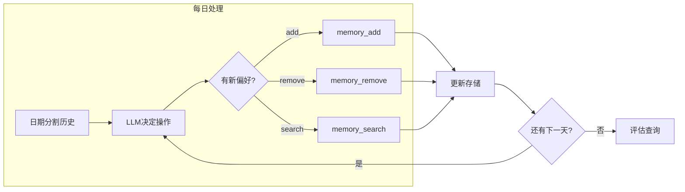

- 智能体使用 `memory_add`、`memory_remove`、`memory_search`、`memory_list` 工具构建结构化记忆
- 评估时允许查询记忆存储

### 4.2 记忆系统评估流程

```mermaid
flowchart TB
    subgraph 阶段一：历史摄入
        A1[读取历史文件] --> A2[调用记忆系统API]
        A2 --> A3[系统处理]
        A3 --> A4[偏好提取]
        A4 --> A5[存储到系统]
    end
    
    subgraph 阶段二：检索与执行
        B1[加载QA问题] --> B2[智能体接收查询]
        B2 --> B3[调用search_memory]
        B3 --> B4[获取检索结果]
        B4 --> B5[调用车辆工具]
        B5 --> B6[执行工具]
        B6 --> B7[生成预测状态]
    end
    
    subgraph 阶段三：评估
        C1[执行参考工具] --> C2[生成参考状态]
        B7 --> C3[状态比较]
        C2 --> C3
        C3 --> C4[计算指标]
    end
```

#### Step 1: 历史摄入（Add Stage）

1. 读取历史文件
2. 调用对应记忆系统的 API
3. 系统自动提取和存储偏好信息

#### Step 2: 检索与执行评估（Test Stage）

1. 加载 QA 问题
2. 智能体接收查询
3. 智能体调用 `search_memory` 工具检索记忆
4. 根据检索结果调用车辆工具
5. 评估最终状态与真值的匹配度

### 4.3 评估执行细节

#### 4.3.1 反思机制（Reflect）

评估过程中，智能体可以多轮思考和调用工具。这种反思机制模拟了人类在做出决策前会反复思考的过程。

```mermaid
flowchart TB
    subgraph 反思循环
        A[初始查询] --> B[LLM决策]
        B --> C{决策类型判断}
        C -->|search_memory| D[检索记忆]
        C -->|list_module_tools| E[发现可用工具]
        C -->|vehicle_tool| F[执行车辆控制]
        C -->|response| G[输出响应]
        
        D --> H[记忆结果]
        E --> I[工具列表]
        F --> J[状态更新]
        
        H --> K[反馈给LLM]
        I --> K
        J --> K
        
        K --> B
        B --> L{反思次数 < N?}
        L -->|是| B
        L -->|否| G
    end
    
    subgraph 工具类型说明
        T1["search_memory<br>从记忆系统检索"]
        T2["list_module_tools<br>发现模块工具"]
        T3["vehicle_tool<br>控制车辆"]
        T4["response<br>输出最终响应"]
    end
```

**反思机制参数**：

| 参数 | 说明 | 典型值 | 影响 |
|------|------|--------|------|
| `reflect_num` | 最大反思轮数 | 10, 20 | 更多轮数允许更复杂推理 |
| `max_tokens` | 单轮输出上限 | 可配置 | 限制单轮响应长度 |

**反思的优势**：
- 允许智能体在决策前多次查询记忆
- 支持工具调用失败时的重试
- 模拟人类的"三思而后行"过程

#### 4.3.2 工具执行环境

车辆工具在 VehicleWorld 模拟器中执行，每次工具调用都会更新模拟器内部状态。

```mermaid
flowchart LR
    subgraph 工具执行流程
        A[工具调用请求] --> B[解析函数名和参数]
        B --> C[查找对应模块]
        C --> D[验证参数合法性]
        D -->|合法| E[执行状态修改]
        D -->|非法| F[返回错误信息]
        E --> G[记录状态变化]
        G --> H[返回执行结果]
    end
    
    subgraph 状态追踪
        S1[初始状态] --> S2[第一次调用后]
        S2 --> S3[第二次调用后]
        S3 --> S4[N次调用后]
    end
```

**状态比较流程**：

```mermaid
flowchart TB
    subgraph 预测路径
        P1[初始状态] --> P2[预测调用1]
        P2 --> P3[预测调用2]
        P3 --> P4[预测最终状态]
    end
    
    subgraph 参考路径
        R1[初始状态] --> R2[正确调用1]
        R2 --> R3[正确调用2]
        R3 --> R4[正确最终状态]
    end
    
    P4 --> C[状态比较]
    R4 --> C
    
    C --> D[计算差异]
    D --> E[输出指标]
```

#### 4.3.3 评估输出结构

评估完成后，每个问题生成详细的评估结果：

```mermaid
graph TB
    subgraph 评估结果
        R[result<br>结果对象]
        R --> TI[task_id<br>问题标识]
        R --> Q[query<br>原始查询]
        R --> RT[reasoning_type<br>推理类型]
        R --> PC[pred_calls<br>预测调用]
        R --> RC[ref_calls<br>参考调用]
        R --> SS[state_score<br>状态分数]
        R --> TS[tool_score<br>工具分数]
        R --> EM[exact_match<br>完全匹配]
    end
    
    subgraph state_score详情
        SS --> TP[TP]
        SS --> FP[FP]
        SS --> FN[FN]
        SS --> CC[correctly_changed]
    end
    
    subgraph tool_score详情
        TS --> PREC[precision]
        TS --> REC[recall]
        TS --> F1[F1]
    end
```

---

## 5. 评估指标

### 5.1 指标体系概览

VehicleMemBench 采用多层次指标体系，从不同维度评估智能体表现：

```mermaid
graph TB
    subgraph 评估指标体系
        subgraph 顶层指标
            EMR[Exact Match Rate<br>完全匹配率]
        end
        
        subgraph 细粒度指标
            FL[Field-Level<br>字段级]
            VL[Value-Level<br>值级]
            NM[Negative Metrics<br>负类指标]
        end
        
        subgraph 效率指标
            EC[Avg Tool Calls<br>平均工具调用]
            OT[Avg Output Tokens<br>平均输出Token]
        end
    end
    
    EMR --> FL
    EMR --> VL
    EMR --> NM
    FL --> EC
    VL --> EC
    NM --> OT
```

| 指标类别 | 指标名称 | 描述 | 优先级 |
|----------|----------|------|--------|
| **成功指标** | Exact Match Rate | 最终状态完全匹配率 | 高 |
| **字段级指标** | Precision/Recall/F1 | 是否修改了正确的字段 | 高 |
| **值级指标** | Change Accuracy/Precision/F1 | 修改后的值是否正确 | 高 |
| **负类指标** | Negative Acc/F1 | 是否避免了错误修改 | 中 |
| **效率指标** | Avg Tool Calls/Tokens | 资源消耗 | 中 |

### 5.2 核心指标详解

#### 5.2.1 Exact Match Rate（完全匹配率）

**定义**：最终环境状态与真值完全匹配的比例。

**判定条件**（需同时满足）：
- 预测状态与参考状态的 `differences` 列表为空
- `FP` = 0（无错误变化）
- `negative_FP` = 0（无遗漏变化）

**公式**：
```text
Exact Match = (differences == []) AND (FP == 0) AND (negative_FP == 0)
```

#### 5.2.2 状态变化基础指标

评估智能体对车辆状态的理解和修改能力：

| 指标 | 定义 | 含义 |
|------|------|------|
| **TP** (True Positive) | 应该变化且确实变化的字段数 | 正确识别并修改 |
| **FP** (False Positive) | 不应变化却变化的字段数 | 错误修改 |
| **FN** (False Negative) | 应该变化却未变化的字段数 | 遗漏修改 |
| **negative_TP** | 不应变化且确实未变化的字段数 | 正确保持不变 |
| **correctly_changed** | 变化值也正确的字段数 | 精准修改 |

#### 5.2.3 字段级指标（Field-Level Metrics）

**关注点**：是否修改了**正确的字段**（不关注值是否正确）

```mermaid
graph LR
    subgraph 字段级评估
        A[应该变化的字段] --> B[是否修改了]
        C[实际修改的字段] --> B
        B --> D{判断结果}
        D -->|修改且应修改| TP[TP +1]
        D -->|修改但不应修改| FP[FP +1]
        D -->|未修改但应修改| FN[FN +1]
    end
```

| 指标 | 公式 | 描述 |
|------|------|------|
| **Acc Positive** | TP / 应该变化的字段数 | 变化字段的召回率 |
| **Precision Positive** | TP / 实际变化的字段数 | 变化字段的精确率 |
| **F1 Positive** | 2×P×R/(P+R) | 变化字段的综合指标 |

#### 5.2.4 值级指标（Value-Level Metrics）

**关注点**：修改后的**值是否正确**

```mermaid
graph LR
    subgraph 值级评估
        A[应该变化的字段] --> B[实际值是否正确]
        C[实际修改的值] --> B
        B --> D{判断结果}
        D -->|值正确| CC[correctly_changed +1]
        D -->|值错误| E[值错误]
    end
```

| 指标 | 公式 | 描述 |
|------|------|------|
| **Change Accuracy** | correctly_changed / 应该变化的字段数 | 值正确率 |
| **Precision Change** | correctly_changed / 实际变化的字段数 | 值精确率 |
| **F1 Change** | 2×P×R/(P+R) | 值级综合指标 |

#### 5.2.5 负类指标（Negative Metrics）

**关注点**：是否避免了**错误修改**

| 指标 | 公式 | 描述 |
|------|------|------|
| **Acc Negative** | negative_TP / 应该保持不变的字段数 | 保持原状的能力 |
| **F1 Negative** | 2×P×R/(P+R) | 避免错误变化的综合能力 |

### 5.3 效率指标

| 指标 | 描述 | 用途 |
|------|------|------|
| **Avg Pred Calls** | 平均预测工具调用数 | 衡量执行效率 |
| **Avg Output Token** | 平均输出 token 数 | 衡量资源消耗 |

### 5.4 指标计算流程

```mermaid
flowchart TB
    subgraph 输入
        W1[初始状态] --> C1[收集状态路径]
        W2[参考最终状态] --> C1
        W3[预测初始状态] --> C1
        W4[预测最终状态] --> C1
    end
    
    subgraph 分析阶段
        C1 --> A1[分析应该变化的路径]
        C1 --> A2[分析不应该变化的路径]
        A1 --> S1[should_change列表]
        A2 --> S2[should_not_change列表]
    end
    
    subgraph 比较阶段
        P1[预测变化] --> COMP1{与参考比较}
        COMP1 -->|正确变化| TP1[TP +1]
        COMP1 -->|值错误| WRC[错误变化]
        COMP1 -->|未变化| FN1[FN +1]
    end
    
    subgraph 聚合阶段
        TP1 --> SUM[汇总指标]
        WRC --> SUM
        FN1 --> SUM
        SUM --> FL[Field-Level]
        SUM --> VL[Value-Level]
    end
```

### 5.5 指标阈值与判定标准

| 指标 | 优秀 | 良好 | 及格 | 说明 |
|------|------|------|------|------|
| Exact Match Rate | >80% | 60-80% | 40-60% | 完全匹配比例 |
| Field-Level F1 | >85% | 70-85% | 50-70% | 字段识别能力 |
| Value-Level F1 | >75% | 60-75% | 40-60% | 值预测能力 |
| Avg Tool Calls | <5 | 5-8 | >8 | 效率指标，越低越好 |

### 5.6 指标应用场景

```mermaid
graph TB
    subgraph 指标应用
        A[评估场景] --> B1[模型对比]
        A --> B2[系统选型]
        A --> B3[性能优化]
        A --> B4[质量监控]
        
        B1 --> C1[不同模型在同一设置下比较]
        B2 --> C2[选择最优记忆系统]
        B3 --> C3[识别性能瓶颈]
        B4 --> C4[监控生产环境]
    end
    
    subgraph 推荐指标
        D1[Exact Match Rate<br/>主要指标]
        D2[Field-Level F1<br/>辅助指标]
        D3[Value-Level F1<br/>辅助指标]
    end
    
    C1 --> D1
    C2 --> D1
    C3 --> D3
    C4 --> D2
```

---

## 6. 实验变量

### 6.1 自变量（Independent Variables）

#### 6.1.1 模型评估自变量

| 变量 | 选项 | 说明 |
|------|------|------|
| 内存类型 | `none`, `gold`, `summary`, `key_value` | 不同的记忆构建方式 |
| 是否启用思考 | `true`, `false` | 是否启用模型思考能力 |
| 基础模型 | 可配置 | 如 Qwen、GPT-4 等 |

#### 6.1.2 记忆系统评估自变量

| 变量 | 选项 | 说明 |
|------|------|------|
| 记忆系统 | `mem0`, `memos`, `lightmem`, `supermemory`, `memobase`, `gold` | 不同的记忆存储后端 |
| 是否启用思考 | `true`, `false` | 是否启用模型思考能力 |
| 基础模型 | 可配置 | 与记忆系统交互的 LLM |

### 6.2 因变量（Dependent Variables）

主要评估指标：

| 因变量 | 指标类型 | 测量方式 |
|--------|----------|----------|
| Exact Match Rate | 成功率 | 二值判定 |
| Field-Level Precision | 字段识别能力 | 比例计算 |
| Field-Level Recall | 字段识别能力 | 比例计算 |
| Field-Level F1 | 字段识别能力 | 综合计算 |
| Value-Level Change Accuracy | 值预测能力 | 比例计算 |
| Value-Level Precision | 值预测能力 | 比例计算 |
| Value-Level F1 | 值预测能力 | 综合计算 |
| Average Tool Calls | 效率 | 统计平均 |
| Average Output Tokens | 效率 | 统计平均 |

### 6.3 控制变量（Control Variables）

在实验中保持恒定的参数：

| 控制变量 | 默认值范围 | 说明 |
|----------|------------|------|
| `max_workers` | 5-10 | 并行评估的线程数 |
| `max_retries` | 3 | API 调用失败重试次数 |
| `reflect_num` | 10-20 | 智能体反思/推理次数上限 |
| `benchmark_dir` | benchmark/qa_data | QA 数据目录 |
| `history_dir` | benchmark/history | 历史数据目录 |

### 6.4 实验设计矩阵

| 实验编号 | 内存类型 | 记忆系统 | 思考能力 | 预期目标 |
|----------|----------|----------|----------|----------|
| 1 | none | - | false | 基线性能 |
| 2 | gold | - | false | 理论上限 |
| 3 | summary | - | true | 摘要能力 |
| 4 | key_value | - | true | 检索能力 |
| 5 | memory_bank | - | true | 遗忘曲线记忆 |
| 6 | - | mem0 | true | Mem0 系统性能 |
| 7 | - | memos | true | MemOS 系统性能 |
| 8 | - | lightmem | true | LightMem 系统性能 |
| 9 | - | supermemory | true | Supermemory 系统性能 |
| 10 | - | memobase | true | Memobase 系统性能 |

---

## 7. 实验配置

### 7.1 运行模式

#### 模型评估流程

```mermaid
flowchart TB
    subgraph 准备阶段
        E1[设置环境变量] --> E2[配置模型参数]
        E2 --> E3[选择记忆类型]
    end
    
    subgraph 执行阶段
        E3 --> EX1[加载历史对话]
        EX1 --> EX2[构建记忆上下文]
        EX2 --> EX3[加载QA问题]
        EX3 --> EX4[模型生成响应]
        EX4 --> EX5[提取工具调用]
        EX5 --> EX6[执行工具]
    end
    
    subgraph 评估阶段
        EX6 --> EV1[生成预测状态]
        EV1 --> EV2[执行参考工具]
        EV2 --> EV3[生成参考状态]
        EV3 --> EV4[状态比较]
        EV4 --> EV5[计算指标]
    end
    
    subgraph 输出阶段
        EV5 --> OUT1[生成详细报告]
        EV5 --> OUT2[聚合指标统计]
        OUT1 --> OUT3[保存到文件]
        OUT2 --> OUT3
    end
```

#### 记忆系统评估流程

```mermaid
flowchart TB
    subgraph 阶段一：摄入准备
        P1[配置API密钥] --> P2[验证连接]
        P2 --> P3[创建记忆实例]
    end
    
    subgraph 阶段一：摄入执行
        P3 --> I1[读取历史文件]
        I1 --> I2[分批处理]
        I2 --> I3[调用摄入API]
        I3 --> I4{摄入成功?}
        I4 -->|是| I5[下一批]
        I4 -->|否| I6[重试/跳过]
        I5 --> I7{还有更多?}
        I7 -->|是| I2
        I7 -->|否| I8[摄入完成]
        I6 --> I2
    end
    
    subgraph 阶段二：评估执行
        I8 --> T1[加载QA问题]
        T1 --> T2[智能体接收查询]
        T2 --> T3[调用search_memory]
        T3 --> T4[获取检索结果]
        T4 --> T5[调用车辆工具]
        T5 --> T6[生成预测状态]
    end
    
    subgraph 阶段二：结果评估
        T6 --> R1[执行参考工具]
        R1 --> R2[状态比较]
        R2 --> R3[计算指标]
    end
```

### 7.2 典型运行场景

#### 场景一：快速验证（2个文件）

```mermaid
flowchart LR
    A[运行命令] --> B[指定范围]
    B --> C["--file-range 1-2"]
    C --> D[快速测试]
    D --> E{验证配置}
    E -->|成功| F[继续完整测试]
    E -->|失败| G[修复配置]
    G --> D
```

适用场景：验证 API 连接、测试代码修改

#### 场景二：完整评估（50个文件）

```mermaid
flowchart TB
    A[完整评估] --> B[分批处理]
    B --> C["第1批: 1-10"]
    B --> D["第2批: 11-20"]
    B --> E["第3批: 21-30"]
    B --> F["第4批: 31-40"]
    B --> G["第5批: 41-50"]
    
    C --> H1[汇总结果]
    D --> H1
    E --> H1
    F --> H1
    G --> H1
    
    H1 --> H2[合并报告]
    H2 --> H3[生成图表]
```

适用场景：正式评估、论文实验

### 7.2 核心参数说明

| 参数 | 说明 | 典型值 | 适用命令 |
|------|------|--------|----------|
| `--memory_type` | 记忆构建类型 | `none`, `gold`, `summary`, `key_value` | model |
| `--memory_system` | 记忆系统名称 | `mem0`, `memos`, `lightmem` 等 | memorysystem |
| `--enable_thinking` | 是否启用思考模式 | `true`, `false` | both |
| `--file_range` | 评估文件范围 | `1-50`, `1,3,5` | both |
| `--reflect_num` | 智能体反思轮数上限 | `10`, `20` | both |
| `--max_workers` | 并行工作线程数 | `5`, `8`, `10` | both |
| `--benchmark_dir` | QA 数据目录 | `benchmark/qa_data` | both |
| `--history_dir` | 历史数据目录 | `benchmark/history` | memorysystem add |

---

## 8. 环境要求与依赖

### 8.1 硬件与软件要求

- **Python 版本**：3.12（推荐）
- **操作系统**：Linux/macOS/Windows
- **网络**：需要访问 LLM API 服务

### 8.2 环境变量配置

#### 模型 API（必需）

| 环境变量 | 说明 | 示例 |
|----------|------|------|
| `LLM_API_BASE` | API 端点 | `https://api.example.com/v1` |
| `LLM_API_KEY` | API 密钥 | `sk-xxx` |
| `LLM_MODEL` | 模型名称 | `gpt-4o`, `qwen-max` |

#### 记忆系统 API（可选）

| 环境变量 | 记忆系统 | 说明 |
|----------|----------|------|
| `MEM0_API_KEY` | Mem0 | API 密钥 |
| `MEMOS_API_URL` | MemOS | 服务地址 |
| `MEMOS_API_KEY` | MemOS | API 密钥 |
| `LIGHTMEM_API_KEY` | LightMem | API 密钥 |
| `LIGHTMEM_API_BASE` | LightMem | 服务地址 |
| `LIGHTMEM_MODEL` | LightMem | 使用模型 |
| `SUPERMEMORY_API_KEY` | Supermemory | API 密钥 |
| `MEMOBASE_API_KEY` | Memobase | API 密钥 |
| `MEMOBASE_API_URL` | Memobase | 服务地址 |

### 8.3 快速安装

**安装步骤**：

| 步骤 | 命令 | 说明 |
|------|------|------|
| 1 | `conda create -n VehicleMemBench python=3.12` | 创建 Python 3.12 环境 |
| 2 | `conda activate VehicleMemBench` | 激活环境 |
| 3 | `pip install -r requirements.txt` | 安装依赖 |

---

## 9. 目录结构

### 9.1 整体结构

```mermaid
graph TB
    subgraph VehicleMemBench根目录
        ROOT[vehicle-membench/]
        
        subgraph 核心数据
            HIST[benchmark/history/<br>50个对话历史]
            QA[benchmark/qa_data/<br>50个QA文件]
        end
        
        subgraph 运行环境
            MOD[environment/module/<br>22个车辆模块]
            VW[environment/vehicleworld.py<br>主模拟器]
            UT[environment/utils.py<br>工具函数]
        end
        
        subgraph 评估引擎
            ME[evaluation/model_evaluation.py<br>模型评估器]
            MSE[evaluation/memorysystem_<br>evaluation.py<br>记忆系统评估器]
            EU[evaluation/eval_utils.py<br>评估工具]
            AG[evaluation/agent_client.py<br>Agent客户端]
            FS[evaluation/functions_schema.json<br>工具定义]
        end
        
        subgraph 记忆系统适配器
            MS[evaluation/memorysystems/]
            M0[mem0.py]
            MOS[memos.py]
            LM[lightmem.py]
            SM[supermemory.py]
            MB[memobase.py]
        end
        
        subgraph 脚本与配置
            SCR[scripts/<br>运行脚本]
            REQ[requirements.txt<br>依赖清单]
            FIG[figure/<br>资源图片]
        end
    end
    
    HIST --> ME
    HIST --> MSE
    QA --> ME
    QA --> MSE
    MOD --> VW
    VW --> ME
    VW --> MSE
    ME --> EU
    MSE --> EU
    MS --> MSE
    SCR --> ME
    SCR --> MSE
```

### 9.2 数据文件结构

#### 历史文件（History）

```mermaid
graph TB
    HIST[history_1.txt] --> L1["[日期时间] 说话人: 消息内容"]
    L1 --> L2["[日期时间] 说话人: 消息内容"]
    L2 --> L3["..."]
    L3 --> Ln["[日期时间] 说话人: 消息内容"]
    
    subgraph 时间跨度
        D1["3月"]
        D2["4月"]
        D3["5月"]
        D4["6月"]
    end
    
    L1 -.-> D1
    Ln -.-> D4
```

- 单个文件约 300-450KB
- 包含数千行对话
- 时间跨度数月

#### QA 文件（Question-Answer）

```mermaid
graph TB
    QA[qa_1.json] --> ARR["related_to_vehicle_preference<br>数组（10个问题）"]
    ARR --> Q1["问题1"]
    ARR --> Q2["问题2"]
    ARR --> Q10["问题10"]
    
    Q1 --> F1["gold_memory"]
    Q1 --> F2["reasoning_type"]
    Q1 --> F3["query"]
    Q1 --> F4["new_answer"]
```

### 9.3 核心文件说明

| 文件路径 | 类型 | 功能描述 |
|----------|------|----------|
| `benchmark/history/history_*.txt` | 数据 | 长期对话历史，共50个文件 |
| `benchmark/qa_data/qa_*.json` | 数据 | 可执行问答数据，共50个文件 |
| `environment/vehicleworld.py` | 核心 | VehicleWorld 主类，聚合22个车辆模块 |
| `environment/module/*.py` | 核心 | 各车辆模块定义（22个文件） |
| `environment/utils.py` | 核心 | 工具装饰器、模块字典 |
| `evaluation/model_evaluation.py` | 核心 | 模型评估核心逻辑（约2000行） |
| `evaluation/memorysystem_evaluation.py` | 核心 | 记忆系统评估（约1000行） |
| `evaluation/eval_utils.py` | 核心 | 状态比较和工具评分函数（约600行） |
| `evaluation/functions_schema.json` | 配置 | 约140个工具函数的 JSON Schema |
| `evaluation/agent_client.py` | 工具 | Agent 客户端封装 |
| `evaluation/format_metric.py` | 工具 | 指标格式化输出 |
| `evaluation/memorysystems/*.py` | 适配器 | 5个记忆系统适配器 |
| `scripts/model_test.sh` | 脚本 | 模型评估入口 |
| `scripts/memorysystem_test.sh` | 脚本 | 记忆系统评估入口 |
| `requirements.txt` | 配置 | Python 依赖清单 |

### 9.4 输出目录结构

评估运行后会生成以下输出：

```mermaid
graph TB
    subgraph 输出结构
        LOG[log/] 
        ML["memory_system_log/"]
        REP[report.json]
    end
    
    subgraph log目录
        LOG --> L1["none结果"]
        LOG --> L2["gold结果"]
        LOG --> L3["summary结果"]
        LOG --> L4["key_value结果"]
    end
    
    subgraph memory_system_log目录
        ML --> M1["mem0结果"]
        ML --> M2["memos结果"]
        ML --> M3["lightmem结果"]
    end
    
    L1 --> R[report.json]
    L2 --> R
    L3 --> R
    L4 --> R
    M1 --> R
    M2 --> R
    M3 --> R
```

---

## 10. 关键结论与贡献

### 10.1 核心贡献

VehicleMemBench 的核心贡献体现在以下几个方面：

```mermaid
graph TB
    subgraph 五大贡献
        C1[首个车内智能体<br>多用户长期记忆benchmark]
        C2[可执行的<br>评估环境]
        C3[多层次<br>评估指标]
        C4[多种记忆<br>系统对比]
        C5[复杂的<br>推理类型]
    end
    
    subgraph 详细说明
        C1 --> D1["填补研究空白<br>推动领域发展"]
        C2 --> D2["VehicleWorld模拟器<br>22模块140工具"]
        C3 --> D3["Exact Match + Field + Value<br>三级细粒度评估"]
        C4 --> D4["4种基线 + 5种外部系统<br>全面对比记忆能力"]
        C5 --> D5["冲突/条件/纠正/消解<br>真实场景挑战"]
    end
```

**贡献详解**：

#### 贡献一：填补研究空白

| 现有 benchmark | VehicleMemBench |
|----------------|-----------------|
| 单用户场景 | 多用户共乘 |
| 短期记忆 | 长期历史（数月） |
| 直接偏好陈述 | 隐式嵌入对话 |
| 单一推理类型 | 多种推理组合 |

#### 贡献二：可执行评估环境

- **VehicleWorld 模拟器**：完整的车辆状态模拟
- **22 个车辆模块**：覆盖车内主要功能
- **约 140 个工具函数**：丰富的控制能力
- **状态比较机制**：精确的评估基础

#### 贡献三：多层次评估指标

```mermaid
graph LR
    subgraph 三层指标
        E[Exact Match<br>完全匹配] --> F[Field-Level<br>字段级]
        F --> V[Value-Level<br>值级]
    end
    
    subgraph 评估重点
        E -->|"是否正确?"| Q1[做什么操作]
        F -->|"做对了吗?"| Q2[改对字段了吗]
        V -->|"值对了吗?"| Q3[值也正确吗]
    end
```

#### 贡献四：多种记忆系统对比

| 类型 | 系统 | 特点 |
|------|------|------|
| 基线 | none | 无记忆 |
| 基线 | gold | 真实记忆 |
| 基线 | summary | 递归摘要 |
| 基线 | key_value | 键值存储 |
| 基线 | memory_bank | 遗忘曲线记忆（本项目） |
| 外部 | Mem0 | 商业产品 |
| 外部 | MemOS | 多模态 |
| 外部 | LightMem | 轻量方案 |
| 外部 | Supermemory | AI原生 |
| 外部 | Memobase | 云端服务 |

#### 贡献五：复杂推理类型

| 推理类型 | 测试能力 | 认知挑战 |
|----------|----------|----------|
| 偏好冲突 | 用户识别 | 身份判断 |
| 条件约束 | 情境理解 | 条件匹配 |
| 错误纠正 | 时序追踪 | 历史记忆 |
| 共指消解 | 指代解析 | 语义理解 |

### 10.2 评估维度总结

VehicleMemBench 从多个维度全面评估智能体的多用户长期记忆能力：

```mermaid
graph TB
    subgraph 四大评估维度
        D1[记忆输入维度]
        D2[知识表征维度]
        D3[认知推理维度]
        D4[多用户处理维度]
    end
    
    subgraph 记忆输入
        D1 --> I1[无历史]
        D1 --> I2[部分历史]
        D1 --> I3[完整历史]
    end
    
    subgraph 知识表征
        D2 --> K1[原始文本]
        D2 --> K2[摘要压缩]
        D2 --> K3[结构化]
        D2 --> K4[外部存储]
    end
    
    subgraph 认知推理
        D3 --> C1[偏好恢复]
        D3 --> C2[冲突解决]
        D3 --> C3[条件应用]
        D3 --> C4[时序推理]
    end
    
    subgraph 多用户处理
        D4 --> M1[用户识别]
        D4 --> M2[身份追踪]
        D4 --> M3[角色判断]
        D4 --> M4[偏好归因]
    end
```

### 10.3 应用场景

VehicleMemBench 可用于以下应用场景：

| 应用场景 | 使用方式 | 价值 |
|----------|----------|------|
| **学术研究** | 在标准 benchmark 上评估新方法 | 公平比较 |
| **产品选型** | 对比不同记忆系统性能 | 选择最优方案 |
| **模型评估** | 全面评估模型能力 | 发现短板 |
| **系统优化** | 分析指标定位瓶颈 | 针对性改进 |
| **教学演示** | 展示多用户记忆挑战 | 教育培训 |

### 10.4 局限性与发展方向

```mermaid
graph LR
    subgraph 当前局限
        L1[仅英文对话]
        L2[固定3个用户]
        L3[单一车辆环境]
    end
    
    subgraph 发展方向
        F1[多语言支持]
        F2[更多用户角色]
        F3[多车型适配]
        F4[真实环境验证]
    end
    
    L1 -.-> F1
    L2 -.-> F2
    L3 -.-> F3
    L3 -.-> F4
```
