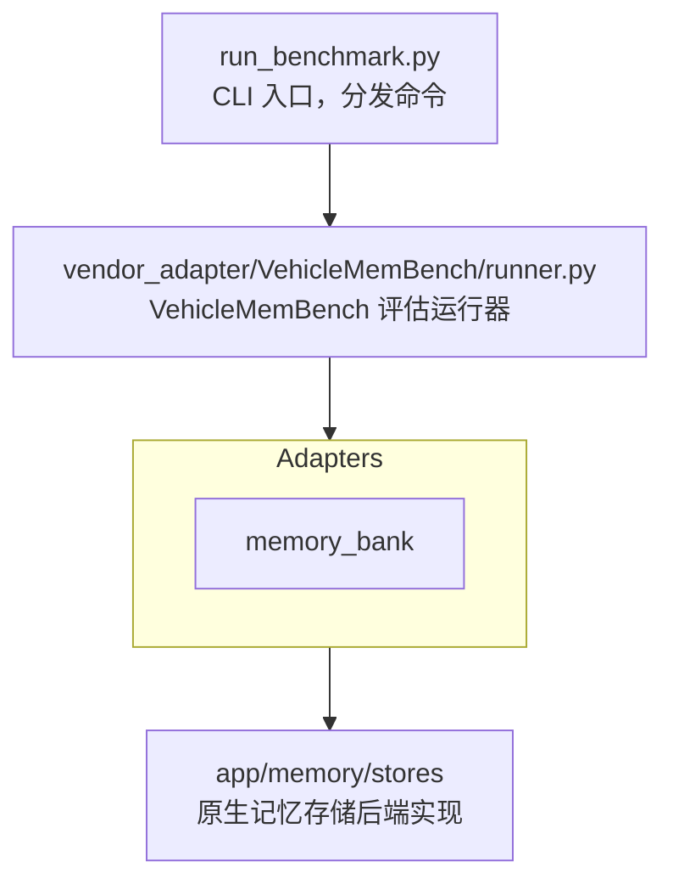

# 对比实验

基于 [VehicleMemBench](https://github.com/isyuhaochen/VehicleMemBench) 的车载记忆基准评估框架。

## 系统架构



## 适配器模式

`vendor_adapter/VehicleMemBench/memory_adapters/` 通过统一接口封装 `app/memory/stores/`，使 VehicleMemBench 能以适配器方式调用（当前仅支持 MemoryBank，MemoChat 尚未添加适配器）：

| 适配器 | 封装 | 原理 |
|--------|------|------|
| `MemoryBankAdapter` | `MemoryBankStore` | 遗忘曲线 + 分层记忆（唯一支持） |

## 运行基准测试

### 前置条件

1. **配置模型**：确保 `config/llm.toml` 中 `model_groups.benchmark` 已配置有效模型
2. **设置API密钥**：导出所需环境变量（如 `MINIMAX_API_KEY`）
3. **初始化子模块**：`git submodule update --init --recursive`

### 命令示例

```bash
# 全流程（建议先小范围测试）
uv run python run_benchmark.py all --file-range 1-2

# 分阶段运行
uv run python run_benchmark.py prepare --file-range 1-2
uv run python run_benchmark.py run --file-range 1-2

# 生成报告
uv run python run_benchmark.py report
```

### 注意事项

- **API限流**：大批量文件（如1-50）可能触发API限流，建议分批处理
- **memory_bank耗时**：memory_bank prepare阶段对大历史文件较慢，属正常现象
- **gold类型**：gold类型prepare阶段仅创建目录，无prep.json文件

## CLI 参数

| 参数 | 默认值 | 适用命令 | 说明 |
|------|--------|----------|------|
| `--file-range` | `1-50` | prepare, run, all | 评估文件范围（如 `1-10` 或 `1,3,5`） |
| `--memory-types` | `gold,summary,kv,memory_bank` | prepare, run, all | 记忆类型 |
| `--reflect-num` | `10` | run, all | 反射推理次数 |
| `--allow-partial` | `false` | all | 即使部分步骤失败也生成报告 |
| `--output` | `None` | all, report | 自定义报告输出路径 |

## 基准测试数据结构

```text
data/benchmark/
├── {memory_type}/               # gold | summary | kv | memory_bank
│   └── file_{n}/
│       ├── prep.json            # prepare 阶段产物（gold类型无此文件）
│       ├── query_{i}.json       # 单个 query 评估结果
│       └── store/               # 仅 memory_bank：MemoryBank 存储数据
└── report.json                  # 最终聚合报告
```

## VehicleMemBench 子模块

作为 `vendor/VehicleMemBench` 子模块引入，评估逻辑由供应商提供。

## 实验报告

实验报告主要通过 CLI pipeline 生成，运行 `report` 命令即可：

```bash
uv run python run_benchmark.py report
```

GraphQL API 保留 `experimentReport` 查询接口，但仅返回迁移提示信息：

```graphql
query { experimentReport { report } }
```

返回示例：
```json
{
  "data": {
    "experimentReport": {
      "report": "Experiment runner migrated to CLI pipeline"
    }
  }
}
```

## 故障排除

### 常见错误

**API错误（如529、429）**：
- 原因：API服务负载过高或达到速率限制
- 解决：减少并发（设置 `BENCHMARK_QUERY_CONCURRENCY=2`），或分批处理文件

**memory_bank prepare超时**：
- 原因：大历史文件需要多次LLM调用进行摘要和嵌入
- 解决：正常现象，耐心等待；或先测试小文件（如 `--file-range 1-1`）

**找不到历史文件**：
- 原因：VehicleMemBench子模块未初始化
- 解决：运行 `git submodule update --init --recursive`

**配置错误（ValueError: model_groups.benchmark must be configured）**：
- 原因：`config/llm.toml` 缺少 `model_groups.benchmark` 配置
- 解决：在配置文件中添加benchmark模型组配置
