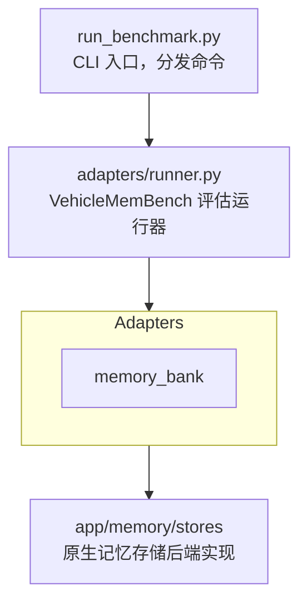

# VehicleMemBench 对比实验

基于 [VehicleMemBench](https://github.com/isyuhaochen/VehicleMemBench) 的车载记忆基准评估框架，支持多种记忆检索策略的对比评估。

---

## 系统架构



## 适配器模式

`adapters/memory_adapters/` 通过统一接口封装 `app/memory/stores/`，使 VehicleMemBench 能以适配器方式调用：

| 适配器 | 封装 | 原理 |
|--------|------|------|
| `NoneAdapter` | - | 无记忆基线，不存储任何信息 |
| `GoldAdapter` | - | Gold标准基线，使用标注数据 |
| `SummaryAdapter` | - | 递归摘要基线，调用VMB的build_memory_recursive_summary |
| `KVAdapter` | - | 键值对基线，调用VMB的build_memory_key_value |
| `MemoryBankAdapter` | `MemoryBankStore` | 遗忘曲线 + 分层记忆 |

---

## 快速开始

### 运行基准测试

```bash
# 全流程（推荐）
uv run python run_benchmark.py all --file-range 1-50

# 分阶段运行
uv run python run_benchmark.py prepare --file-range 1-50
uv run python run_benchmark.py run --file-range 1-50

# 生成报告
uv run python run_benchmark.py report
```

### CLI 参数

| 参数 | 默认值 | 说明 |
|------|--------|------|
| `--file-range` | `1-50` | 评估文件范围（如 `1-10` 或 `1,3,5`） |
| `--memory-types` | `gold,summary,kv,memory_bank` | 记忆类型 |

---

## 数据结构

```text
data/benchmark/
├── qa_{n}.json           # QA 测试用例
├── history_{n}.txt       # 历史交互记录
└── results/              # 运行结果
    └── {memory_type}/
        └── ...
```

---

## 模型配置

基准测试使用独立的 `benchmark` 配置（在 `config/llm.json` 中）：

```json
{
  "benchmark": {
    "model": "MiniMax-M2.7",
    "base_url": "https://api.minimaxi.com/v1",
    "api_key_env": "MINIMAX_API_KEY",
    "temperature": 0.0,
    "max_tokens": 8192
  }
}
```

**环境变量：**

| 变量 | 说明 |
|------|------|
| `MINIMAX_API_KEY` | 基准测试 API Key（用于 `benchmark.api_key_env`） |

---

## VehicleMemBench 子模块

作为 `vendor/VehicleMemBench` 子模块引入，评估逻辑由供应商提供。

---

## 实验结果

实验结果存储在 `data/experiment_results.json`，可通过 API 端点 `GET /api/experiment/report` 获取。
