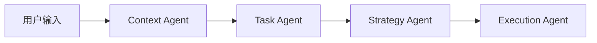
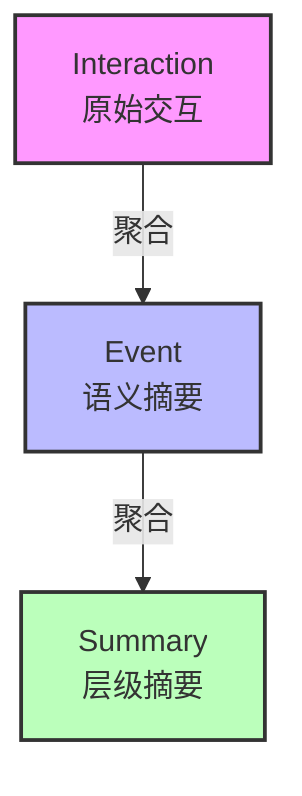
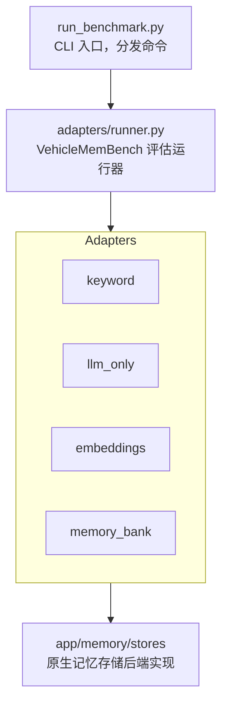

# 知行车秘 - 车载AI智能体原型系统

基于大语言模型的车载智能提醒与日程管理智能体，支持多种记忆检索策略的对比评估（基于 VehicleMemBench 基准测试框架）。

---

## 目录

- [项目概述](#项目概述)
- [项目结构](#项目结构)
- [核心功能](#核心功能)
  - [多Agent工作流](#1-多agent工作流)
  - [记忆检索系统](#2-记忆检索系统)
  - [VehicleMemBench 基准测试](#3-vehiclemembench-基准测试)
  - [REST API](#4-rest-api)
  - [Web界面](#5-web界面)
- [快速开始](#快速开始)
- [配置说明](#配置说明)
- [数据存储](#数据存储)
- [测试](#测试)
- [技术栈](#技术栈)

---

## 项目概述

知行车秘是一个车载AI智能体原型系统，专注于**驾驶场景下的智能提醒和日程管理**。系统基于 LangGraph 构建多Agent协作工作流，支持四种记忆检索策略的对比实验。

### 设计目标

1. **驾驶安全优先**：根据驾驶员状态（专注驾驶、交通拥堵、高速行驶等）智能调整提醒方式
2. **多策略对比**：支持关键词、纯LLM、向量嵌入、MemoryBank 四种记忆检索方式的性能对比
3. **可解释决策**：明确输出提醒决策的理由，支持用户反馈迭代优化

---

## 项目结构

```
thesis-cockpit-memo/
├── app/                          # 应用核心代码
│   ├── agents/                   # AI智能体核心模块
│   │   ├── workflow.py           # LangGraph工作流编排
│   │   ├── state.py              # Agent状态类型定义
│   │   └── prompts.py            # 系统提示词模板
│   ├── models/                   # AI模型封装
│   │   ├── chat.py               # LLM调用封装
│   │   ├── embedding.py          # 嵌入模型封装
│   │   └── settings.py           # ProviderConfig组合配置 + Judge配置
│   ├── memory/                   # 记忆模块
│   │   ├── memory.py             # MemoryModule调度层
│   │   ├── interfaces.py         # MemoryStore Protocol定义
│   │   ├── components.py         # 可组合组件（EventStorage等）
│   │   ├── types.py              # MemoryMode枚举
│   │   ├── schemas.py            # 数据模型定义
│   │   └── stores/               # 各记忆后端实现（组合components）
│   │       ├── embedding_store.py # Embedding检索（混合检索）
│   │       ├── keyword_store.py  # 关键词检索
│   │       ├── llm_store.py      # LLM语义检索
│   │       └── memory_bank_store.py # MemoryBank后端
│   ├── storage/                  # 存储模块
│   │   └── json_store.py         # JSON文件存储
│   └── api/                      # FastAPI接口
│       └── main.py               # REST API
├── adapters/                     # VehicleMemBench适配器层
│   ├── __init__.py               # 适配器注册表
│   ├── model_config.py           # 基准测试模型配置
│   ├── runner.py                 # VehicleMemBench运行器
│   └── memory_adapters/          # 记忆存储策略适配器
│       ├── __init__.py           # 适配器注册表
│       ├── common.py            # 通用工具函数
│       ├── keyword_adapter.py    # 关键词检索适配器
│       ├── llm_only_adapter.py  # LLM语义检索适配器
│       ├── embeddings_adapter.py # 向量嵌入适配器
│       └── memory_bank_adapter.py # MemoryBank适配器
├── config/                       # 配置文件
│   ├── scenarios.json            # 驾驶场景模板
│   ├── driver_states.json        # 驾驶员状态配置
│   └── llm.json                  # 模型配置（含benchmark）
├── data/                         # 数据目录（运行时生成）
├── vendor/VehicleMemBench        # 基准测试子模块
├── tests/                        # 测试
├── webui/                        # Web界面
├── run_benchmark.py              # VehicleMemBench CLI
├── main.py                       # Web服务入口
└── pyproject.toml                # 项目配置
```

---

## 核心功能

### 1. 多Agent工作流

基于 LangGraph 构建的四阶段工作流，每个阶段由专门的Agent处理：



#### Agent职责

| Agent | 输入 | 输出 | 说明 |
|-------|------|------|------|
| **Context Agent** | 用户输入 + 历史记忆 | JSON上下文对象 | 整合时间、位置、交通、用户偏好 |
| **Task Agent** | 用户输入 + 上下文 | JSON任务对象 | 事件抽取、类型归因（meeting/travel/shopping/contact） |
| **Strategy Agent** | 上下文 + 任务 + 个性化策略 | JSON决策对象 | 决定提醒时机、方式、内容 |
| **Execution Agent** | 决策对象 | 执行结果 + event_id | 存储事件，返回提醒内容 |

---

### 2. 记忆检索系统

支持四种检索模式，各 Store 通过组合 `app/memory/components.py` 中的可复用组件实现，无需继承公共基类。通过 `memory_mode` 参数切换：

#### 检索模式对比

| 模式 | 实现类 | 原理 | 适用场景 |
|------|--------|------|----------|
| `keyword` | `KeywordMemoryStore` | 关键词大小写不敏感匹配 | 快速、简单查询 |
| `llm_only` | `LLMOnlyMemoryStore` | LLM判断语义相关性 | 复杂语义理解 |
| `embeddings` | `EmbeddingMemoryStore` | BGE向量余弦相似度 + keyword fallback | 语义模糊查询 |
| `memorybank` | `MemoryBankStore` | Ebbinghaus遗忘曲线 + 分层记忆 + 混合检索 | 长期记忆管理 |

#### MemoryBank 分层记忆结构

基于 MemoryBank 论文实现的三层记忆架构：



**核心机制：**

- **遗忘曲线**：`retention = e^(-days / (5 × strength))`，模拟人类记忆衰减
- **回忆强化**：检索命中时 `memory_strength += 1`，增加记忆留存
- **自动聚合**：语义相似的交互自动聚合为同一事件（余弦相似度 ≥ 0.8 或关键词重叠 ≥ 50%）
- **层级摘要**：事件数达到日阈值后生成 daily_summary，daily_summary 数量达到总阈值后生成 overall_summary
- **结果展开**：检索命中事件时，自动附加其关联的原始交互记录

#### 可组合组件架构

`app/memory/components.py` 提供独立可复用的组件，各 Store 通过组合而非继承共享行为：

| 组件 | 职责 |
|------|------|
| `EventStorage` | 事件 JSON 文件 CRUD + ID 生成 |
| `KeywordSearch` | 关键词大小写不敏感搜索 |
| `FeedbackManager` | 反馈记录 + 策略权重更新 |
| `SimpleInteractionWriter` | 交互记录写入 |
| `MemoryBankEngine` | 遗忘曲线衰减 + 事件聚合 + 分层摘要 |

#### 反馈学习机制

用户反馈（accept/ignore）会更新 `strategies.json` 中的 `reminder_weights`：

- **accept**：对应事件类型权重 +0.1（上限1.0）
- **ignore**：对应事件类型权重 -0.1（下限0.1）

---

### 3. VehicleMemBench 基准测试

基于 [VehicleMemBench](https://github.com/isyuhaochen/VehicleMemBench) 的车载记忆基准评估框架。

#### 系统架构



#### 适配器模式

`adapters/memory_adapters/` 通过统一接口封装 `app/memory/stores/`，使 VehicleMemBench 能以适配器方式调用：

| 适配器 | 封装 | 原理 |
|--------|------|------|
| `KeywordAdapter` | `KeywordMemoryStore` | 关键词大小写不敏感匹配 |
| `LLMOnlyAdapter` | `LLMOnlyMemoryStore` | LLM 判断语义相关性 |
| `EmbeddingsAdapter` | `EmbeddingMemoryStore` | BGE 向量余弦相似度 |
| `MemoryBankAdapter` | `MemoryBankStore` | 遗忘曲线 + 分层记忆 |

#### 运行基准测试

```bash
# 全流程
uv run python run_benchmark.py all --file-range 1-50

# 分阶段运行
uv run python run_benchmark.py prepare --file-range 1-50
uv run python run_benchmark.py run --file-range 1-50

# 生成报告
uv run python run_benchmark.py report
```

#### CLI 参数

| 参数 | 默认值 | 说明 |
|------|--------|------|
| `--file-range` | `1-50` | 评估文件范围（如 `1-10` 或 `1,3,5`） |
| `--memory-types` | `gold,summary,kv,keyword,llm_only,embeddings,memory_bank` | 记忆类型 |

#### 基准测试数据结构

```text
data/benchmark/
├── qa_{n}.json           # QA 测试用例
├── history_{n}.txt       # 历史交互记录
└── results/              # 运行结果
    └── {memory_type}/
        └── ...
```

#### VehicleMemBench 子模块

作为 `vendor/VehicleMemBench` 子模块引入，评估逻辑由供应商提供。

---

### 4. REST API

#### 基础信息

- 基础路径：`/api`
- 服务启动：`python main.py`（默认 `0.0.0.0:8000`）
- Web界面：`/` 根路径返回 `webui/index.html`

#### API端点

##### POST `/api/query` - 处理用户查询

**请求体：**

```json
{
  "query": "明天上午9点有个会议",
  "memory_mode": "keyword"   // 可选: keyword | llm_only | embeddings | memorybank
}
```

**响应：**

```json
{
  "result": "提醒已发送: 明天上午9点会议提醒",
  "event_id": "20260327120000_a1b2c3d4"
}
```

##### POST `/api/feedback` - 提交反馈

**请求体：**

```json
{
  "event_id": "20260327120000_a1b2c3d4",
  "action": "accept",        // accept | ignore
  "modified_content": "修改后的内容"  // 可选
}
```

**响应：**

```json
{
  "status": "success"
}
```

##### GET `/api/history` - 获取历史记录

| 参数 | 类型 | 默认值 | 说明 |
|------|------|--------|------|
| `limit` | int | 10 | 返回记录数（0 = 全部） |

##### GET `/api/experiment/report` - 获取实验报告

---

### 5. Web界面

基于纯HTML/CSS/JavaScript的单页应用，提供：

- **设置面板**：选择记忆检索模式
- **输入面板**：文本输入框发送查询
- **响应面板**：显示AI回复，支持接受/忽略反馈
- **历史记录面板**：展示最近10条交互记录

---

## 快速开始

### 环境要求

- Python 3.13+
- 本地部署 vLLM（Qwen3.5-2B）或 OpenAI 兼容 API

### 1. 安装依赖

```bash
uv sync
```

### 2. 配置环境变量

```bash
# 设置 vLLM 服务地址（默认 http://localhost:8000/v1）
export VLLM_BASE_URL="http://localhost:8000/v1"

# 如需使用 DeepSeek 作为备用
# export DEEPSEEK_API_KEY="your-api-key"
```

### 3. 初始化数据目录

```bash
python -c "from app.storage.init_data import init_storage; init_storage()"
```

### 4. 启动Web服务

```bash
python main.py
```

访问 http://localhost:8000

### 5. 运行基准测试

```bash
# 全流程（推荐）
uv run python run_benchmark.py all --file-range 1-50

# 分阶段运行
uv run python run_benchmark.py prepare --file-range 1-50
uv run python run_benchmark.py run --file-range 1-50

# 生成报告
uv run python run_benchmark.py report
```

---

## 配置说明

### 模型配置 (`config/llm.json`)

所有 LLM、Embedding 模型配置统一在 `config/llm.json` 管理，Python 侧由 `app/models/settings.py` 加载（`LLMSettings.load()`）。配置采用组合模式：`ProviderConfig`（model/base_url/api_key）被各专用配置（`LLMProviderConfig`/`EmbeddingProviderConfig`）组合引用。

基准测试使用独立的 `benchmark` 配置：

```json
{
  "llm": [
    {
      "model": "qwen3.5-2b",
      "base_url": "http://127.0.0.1:50721/v1",
      "api_key": "none",
      "temperature": 0.7
    }
  ],
  "benchmark": {
    "model": "MiniMax-M2.7",
    "base_url": "https://api.minimaxi.com/v1",
    "api_key_env": "MINIMAX_API_KEY",
    "temperature": 0.0,
    "max_tokens": 8192
  },
  "embedding": [
    {
      "model": "BAAI/bge-small-zh-v1.5",
      "device": "cpu"
    }
  ]
}
```

**环境变量覆盖：**

| 变量 | 说明 |
|------|------|
| `VLLM_BASE_URL` | 默认 LLM provider 的 base_url |
| `OPENAI_MODEL` / `DEEPSEEK_MODEL` | 自动注册为额外 LLM provider |
| `MINIMAX_API_KEY` | 基准测试 API Key（用于 `benchmark.api_key_env`） |

### 驾驶场景配置 (`config/scenarios.json`)

| 类型 | 说明 | 示例模板 |
|------|------|----------|
| `schedule_check` | 日程查询 | "今天有什么安排？" |
| `event_add` | 添加事件 | "提醒我下午三点开会" |
| `event_delete` | 删除事件 | "取消明天的会议" |
| `general` | 通用对话 | "你好" |

### 驾驶员状态配置 (`config/driver_states.json`)

| 状态 | 说明 | 容忍度 | 合适方式 |
|------|------|--------|----------|
| `focused` | 专注驾驶 | 低 | visual, audio |
| `traffic_jam` | 交通拥堵 | 中 | visual, audio |
| `parked` | 停车状态 | 高 | visual, audio, detailed |
| `highway` | 高速行驶 | 极低 | audio |
| `city_driving` | 城市驾驶 | 低 | visual, audio |

---

## 数据存储

### 存储目录结构

```
data/
├── events.json               # 事件历史（含 interaction_ids）
├── interactions.json          # 原始交互记录（MemoryBank）
├── memorybank_summaries.json  # MemoryBank 层级摘要
│   ├── daily_summaries: {}    # {date → {content, memory_strength, event_count}}
│   └── overall_summary: ""    # 总摘要
├── contexts.json            # 上下文缓存
├── preferences.json         # 用户偏好
├── feedback.json            # 用户反馈记录
├── strategies.json          # 个性化策略
└── experiment_results.json   # 实验结果
```

### 存储接口 (`app/storage/json_store.py`)

```python
store = JSONStore(data_dir, "filename.json", default_factory=list)

store.read()           # 读取数据
store.write(data)      # 写入数据
store.append(item)     # 追加单项（仅list类型）
store.update(key, val) # 更新键值（仅dict类型）
```

---

## 测试

### 运行所有测试

```bash
uv run pytest tests/ -v
```

### 测试覆盖模块

| 文件 | 说明 |
|------|------|
| `tests/test_adapters/test_adapters.py` | 适配器注册与基础功能 |
| `tests/test_adapters/test_common.py` | 适配器通用工具函数 |
| `tests/test_adapters/test_model_config.py` | 模型配置加载 |
| `tests/test_adapters/test_runner.py` | VehicleMemBench 运行器 |
| `stores/test_keyword_store.py` | Keyword 记忆后端 |
| `stores/test_embedding_store.py` | Embedding 记忆后端 |
| `stores/test_llm_store.py` | LLM 记忆后端 |
| `stores/test_memory_bank_store.py` | MemoryBank 后端 |
| `test_api.py` | API 端点集成测试 |
| `test_chat.py` | Chat 驱动 LLM 记忆搜索、Workflow 上下文注入 |
| `test_embedding.py` | Embedding 语义检索与聚合 |
| `test_memory_bank.py` | 遗忘曲线、层级摘要、交互聚合 |
| `test_storage.py` | 跨实例持久化、反馈策略更新 |
| `test_settings.py` | 模型配置加载与环境变量覆盖 |
| `test_components.py` | 可组合组件 |
| `test_memory_module_facade.py` | MemoryModule 调度层 |

---

## 技术栈

| 类别 | 技术 |
|------|------|
| **Web框架** | FastAPI + Uvicorn |
| **AI工作流** | LangChain + LangGraph |
| **LLM支持** | Qwen3.5-2B (vLLM, 默认), DeepSeek-chat, GPT-4, Claude-3 (OpenAI兼容接口) |
| **LLM推理** | vLLM (本地部署), OpenAI兼容接口 |
| **嵌入模型** | BGE-small-zh-v1.5 (HuggingFace) |
| **记忆系统** | MemoryBank (Ebbinghaus遗忘曲线 + 分层摘要) |
| **数据存储** | JSON文件 (标准库json) |
| **数据集** | HuggingFace Datasets |
| **基准测试** | VehicleMemBench (vendor 子模块) |
| **开发工具** | uv (包管理), pytest (测试), ruff (lint), ty (类型检查) |

---

## License

MIT
