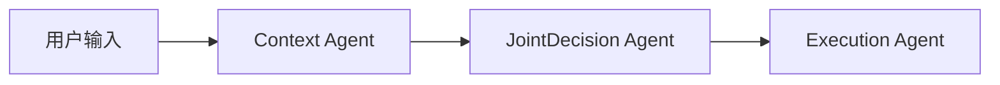
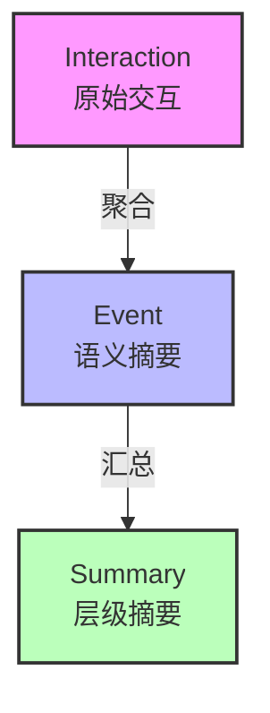

# 知行车秘 - 车载AI智能体原型系统

基于大语言模型的车载智能提醒与日程管理智能体，支持多Agent工作流、情境感知规则引擎和基于遗忘曲线的长期记忆管理。

---

## 项目概述

知行车秘是一个车载AI智能体原型系统，专注于**驾驶场景下的智能提醒和日程管理**。系统基于三Agent协作工作流（Context → JointDecision → Execution），支持 MemoryBank 长期记忆管理策略，并通过请求级上下文注入集成外部数据（驾驶员状态、时空信息、交通状况）。

### 设计目标

1. **驾驶安全优先**：轻量规则引擎基于驾驶员状态自动约束提醒方式
2. **情境感知**：通过 GraphQL API 接收细粒度外部数据，跳过 LLM 编造上下文
3. **遗忘曲线记忆**：基于 Ebbinghaus 遗忘曲线实现记忆衰减与强化
4. **可解释决策**：三阶段工作流各节点输出可独立审查
5. **交互灵活性**：支持多格式输出、主动触发、流式响应、多轮对话、快捷指令

---

## 核心架构

### 多Agent工作流



三阶段流水线，各阶段职责概览：

| Agent | 说明 |
|-------|------|
| **Context Agent** | 有外部数据时直接使用，无数据时 LLM 推断 |
| **JointDecision Agent** | 事件归因 + 策略决策（合原 Task + Strategy 为一次 LLM 调用），前有规则引擎安全约束 |
| **Execution Agent** | 存储事件，路由多格式输出，规则后处理强制覆盖 |

### 记忆系统

基于 MemoryBank 论文的三层记忆架构：



核心机制：FAISS 向量索引 + Ebbinghaus 遗忘曲线 + 回忆强化 + 自动聚合 + 分层摘要。

### 规则引擎

数据驱动的安全约束系统，基于驾驶场景和驾驶员状态自动限制提醒通道与频率（如高速仅音频、疲劳抑制、过载延后等）。规则后处理函数在 LLM 输出后强制执行，不可绕过。

---

## 交互能力

| 能力 | 说明 |
|------|------|
| **多格式输出** | visual（屏幕文字）、audio（语音播报）、detailed（详细图文） |
| **主动触发** | 定时、定位、延时三种触发模式 |
| **SSE 流式** | 按 Agent 阶段推送进度事件 |
| **多轮对话** | session-based 连续对话 |
| **快捷指令** | 预定义高频场景，跳过 LLM 流水线 |
| **反馈学习** | accept/ignore 反馈自动调整事件类型偏好权重 |

---

## 项目结构

```
main.py                # Uvicorn 入口
app/
├── agents/            # 工作流编排、规则引擎、概率推断、提示词
│   ├── workflow.py    #   三阶段流水线
│   ├── rules.py       #   规则引擎
│   ├── prompts.py     #   系统提示词
│   ├── outputs.py     #   多格式输出路由
│   ├── pending.py     #   待触发提醒管理
│   ├── conversation.py #  多轮对话
│   ├── shortcuts.py   #   快捷指令
│   ├── probabilistic.py # 概率推断
│   └── state.py       #   工作流状态定义
├── api/               # GraphQL API (Strawberry + FastAPI)
│   ├── main.py        #   应用入口 + SSE 端点
│   ├── graphql_schema.py
│   ├── stream.py      #   流式响应
│   └── resolvers/     #   Query/Mutation/错误/转换
├── models/            # LLM/Embedding 封装（多provider fallback）
├── memory/            # MemoryBank 记忆系统
│   ├── memory_bank/   #   FAISS 索引 + 遗忘曲线 + 摘要
│   ├── stores/        #   扩展点（预留）
│   └── ...            #   单例/接口/隐私/异常
├── schemas/           # 驾驶上下文 Pydantic 数据模型
├── storage/           # TOML/JSONL 持久化引擎
└── config.py          # 应用配置
config/                # 模型/规则/快捷指令 TOML 配置
data/                  # 运行时数据（用户隔离）
webui/                 # 模拟测试工作台（纯前端）
tests/                 # 测试（镜像 app/ 结构）
scripts/               # 工具脚本
experiments/           # 消融实验
```

> 开发者文档见各目录的 `AGENTS.md`（接口契约、阈值、错误处理等实现细节）。

---

## GraphQL API

基于 Strawberry GraphQL 的 code-first API。

**端点：** `/graphql`（内置 Playground）

### 核心 Mutation

```graphql
mutation {
  processQuery(input: {
    query: "明天上午9点有个会议"
    memoryMode: MEMORY_BANK
    context: {
      driver: { emotion: "calm", workload: "normal", fatigueLevel: 0.2 }
      spatial: {
        currentLocation: { latitude: 39.9042, longitude: 116.4074, address: "北京市东城区", speedKmh: 0 }
        destination: { latitude: 39.9142, longitude: 116.4174, address: "国贸大厦" }
        etaMinutes: 25
      }
      traffic: { congestionLevel: "smooth", incidents: [], estimatedDelayMinutes: 0 }
      scenario: "parked"
    }
  }) {
    result eventId
    stages { context task decision execution }
  }
}
```

### 其他操作

```graphql
# 反馈学习
mutation { submitFeedback(input: { eventId: "xxx", action: accept }) { status } }

# 待触发提醒轮询
mutation { pollPendingReminders { triggered { id content } } }

# 场景预设
mutation { saveScenarioPreset(input: { name: "高速驾驶", context: { scenario: "highway" } }) { id name } }

# 数据管理
mutation { exportData(currentUser: "default") { filePath } }
```

---

## 隐私保护

- 所有数据存储在本地 `data/users/` 目录，无云端同步
- LLM 调用仅发送当前查询文本及必要上下文摘要，不发送原始记忆数据
- 位置信息自动脱敏（经纬度截断至约 1km 精度）
- 支持 `exportData` / `deleteAllData` 数据可携带

---

## 快速开始

### 环境要求

- Python 3.14+
- LLM API（DeepSeek / OpenAI 兼容接口 / 本地 vLLM）

### 安装与启动

```bash
# 1. 安装依赖
uv sync

# 2. 配置 LLM（编辑 config/llm.toml 或设置环境变量）
export DEEPSEEK_API_KEY="your-api-key"

# 3. 启动服务（数据目录自动初始化）
uv run uvicorn app.api.main:app
```

- 模拟测试工作台：http://localhost:8000
- GraphQL Playground：http://localhost:8000/graphql

---

## 基准测试

基准测试独立为外部项目 [MiyakoMeow/VehicleMemBench](https://github.com/MiyakoMeow/VehicleMemBench)，提供 50 组数据集、23 个车辆模块模拟器、五种记忆策略对比。本项目的 MemoryBank 实现已与 VehicleMemBench 对齐，可直接运行对照实验。

---

## License

Apache-2.0
