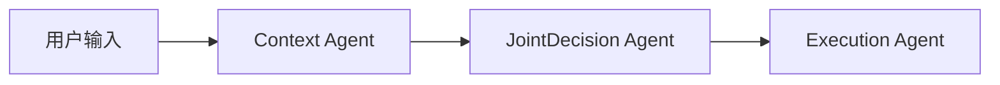
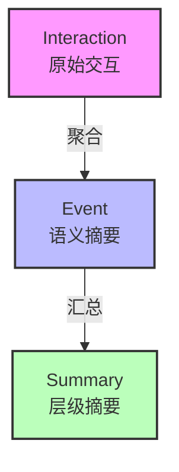

# 知行车秘 - 车载AI智能体原型系统

基于大语言模型的车载智能提醒与日程管理智能体，支持多Agent工作流、情境感知规则引擎和基于遗忘曲线的长期记忆管理。集成语音被动记录、主动提醒调度与工具调用能力。

---

## 项目概述

知行车秘是一个车载AI智能体原型系统，专注于**驾驶场景下的智能提醒和日程管理**。系统基于三Agent协作工作流（Context → JointDecision → Execution），支持 MemoryBank 长期记忆管理策略，并通过请求级上下文注入集成外部数据（驾驶员状态、时空信息、交通状况）。

### 设计目标

1. **驾驶安全优先**：轻量规则引擎基于驾驶员状态自动约束提醒方式
2. **情境感知**：通过 REST API 接收细粒度外部数据，跳过 LLM 编造上下文
3. **遗忘曲线记忆**：基于 Ebbinghaus 遗忘曲线实现记忆衰减与强化
4. **可解释决策**：三阶段工作流各节点输出可独立审查
5. **交互灵活性**：支持多格式输出、主动触发、流式响应、多轮对话、快捷指令

---

## 核心架构

### 多Agent工作流



三阶段流水线，各阶段职责概览：

| Agent | 说明 |
|-------|------|
| **Context Agent** | 有外部数据时直接使用，无数据时 LLM 推断 |
| **JointDecision Agent** | 事件归因 + 策略决策 + 工具调用（合原 Task + Strategy 为一次 LLM 调用），前有规则引擎安全约束 |
| **Execution Agent** | 存储事件，路由多格式输出，规则后处理强制覆盖，工具执行 |

### 记忆系统

基于 MemoryBank 论文的三层记忆架构：



核心机制：FAISS 向量索引 + Ebbinghaus 遗忘曲线 + 回忆强化 + 自动聚合 + 分层摘要。

### 规则引擎

数据驱动的安全约束系统，基于驾驶场景和驾驶员状态自动限制提醒通道与频率（如高速仅音频、疲劳抑制、过载延后等）。规则后处理函数在 LLM 输出后强制执行，不可绕过。

---

## 交互能力

| 能力 | 说明 |
|------|------|
| **语音被动记录** | 车载麦克风持续监听 → VAD 切分 → ASR 转录 → 自动写 Memory |
| **主动提醒** | 后台调度器轮询 5 种触发源（场景变化/位置接近/定时/状态/周期性） |
| **工具调用** | 导航/通信/车控/记忆查询等内置工具，JointDecision 决策时触发 |
| **多格式输出** | visual（屏幕文字）、audio（语音播报）、detailed（详细图文） |
| **SSE 流式** | 按 Agent 阶段推送进度事件 |
| **多轮对话** | session-based 连续对话 |
| **快捷指令** | 预定义高频场景，跳过 LLM 流水线 |
| **反馈学习** | accept/ignore 反馈自动调整事件类型偏好权重 |

---

## 项目结构

```
main.py                # Uvicorn 入口
app/
├── agents/            # 工作流编排、规则引擎、概率推断、提示词
│   ├── workflow.py    #   三阶段流水线
│   ├── rules.py       #   规则引擎
│   ├── prompts.py     #   系统提示词
│   ├── outputs.py     #   多格式输出路由
│   ├── pending.py     #   待触发提醒管理
│   ├── conversation.py #  多轮对话
│   ├── shortcuts.py   #   快捷指令
│   ├── probabilistic.py # 概率推断
│   └── state.py       #   工作流状态定义
├── voice/             # 语音流水线（录音→VAD→ASR）
│   ├── pipeline.py    #   VAD→ASR 编排
│   ├── recorder.py    #   麦克风录音
│   ├── vad.py         #   语音活动检测
│   └── asr.py         #   sherpa-onnx ASR 引擎
├── scheduler/         # 主动调度器（后台触发引擎）
│   ├── scheduler.py   #   主循环
│   ├── context_monitor.py  # 上下文变化检测
│   ├── memory_scanner.py   # 记忆检索
│   └── trigger_evaluator.py# 触发评估
├── tools/             # 工具调用框架
│   ├── registry.py    #   工具注册表
│   ├── executor.py    #   工具执行器
│   └── tools/         #   内置工具（导航/通信/车控/记忆查询）
├── api/               # REST API (FastAPI)
│   ├── main.py        #   应用入口 + SSE 端点
│   ├── stream.py      #   流式响应
│   └── routes/        #   路由定义（query/feedback/presets/data/reminders/sessions）
├── models/            # LLM/Embedding 封装（多provider fallback）
├── memory/            # MemoryBank 记忆系统
│   ├── memory_bank/   #   FAISS 索引 + 遗忘曲线 + 摘要
│   ├── stores/        #   扩展点（预留）
│   └── ...            #   单例/接口/隐私/异常
├── schemas/           # 驾驶上下文 Pydantic 数据模型
├── storage/           # TOML/JSONL 持久化引擎
└── config.py          # 应用配置
config/                # 模型/规则/快捷指令/语音/调度/工具 TOML 配置
data/                  # 运行时数据（用户隔离）
data/models/           # ASR 模型文件（需手动下载）
webui/                 # 模拟测试工作台（纯前端）
tests/                 # 测试（镜像 app/ 结构）
scripts/               # 工具脚本
experiments/           # 消融实验
```

> 开发者文档见各目录的 `AGENTS.md`（接口契约、阈值、错误处理等实现细节）。

---

## REST API

基于 FastAPI 的 REST API。

**端点：** `/api` 前缀，详见 [app/api/AGENTS.md](app/api/AGENTS.md)

### 核心端点

```
POST /api/query          # 处理用户查询
POST /api/query/stream   # SSE 流式返回各阶段结果
POST /api/feedback       # 提交用户反馈
GET  /api/history        # 查询历史记忆事件
GET  /api/presets         # 查询场景预设
POST /api/presets         # 保存场景预设
```

### 请求示例

```json
POST /api/query/stream
{
  "query": "明天上午9点有个会议",
  "current_user": "default",
  "context": {
    "driver": { "emotion": "calm", "workload": "normal", "fatigue_level": 0.2 },
    "spatial": {
      "current_location": { "latitude": 39.9042, "longitude": 116.4074, "address": "北京市东城区", "speed_kmh": 0 },
      "destination": { "latitude": 39.9142, "longitude": 116.4174, "address": "国贸大厦" },
      "eta_minutes": 25
    },
    "traffic": { "congestion_level": "smooth", "incidents": [], "estimated_delay_minutes": 0 },
    "scenario": "parked"
  }
}
```

### 其他操作

```
POST   /api/feedback              # 反馈学习（accept/ignore）
POST   /api/reminders/poll        # 车机端轮询待触发提醒
POST   /api/presets               # 保存场景预设
GET    /api/export?current_user=default  # 导出数据
DELETE /api/data?current_user=default    # 删除数据
```

---

## 隐私保护

- 所有数据存储在本地 `data/users/` 目录，无云端同步
- LLM 调用仅发送当前查询文本及必要上下文摘要，不发送原始记忆数据
- 位置信息自动脱敏（经纬度截断至约 1km 精度）
- 支持 `exportData` / `deleteAllData` 数据可携带

---

## 快速开始

### 环境要求

- Python 3.14+
- LLM API（DeepSeek / OpenAI 兼容接口 / 本地 vLLM）
- sherpa-onnx 自动安装，运行时需要 onnxruntime==1.24.4（自动安装）

### 安装与启动

```bash
# 1. 安装依赖
uv sync

# 2. 配置 LLM（编辑 config/llm.toml 或设置环境变量）
export DEEPSEEK_API_KEY="your-api-key"

# 3. （可选）下载 ASR 模型—启用语音被动记录
mkdir -p data/models
wget -qO- https://github.com/k2-fsa/sherpa-onnx/releases/download/asr-models/sherpa-onnx-sense-voice-zh-en-ja-ko-yue-2024-07-17.tar.bz2 \
  | tar -xj -C data/models/
mv data/models/sherpa-onnx-sense-voice-zh-en-ja-ko-yue-2024-07-17 data/models/sense_voice
# 小资源环境可用 int8 量化版：编辑 config/voice.toml 将 model 路径指向 model.int8.onnx

# 4. 启动服务（数据目录和 ASR 模型自动初始化）
uv run uvicorn app.api.main:app
```

- 模拟测试工作台：http://localhost:8000
- REST API 文档：http://localhost:8000/docs（Swagger UI）

> **注意：** ASR 模型约 1GB 下载量。首次启动时系统自动创建 onnxruntime 符号链接（约 1 秒）。若 ASR 模型未下载，语音流水线静默降级返回空文本，不影响其他功能。

---

## 基准测试

基准测试独立为外部项目 [MiyakoMeow/VehicleMemBench](https://github.com/MiyakoMeow/VehicleMemBench)，提供 50 组数据集、23 个车辆模块模拟器、五种记忆策略对比。本项目的 MemoryBank 实现已与 VehicleMemBench 对齐，可直接运行对照实验。

---

## License

Apache-2.0
