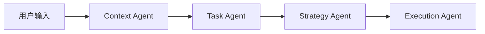
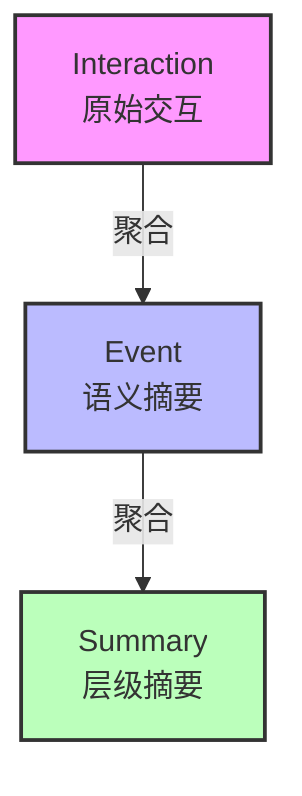

# 知行车秘 - 车载AI智能体原型系统

基于大语言模型的车载智能提醒与日程管理智能体，支持多Agent工作流、情境感知规则引擎和基于遗忘曲线的长期记忆管理。

---

## 目录

- [项目概述](#项目概述)
- [项目结构](#项目结构)
- [核心功能](#核心功能)
  - [多Agent工作流](#1-多agent工作流)
  - [上下文注入与规则引擎](#2-上下文注入与规则引擎)
  - [记忆检索系统](#3-记忆检索系统)
  - [GraphQL API](#4-graphql-api)
  - [模拟测试工作台](#5-模拟测试工作台)
- [快速开始](#快速开始)
- [开发指南](#开发指南)
- [License](#license)

---

## 项目概述

知行车秘是一个车载AI智能体原型系统，专注于**驾驶场景下的智能提醒和日程管理**。系统基于多Agent协作工作流（Context → Task → Strategy → Execution），支持 MemoryBank 长期记忆管理策略，并通过请求级上下文注入实现外部数据（驾驶员状态、时空信息、交通状况）的集成。

### 设计目标

1. **驾驶安全优先**：轻量规则引擎基于驾驶员状态（疲劳、工作负荷、驾驶场景）自动约束提醒方式
2. **情境感知**：通过 GraphQL API 接收细粒度外部数据（经纬度、车速、ETA、拥堵等级），跳过 LLM 编造上下文
3. **遗忘曲线记忆**：基于 Ebbinghaus 遗忘曲线实现记忆衰减与强化，模拟人类记忆机制
4. **可解释决策**：四阶段工作流各节点输出可独立审查，支持用户反馈迭代优化

---

## 项目结构

```
thesis-cockpit-memo/
├── app/                          # 应用核心代码
│   ├── agents/                   # AI智能体核心模块
│   │   ├── workflow.py           # 多Agent工作流编排（四阶段流水线）
│   │   ├── state.py              # Agent状态类型定义 + WorkflowStages
│   │   ├── rules.py              # 轻量规则引擎（安全约束规则 + 合并策略）
│   │   └── prompts.py            # 系统提示词模板
│   ├── api/                      # GraphQL API 层
│   │   ├── main.py               # FastAPI 应用入口 + GraphQL 挂载
│   │   ├── graphql_schema.py     # Strawberry schema 定义
│   │   └── resolvers/            # GraphQL resolvers
│   │       ├── query.py          #   Query resolvers
│   │       └── mutation.py       #   Mutation resolvers
│   ├── models/                   # AI模型封装
│   │   ├── chat.py               # LLM调用封装（多provider自动fallback，纯异步）
│   │   ├── embedding.py          # 嵌入模型封装（纯远程OpenAI兼容接口）
│   │   ├── settings.py           # 模型组/Provider配置加载
│   │   ├── model_string.py       # 模型字符串解析工具
│   │   ├── _http.py              # HTTP客户端共享超时配置（12h read timeout）
│   │   ├── types.py              # 纯数据类型（ProviderConfig等）
│   │   └── exceptions.py         # 模型异常定义
│   ├── memory/                   # 记忆模块
│   │   ├── memory.py             # MemoryModule Facade（工厂注册表）
│   │   ├── interfaces.py         # MemoryStore Protocol定义
│   │   ├── components.py         # 可组合组件（EventStorage等）
│   │   ├── singleton.py          # 记忆模块单例（线程安全延迟初始化）
│   │   ├── types.py              # MemoryMode枚举（memory_bank）
│   │   ├── schemas.py            # 记忆数据模型定义
│   │   ├── utils.py              # 记忆模块共享工具函数
│   │   └── stores/               # 各记忆后端实现
│   │       └── memory_bank/      # MemoryBank后端
│   │           ├── store.py      #   MemoryStore Protocol 实现（Facade）
│   │           ├── faiss_index.py #   FAISS 索引管理（IndexFlatIP）
│   │           ├── retrieval.py   #   四阶段检索管道
│   │           ├── forget.py      #   遗忘曲线（Ebbinghaus + 概率模式）
│   │           ├── summarizer.py  #   分层摘要与人格生成
│   │           └── llm.py        #   LLM 封装（上下文截断重试）
│   ├── schemas/                  # 通用数据模型
│   │   └── context.py            # 驾驶上下文数据模型（DrivingContext等）
│   ├── config.py                 # 应用配置（DATA_DIR等）
│   ├── storage/                  # 存储模块
│   │   ├── toml_store.py         # TOML文件存储引擎
│   │   └── init_data.py          # 数据目录初始化
├── config/                       # 配置文件
│   └── llm.toml                  # 模型组+Provider配置
├── data/                         # 数据目录（运行时生成）
├── tests/                        # 测试
├── webui/                        # 模拟测试工作台（Web UI）
├── main.py                       # 服务入口
└── pyproject.toml                # 项目配置
```

---

## 核心功能

### 1. 多Agent工作流

自定义四阶段流水线工作流，每个阶段由专门的Agent处理。**所有工作流方法均为异步（async/await）。**



#### Agent职责

| Agent | 输入 | 输出 | 说明 |
|-------|------|------|------|
| **Context Agent** | 用户输入 + 历史记忆 + 外部上下文 | JSON上下文对象 | 有外部数据时直接使用，无数据时 LLM 推断 |
| **Task Agent** | 用户输入 + 上下文 | JSON任务对象 | 事件抽取、类型归因（meeting/travel/shopping/contact） |
| **Strategy Agent** | 上下文 + 任务 + 安全约束 + 个性化策略 | JSON决策对象 | 在安全约束范围内决定提醒时机、方式、内容 |
| **Execution Agent** | 决策对象 | 执行结果 + event_id | 存储事件，返回提醒内容 |

#### 工作流阶段输出

通过 `run_with_stages()` 方法获取各阶段的详细输出，用于调试和可解释性：

```python
result, event_id, stages = await workflow.run_with_stages(
    "明天上午9点有个会议",
    driving_context={"scenario": "highway", "driver": {"fatigue_level": 0.8}},
)
# stages.context / stages.task / stages.decision / stages.execution
```

---

### 2. 上下文注入与规则引擎

#### 外部上下文注入

通过 GraphQL API 的 `processQuery` mutation 传入 `DrivingContext`，包含细粒度驾驶环境数据：

| 数据类别 | 字段 | 说明 |
|----------|------|------|
| **驾驶员状态** | `emotion`, `workload`, `fatigue_level` | 情绪（5级）、工作负荷（4级）、疲劳度（0~1） |
| **时空信息** | `currentLocation`, `destination`, `etaMinutes`, `heading` | 经纬度、街道地址、车速 |
| **交通状况** | `congestionLevel`, `incidents`, `estimatedDelayMinutes` | 拥堵等级（4级）、事故列表 |
| **驾驶场景** | `scenario` | parked / city_driving / highway / traffic_jam |

当提供外部上下文时，Context Agent 跳过 LLM 推断，直接使用注入数据构建上下文对象。

#### 轻量规则引擎

规则引擎在 Task Agent 之后、Strategy Agent 之前执行，基于 `DrivingContext` 应用安全约束：

| 规则 | 条件 | 约束 |
|------|------|------|
| 高速仅音频 | `scenario == "highway"` | `allowed_channels: [audio]`, `max_frequency_minutes: 30` |
| 疲劳抑制 | `fatigue_level > 0.7` | `only_urgent: true`, `allowed_channels: [audio]` |
| 过载延后 | `workload == "overloaded"` | `postpone: true` |
| 停车全通道 | `scenario == "parked"` | `allowed_channels: [visual, audio, detailed]` |

多规则匹配时按优先级合并：`allowed_channels` 取交集（空集时回退到 `{"visual", "audio", "detailed"}`），`only_urgent` / `postpone` 取布尔或。

---

### 3. 记忆检索系统

#### MemoryBank（FAISS 向量索引 + 遗忘曲线）

基于 MemoryBank 论文实现的三层记忆架构，使用 **FAISS IndexFlatIP** + **L2 归一化**（等价余弦相似度）的向量检索：



- **向量索引**：FAISS IndexFlatIP + L2 归一化（精确内积搜索），每日检索时重建索引确保最新数据
- **自适应分块**：基于事件长度 P90 百分位动态校准分块大小，平衡检索粒度与性能
- **四阶段检索管道**：粗排（FAISS top-k）→ 邻居合并（相邻分块拼接）→ 重叠去重（按事件 ID 合并）→ 说话人过滤（可选）
- **遗忘曲线**：`retention = e^(-days / (5 × strength))`，确定性阈值模式（默认 `retention < SOFT_FORGET_THRESHOLD=0.15` 标记遗忘），可选概率性模式（`MEMORYBANK_FORGET_MODE=probabilistic`）
- **回忆强化**：检索命中时 `memory_strength += 1`，增加记忆留存
- **自动聚合**：写入交互时扫描全部当日事件取最高相似度（余弦相似度 ≥ 0.8 或字符重叠 ≥ 45%），满足则聚合
- **分层摘要**：事件数达到日阈值后生成 daily_summary，达到总阈值后生成 overall_summary，附带人格画像
- **结果展开**：检索命中事件时，自动附加其关联的原始交互记录

#### 与原始 MemoryBank 论文的实现对比

基于 [MemoryBank-SiliconFriend](https://github.com/zhongwanjun/MemoryBank-SiliconFriend)（论文 [MemoryBank: Enhancing Large Language Models with Long-Term Memory](https://arxiv.org/pdf/2305.10250.pdf)）实现。核心机制（遗忘曲线、记忆强化、双层摘要、人格分析）均已覆盖，同时在事件聚合、搜索评分等方面做了工程改进。详细的逐行对比分析见 [DEV.md - MemoryBank 实现差异分析](./DEV.md#memorybank-实现差异分析)。

#### 可组合组件架构

`app/memory/components.py` 提供独立可复用的组件，各 Store 通过组合而非继承共享行为：

| 组件 | 职责 |
|------|------|
| `KeywordSearch` | 关键词搜索回退（embedding 无结果时使用） |
| `FeedbackManager` | 反馈记录 + 策略权重更新 |

#### 反馈学习机制

用户反馈（accept/ignore）会更新 `strategies.toml` 中的 `reminder_weights`：

- **accept**：对应事件类型权重 +0.1（上限1.0）
- **ignore**：对应事件类型权重 -0.1（下限0.1）

**关键阈值**：
- 遗忘曲线软阈值：`SOFT_FORGET_THRESHOLD = 0.15`
- 聚合相似度阈值：余弦相似度 ≥ 0.8 或字符重叠 ≥ 45%
- 向量搜索最低相似度：`EMBEDDING_MIN_SIMILARITY = 0.3`
- 搜索评分权重：摘要/个性 `SUMMARY_WEIGHT = 0.8`

---

### 4. GraphQL API

基于 [Strawberry GraphQL](https://strawberry.rocks/) 的 code-first GraphQL API，与 FastAPI 集成。

#### 基础信息

- 端点：`/graphql`（GraphQL Playground 可用）
- 服务启动：`python main.py`（默认 `0.0.0.0:8000`）

#### Query

```graphql
type Query {
  history(limit: Int = 10, memoryMode: MemoryMode! = MEMORY_BANK): [MemoryEvent!]!
  scenarioPresets: [ScenarioPreset!]!
}
```

#### Mutation

```graphql
type Mutation {
  processQuery(input: ProcessQueryInput!): ProcessQueryResult!
  submitFeedback(input: FeedbackInput!): FeedbackResult!
  saveScenarioPreset(input: ScenarioPresetInput!): ScenarioPreset!
  deleteScenarioPreset(id: String!): Boolean!
}
```

#### 核心查询示例 — 带上下文注入

```graphql
mutation {
  processQuery(input: {
    query: "明天上午9点有个会议"
    memoryMode: MEMORY_BANK
    context: {
      driver: { emotion: "calm", workload: "normal", fatigueLevel: 0.2 }
      spatial: {
        currentLocation: { latitude: 39.9042, longitude: 116.4074, address: "北京市东城区", speedKmh: 0 }
        destination: { latitude: 39.9142, longitude: 116.4174, address: "国贸大厦" }
        etaMinutes: 25
      }
      traffic: { congestionLevel: "smooth", incidents: [], estimatedDelayMinutes: 0 }
      scenario: "parked"
    }
  }) {
    result eventId
    stages { context task decision execution }
  }
}
```

#### 场景预设管理

```graphql
# 保存预设
mutation { saveScenarioPreset(input: { name: "高速驾驶", context: { scenario: "highway" } }) { id name } }

# 加载预设
query { scenarioPresets { id name context { scenario driver { emotion } } } }

# 删除预设
mutation { deleteScenarioPreset(id: "abc123") }
```

---

### 5. 模拟测试工作台

基于纯 HTML/CSS/JavaScript 的单页应用，作为场景模拟与工作流调试工具：

- **场景配置面板**：配置驾驶员状态、时空信息、交通状况、驾驶场景
- **场景预设**：保存/加载模拟场景，快速切换测试场景
- **工作流调试**：展示四个 Agent 各阶段的 JSON 输出（Context/Task/Strategy/Execution）
- **反馈按钮**：接受/忽略提醒，验证反馈学习机制
- **历史记录**：查看最近交互记录
- **GraphQL Playground**：通过底部链接访问高级查询界面

#### 启动方式

WebUI 由 FastAPI 静态文件服务托管，无需单独构建或启动前端开发服务器。数据目录在服务启动时自动初始化。

```bash
# 1. 安装依赖（首次）
uv sync

# 2. 启动服务
python main.py
```

- 模拟测试工作台：http://localhost:8000
- GraphQL Playground：http://localhost:8000/graphql

---

## 快速开始

### 环境要求

- Python 3.14+
- 本地部署 vLLM（Qwen3.5-2B）或 OpenAI 兼容 API

### 1. 安装依赖

```bash
uv sync
```

### 2. 配置

编辑 `config/llm.toml` 中的 `model_providers` 和 `model_groups`。也可通过环境变量覆盖：

```bash
# 示例：设置 MiniMax API Key（用于 balanced 模型组）
export MINIMAX_API_KEY="your-api-key"
```

### 3. 启动Web服务

数据目录在服务启动时自动初始化，无需手动操作。

```bash
python main.py
```

- 模拟测试工作台：http://localhost:8000
- GraphQL Playground：http://localhost:8000/graphql

---

## 开发指南

详见 [DEV.md](./DEV.md)。

---

## 隐私保护

- 所有数据存储在本地 `data/users/` 目录下
- 无云端同步、无遥测、无第三方数据共享
- LLM 调用不发送原始记忆数据至外部——仅发送当前查询文本、规则约束及必要上下文摘要
- 用户可关闭记忆功能减少数据暴露
- 支持通过 GraphQL `exportData` / `deleteAllData` 导出或删除个人数据

---

## License

MIT
