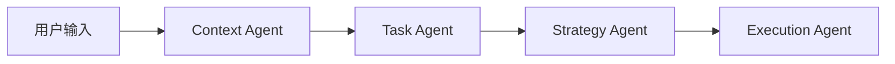
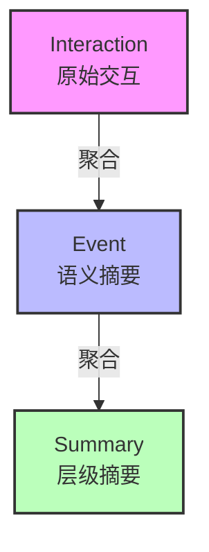
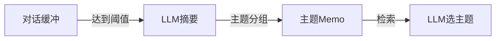

# 知行车秘 - 车载AI智能体原型系统

基于大语言模型的车载智能提醒与日程管理智能体，支持多种记忆检索策略的对比评估（基于 VehicleMemBench 基准测试框架）。

---

## 目录

- [项目概述](#项目概述)
- [项目结构](#项目结构)
- [核心功能](#核心功能)
  - [多Agent工作流](#1-多agent工作流)
  - [记忆检索系统](#2-记忆检索系统)
  - [对比实验](#3-对比实验)
  - [REST API](#4-rest-api)
  - [Web界面](#5-web界面)
- [快速开始](#快速开始)
- [开发指南](#开发指南)
- [License](#license)

---

## 项目概述

知行车秘是一个车载AI智能体原型系统，专注于**驾驶场景下的智能提醒和日程管理**。系统基于多Agent协作工作流（Context → Task → Strategy → Execution），支持 MemoryBank 和 MemoChat 两种长期记忆管理策略。

### 设计目标

1. **驾驶安全优先**：根据驾驶员状态（专注驾驶、交通拥堵、高速行驶等）智能调整提醒方式
2. **遗忘曲线记忆**：基于 Ebbinghaus 遗忘曲线实现记忆衰减与强化，模拟人类记忆机制
3. **可解释决策**：明确输出提醒决策的理由，支持用户反馈迭代优化

---

## 项目结构

```
thesis-cockpit-memo/
├── app/                          # 应用核心代码
│   ├── agents/                   # AI智能体核心模块
│   │   ├── workflow.py           # 多Agent工作流编排（四阶段流水线）
│   │   ├── state.py              # Agent状态类型定义
│   │   └── prompts.py            # 系统提示词模板
│   ├── models/                   # AI模型封装
│   │   ├── chat.py               # LLM调用封装（多provider自动fallback）
│   │   ├── embedding.py          # 嵌入模型封装
│   │   └── settings.py           # 模型组/Provider配置加载
│   ├── memory/                   # 记忆模块
│   │   ├── memory.py             # MemoryModule Facade（工厂注册表）
│   │   ├── interfaces.py         # MemoryStore Protocol定义
│   │   ├── components.py         # 可组合组件（EventStorage等）
│   │   ├── types.py              # MemoryMode枚举（memory_bank/memochat）
│   │   ├── schemas.py            # 数据模型定义
│   │   └── stores/               # 各记忆后端实现
│   │       ├── memory_bank/      # MemoryBank后端
│   │       │   ├── store.py      #   薄Facade
│   │       │   ├── engine.py     #   核心引擎（遗忘曲线+聚合+摘要）
│   │       │   ├── personality.py #  个性分析管理器
│   │       │   └── summarization.py # 分层摘要管理器
│   │       └── memochat/         # MemoChat后端
│   │           ├── store.py      #   薄Facade
│   │           ├── engine.py     #   对话缓冲+LLM摘要引擎
│   │           ├── retriever.py  #   检索策略（Full LLM / Hybrid）
│   │           └── prompts.py    #   车载场景提示词
│   ├── storage/                  # 存储模块
│   │   ├── toml_store.py         # TOML文件存储引擎
│   │   └── init_data.py          # 数据目录初始化
│   └── api/                      # FastAPI接口
│       └── main.py               # REST API
├── adapters/                     # VehicleMemBench适配器层
│   ├── __init__.py               # 适配器注册表
│   ├── model_config.py           # 模型字符串解析（provider/model?params）
│   ├── runner.py                 # VehicleMemBench运行器
│   └── memory_adapters/          # 记忆存储策略适配器
│       ├── __init__.py           # 适配器注册表
│       ├── common.py            # 通用工具函数
│       └── memory_bank_adapter.py # MemoryBank适配器
├── config/                       # 配置文件
│   ├── scenarios.toml            # 驾驶场景模板
│   ├── driver_states.toml        # 驾驶员状态配置
│   └── llm.toml                  # 模型组+Provider配置
├── data/                         # 数据目录（运行时生成）
├── vendor/VehicleMemBench        # 基准测试子模块
├── tests/                        # 测试
├── webui/                        # Web界面
├── run_benchmark.py              # VehicleMemBench CLI
├── main.py                       # Web服务入口
└── pyproject.toml                # 项目配置
```

---

## 核心功能

### 1. 多Agent工作流

自定义四阶段流水线工作流，每个阶段由专门的Agent处理。**所有工作流方法均为异步（async/await）。**



#### Agent职责

| Agent | 输入 | 输出 | 说明 |
|-------|------|------|------|
| **Context Agent** | 用户输入 + 历史记忆 | JSON上下文对象 | 整合时间、位置、交通、用户偏好 |
| **Task Agent** | 用户输入 + 上下文 | JSON任务对象 | 事件抽取、类型归因（meeting/travel/shopping/contact） |
| **Strategy Agent** | 上下文 + 任务 + 个性化策略 | JSON决策对象 | 决定提醒时机、方式、内容 |
| **Execution Agent** | 决策对象 | 执行结果 + event_id | 存储事件，返回提醒内容 |

---

### 2. 记忆检索系统

通过 `memory_mode` 参数切换记忆策略（当前支持 `memory_bank` 和 `memochat`）：

#### MemoryBank（遗忘曲线 + 分层摘要）

基于 MemoryBank 论文实现的三层记忆架构，核心引擎委托 `PersonalityManager` 和 `SummaryManager`：



**核心机制：**

- **遗忘曲线**：`retention = e^(-days / (5 × strength))`，模拟人类记忆衰减
- **回忆强化**：检索命中时 `memory_strength += 1`，增加记忆留存
- **自动聚合**：语义相似的交互自动聚合为同一事件（余弦相似度 ≥ 0.8 或关键词重叠 ≥ 50%）
- **层级摘要**：`SummaryManager` 管理事件数达到日阈值后生成 daily_summary，达到总阈值后生成 overall_summary
- **个性分析**：`PersonalityManager` 管理每日个性摘要和总体个性画像
- **结果展开**：检索命中事件时，自动附加其关联的原始交互记录

#### MemoChat（对话缓冲 + LLM摘要）

基于 MemoChat 论文实现的三阶段 pipeline：



**核心机制：**

- **滚动对话缓冲**：维护 `memochat_recent_dialogs.toml`，对话轮次 ≥ 10 或总字符 > 1024 时触发摘要
- **LLM主题摘要**：LLM 将对话解析为 `{topic, summary, start, end}` JSON，写入 `memochat_memos.toml`（主题→条目映射）
- **检索策略**：`RetrievalMode.FULL_LLM`（全量送LLM选题）/ `RetrievalMode.HYBRID`（Embedding/关键词粗筛 + LLM精排）

#### 可组合组件架构

`app/memory/components.py` 提供独立可复用的组件，各 Store 通过组合而非继承共享行为：

| 组件 | 职责 |
|------|------|
| `EventStorage` | 事件 TOML 文件 CRUD + ID 生成 |
| `KeywordSearch` | 关键词大小写不敏感搜索 |
| `FeedbackManager` | 反馈记录 + 策略权重更新 |
| `SimpleInteractionWriter` | 交互记录写入 |
| `forgetting_curve()` | Ebbinghaus遗忘曲线计算（供MemoryBank使用） |

#### 反馈学习机制

用户反馈（accept/ignore）会更新 `strategies.toml` 中的 `reminder_weights`：

- **accept**：对应事件类型权重 +0.1（上限1.0）
- **ignore**：对应事件类型权重 -0.1（下限0.1）

---

### 3. 对比实验

详见 [EXPERIMENT.md](./EXPERIMENT.md)。

---

### 4. REST API

#### 基础信息

**所有 API 端点均为异步（async/await）。**

- 基础路径：`/api`
- 服务启动：`python main.py`（默认 `0.0.0.0:8000`）

#### API端点

##### POST `/api/query` - 处理用户查询

**请求体：**

```json
{
  "query": "明天上午9点有个会议",
  "memory_mode": "memory_bank"
}
```

`memory_mode` 可选值：`memory_bank`（默认）、`memochat`

**响应：**

```json
{
  "result": "提醒已发送: 明天上午9点会议提醒",
  "event_id": "20260327120000_a1b2c3d4"
}
```

##### POST `/api/feedback` - 提交反馈

**请求体：**

```json
{
  "event_id": "20260327120000_a1b2c3d4",
  "action": "accept",        // accept | ignore
  "modified_content": "修改后的内容"  // 可选
}
```

**响应：**

```json
{
  "status": "success"
}
```

##### GET `/api/history` - 获取历史记录

| 参数 | 类型 | 默认值 | 说明 |
|------|------|--------|------|
| `limit` | int | 10 | 返回记录数（0 = 全部） |

##### GET `/api/experiment/report` - 获取实验报告

---

### 5. Web界面

基于纯HTML/CSS/JavaScript的单页应用，提供：

- **设置面板**：选择记忆检索模式
- **输入面板**：文本输入框发送查询
- **响应面板**：显示AI回复，支持接受/忽略反馈
- **历史记录面板**：展示最近10条交互记录

---

## 快速开始

### 环境要求

- Python 3.13+
- 本地部署 vLLM（Qwen3.5-2B）或 OpenAI 兼容 API

### 1. 安装依赖

```bash
uv sync
```

### 2. 配置

编辑 `config/llm.toml` 中的 `model_providers` 和 `model_groups`。也可通过环境变量覆盖：

```bash
# 示例：设置 MiniMax API Key（用于 benchmark 模型组）
export MINIMAX_API_KEY="your-api-key"
```

### 3. 初始化数据目录

```bash
python -c "from app.storage.init_data import init_storage; init_storage()"
```

### 4. 启动Web服务

```bash
python main.py
```

访问 http://localhost:8000

---

## 开发指南

详见 [DEV.md](./DEV.md)。

---

## License

MIT
