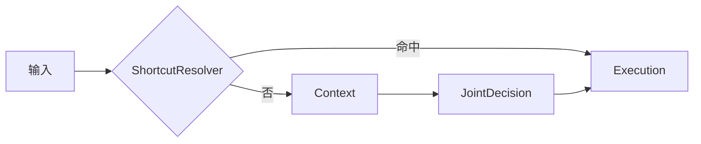

# Agent 系统

`app/agents/` — 三阶段异步流水线 + 规则引擎 + 概率推断。

## 工作流

ShortcutResolver 匹配快捷指令 → 命中则跳至 Execution，否则走三阶段：

| Agent | 入→出 | 要点 |
|-------|-------|------|
| Context | 用户+记忆+外部+历史 → JSON上下文 | 有外部直接用，无则LLM推断 |
| JointDecision | 用户+上下文+规则+偏好+概率 → JSON任务+决策 | 合并原Task+Strategy为单次LLM调用 |
| Execution | 决策 → 结果+event_id | 频次抑制、PendingReminder、隐私脱敏 |

`run_with_stages()` 返回各阶段输出（可解释性）。`run_stream()` 逐阶段 yield SSE事件。

`proactive_run()` — 无用户 query 模式，由 scheduler/context 变化触发。接收 `context_override`/`memory_hints`/`trigger_source`，跳过快捷指令检查，直接 JointDecision + Execution。使用 `prompts_proactive.py` 中 `PROACTIVE_JOINT_DECISION_PROMPT`（非 `prompts.py`）。仍走规则后处理强制覆盖。

### SSE事件

| 事件 | 时机 | data |
|------|------|------|
| stage_start | 阶段开始 | `{stage}` |
| context_done | Context完成 | `{context}` |
| decision | JointDecision完成 | `{should_remind, task_type}` |
| done | Execution完成 | `_build_done_data()` |
| error | 任一阶段失败 | `{code, message}` |

快捷指令命中时跳中间事件，直接 yield done/error。

## 快捷指令

`shortcuts.py`。`ShortcutResolver` 从 `config/shortcuts.toml` 加载，匹配高频场景不走LLM。`resolve(query)` → decision dict 或 None。

| 类型 | 匹配方式 | 示例 |
|------|---------|------|
| travel | patterns文本+参数解析 | "提醒到家" → location触发 |
| action | patterns文本 | "取消提醒"→cancel_last, "延迟"→snooze |

## 多轮对话

`conversation.py`。`ConversationManager` 纯内存，TTL 30min，上限10轮。`session_id` 注入历史解析指代。

模块级单例 `_conversation_manager = ConversationManager()`（`conversation.py:128`），供 `workflow.py` 和 API 层导入共享。

## 输出路由

`outputs.py`。`OutputRouter.route()` → `MultiFormatContent`：

| 字段 | 说明 | 长度 |
|------|------|------|
| speakable_text | TTS友好 | ≤15字 |
| display_text | HUD可扫读 | ≤20字 |
| detailed | 完整文本 | 不限 |
| channel | audio/visual/detailed | |
| interrupt_level | 0/1/2 | |

## 待触发提醒

`pending.py`。`PendingReminderManager` 管理五种 trigger_type：

| trigger_type | 触发条件 |
|-------------|---------|
| time | 当前时间 ≥ target_time |
| location | 距目标 <500m（停车1000m） |
| context | 驾驶场景切换 |
| state | 疲劳度 > 阈值 / workload 变化 |
| periodic | 按 interval_hours 周期性触发 |

`postpone` 为 decision dict 独立布尔字段，不由 timing 决定。`location_time` 拆为两条独立 pending。`poll(driving_context)` 检查触发条件。`cancel_last()` 取消最近一条。

## 隐私脱敏

Execution 写 memory 前调用 `sanitize_context()`（`app/memory/privacy.py`）。

## 状态

`state.py`。`AgentState`(TypedDict, 12字段) + `WorkflowStages`(dataclass, 4字段)，工作流共享状态。

## 提示词

`prompts.py`：Context + JointDecision 各有系统提示词，中文+JSON输出。Execution 无提示词——规则引擎硬约束+代码实现。

`prompts_proactive.py`：`PROACTIVE_JOINT_DECISION_PROMPT`，主动模式无用户 query，由 `proactive_run()` 使用。

## 输出鲁棒性

`workflow.py`。`ContextOutput`/`JointDecisionOutput` 用 `Field(validation_alias=AliasChoices(...))` 兜底LLM字段名漂移。`extra="forbid"` 严格校验。校验失败时回退原始输出继续流程。

| 模型 | 规范键 | 接受别名 |
|------|--------|---------|
| JointDecisionOutput | task_type | type, task_attribution |
| JointDecisionOutput | entities | events, event_list |
| JointDecisionOutput | confidence | conf |
| ContextOutput | scenario | scene, driving_scenario |
| ContextOutput | driver_state | driver, state |
| ContextOutput | spatial | location, position |
| ContextOutput | traffic | traffic_status |

`decision` 字段为原始 dict，无Pydantic校验。含 `should_remind`/`timing`/`is_emergency`/`reminder_content`/`reason`。`should_remind` 可被 `postprocess_decision()` 强制设 false。

`decision` 还含 `_postprocessed` 布尔标志，标记已被 `postprocess_decision()` 处理过，防止重复执行。

辅助类型（均在 `workflow.py`）：`LLMJsonResponse`(BaseModel, 通用JSON响应)、`ReminderContent`(提醒内容, speakable/display/detailed)。

## 规则引擎

`rules.py`。7条规则数据驱动加载自 `config/rules.toml`。`apply_rules()` 共6处静态调用。`postprocess_decision()` 在LLM输出后强制覆盖，不可绕过。

TOML 加载失败时使用 `_FALLBACK_RULES`（`rules.py:85-112`，4条硬编码规则：highway_audio_only / fatigue_suppress / overloaded_postpone / parked_all_channels）。

| 规则 | 条件 | 约束 | 优先级 |
|------|------|------|--------|
| 高速仅音频 | scenario==highway | channels:[audio], freq:30min | 10 |
| 疲劳抑制 | fatigue>FATIGUE_THRESHOLD | only_urgent, channels:[audio] | 20 |
| 过载延后 | workload==overloaded | postpone | 15 |
| 停车全通道 | scenario==parked | channels:[visual,audio,detailed] | 5 |
| city限制 | scenario==city_driving | channels:[audio], freq:15min | 8 |
| traffic_jam安抚 | scenario==traffic_jam | channels:[audio,visual], freq:10min | 7 |
| 乘客放宽 | has_passengers && !=highway | extra:[visual] | 3 |

`FATIGUE_THRESHOLD` 默认 0.7，通过 `FATIGUE_THRESHOLD` 环境变量可配置。

合并：channels 交集（空集回退默认），extra 并集追加，freq 取最小，only_urgent/postpone 布尔或。

### 消融实验支持

`_ablation_disable_rules`（`rules.py:70`，ContextVar）— 设 `true` 跳过规则引擎。`_ablation_disable_feedback`（`workflow.py:43`，ContextVar）— 设 `true` 跳过记忆反馈写入。均通过对应 `set_*()` 函数设值，用于对比实验。

### 频次约束

`max_frequency_minutes` 由 `apply_rules()` 合并，Execution 节点 `_check_frequency_guard()` 运行时检查。距上次提醒不足则抑制。

## 概率推断

`probabilistic.py`。JointDecision 前执行，MemoryBank启用时注入prompt。

1. **意图推断** `infer_intent`：检索top-20 → 按type聚合 → 归一化置信度。冷启动返 unknown/0.2
2. **打断风险** `compute_interrupt_risk`：`0.4×fatigue + 0.3×workload + 0.2×scenario + 0.1×speed`
3. **高风险阈值**：`OVERLOADED_WARNING_THRESHOLD=0.36`，≥ 此值追加警告
4. **开关**：`PROBABILISTIC_INFERENCE_ENABLED`（默认 `1` 启用，设 `0` 关闭）

## 异常

| 异常 | 文件 | 继承 | 说明 |
|------|------|------|------|
| `WorkflowError` | `workflow.py:65` | `AppError` | 模型不可用等，code=WORKFLOW_ERROR |
| `AppError`(catch) | 各工作流方法 | — | **不 catch 具体子类型**，统一 except→log→回退 |

catch 模式：
- LLM JSON 解析：`except json.JSONDecodeError` → 回退原文本
- Pydantic：`except ValidationError` → 回退原始 output
- 工作流步骤：`except AppError` → log→raise 或 yield error
- 数据校验：`except ValueError, TypeError:` → log→安全回退
- 配置加载：`except OSError, tomllib.TOMLDecodeError, ValueError` → fallback 规则

### 状态输出

`_build_done_data()` 三种状态：

| 状态 | 条件 |
|------|------|
| pending | 含 pending_reminder_id |
| suppressed | result 含"取消"/"抑制" |
| delivered | 即时提醒已发送 |
