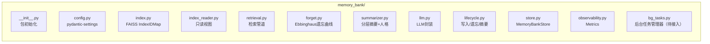

# 记忆系统

`app/memory/` — MemoryBank + 基础设施。

## 架构

`write()`/`write_batch()`/`write_interaction()` 直接写 FAISS entry。`format_search_results()` 返回分组格式化文本供 LLM 注入。`finalize_ingestion()` 编排摘要 → 遗忘 → 持久化，内部调用 `finalize()` 串行遍历日期，per-date 生成 daily_summary+daily_personality → overall_summary → overall_personality。

### MemoryModule

`memory.py`。Facade 主实现。工厂注册表（由 `MemoryMode` 键控）管理 store 生命周期，`_get_store()` 返回 per-user MemoryBankStore。

### 单例

`singleton.py`。线程安全双检锁。`get_memory_module()` 懒初始化。

### 多用户隔离

`_get_store(mode, user_id)` 返回 per-user 实例。每用户独立 `data/users/{user_id}/`。

### 可观测性

`observability.py`。`MemoryBankMetrics`(dataclass, 零锁)。search_count/search_latency_ms/forget_count 等。

## 组件

| 文件 | 类/模块 | 职责 |
|------|---------|------|
| `memory_bank/store.py` | MemoryBankStore | 持久化存储 |
| `memory_bank/index.py` | FaissIndex | FAISS 索引管理 |
| `memory_bank/index_reader.py` | — | 只读视图 |
| `memory_bank/retrieval.py` | — | 检索管道（6 步） |
| `memory_bank/forget.py` | — | Ebbinghaus 遗忘曲线 |
| `memory_bank/summarizer.py` | — | 分层摘要 + 人格 |
| `memory_bank/llm.py` | — | LLM 封装 |
| `memory_bank/lifecycle.py` | — | 写入/遗忘/摘要编排 |
| `memory_bank/config.py` | pydantic-settings | 配置参数 |
| `memory_bank/observability.py` | MemoryBankMetrics | 指标收集 |
| `memory_bank/bg_tasks.py` | — | 后台任务管理器（待接入） |
| `memory.py` | MemoryModule | Facade 主实现 |
| `schemas.py` | MemoryEvent 等 | 数据模型 |
| `types.py` | MemoryMode(StrEnum) | 工厂注册表键 |
| `embedding_client.py` | EmbeddingClient | Embedding 代理 |
| `interfaces.py` | MemoryStore(Protocol) | Store 接口定义 |
| `utils.py` | — | 工具函数 |
| `privacy.py` | — | 隐私脱敏 |
| `singleton.py` | — | 双检锁单例 |

`memory/stores/` — 多 store 切换扩展点，当前仅 re-export MemoryBankStore。

## 关键类/接口

### MemoryModule

`memory.py`。Facade 实现。工厂注册表由 `MemoryMode`（`types.py`）键控，`_get_store()` 返回 per-user MemoryBankStore。

### MemoryStore Protocol

`interfaces.py`。七方法（write/search/get_history/update_feedback/get_event_type/write_interaction/close）和四个类属性（`store_name`、`requires_embedding`、`requires_chat`、`supports_interaction`）。

### MemoryBankMetrics

`observability.py`。dataclass，零锁。字段：search_count/search_latency_ms/forget_count 等。

### FaissIndex

`index.py`。IndexIDMap(IndexFlatIP) + L2 归一化 ≈ 余弦相似度。自适应分块 P90×3。`save()` 持有 asyncio.Lock 防并发写入损坏。

### EmbeddingClient

`embedding_client.py`。薄代理。`encode_batch()` 含数量+维度双重校验。重试由 EmbeddingModel 内部处理。

## 数据模型

`schemas.py`：

| 类型 | 关键字段 | 说明 |
|------|----------|------|
| MemoryEvent | id, created_at, content, type, description, memory_strength, last_recall_date, date_group, interaction_ids, updated_at, speaker | 语义摘要后事件 |
| InteractionRecord | id, event_id, query, response, timestamp, memory_strength, last_recall_date | 原始交互（仅测试用） |
| FeedbackData | event_id, action(accept\|ignore), type, timestamp, modified_content | 用户反馈 |
| SearchResult | event, score, source, interactions; to_public() 返回不含内部字段的纯事件数据 | 检索结果包装 |
| InteractionResult | event_id, interaction_id | `write_interaction()` 返回类型 |

`schemas.py` 底部暴露**事件类型常量**：`EVENT_TYPE_REMINDER = "reminder"`、`EVENT_TYPE_PASSIVE_VOICE = "passive_voice"`、`EVENT_TYPE_TOOL_CALL = "tool_call"`。

`types.py` 定义 `MemoryMode(StrEnum)`，含 `MEMORY_BANK = "memory_bank"`，工厂注册表以此键控。

## FAISS 索引

IndexIDMap(IndexFlatIP) + L2 归一化 ≈ 余弦相似度。自适应分块 P90×3。`save()` 持有 asyncio.Lock 防并发写入损坏。

### 索引损坏恢复

`FaissIndex.load()` → `LoadResult(ok, warnings, recovery_actions)`

| 损坏 | 恢复 |
|------|------|
| metadata.json 格式错 | 从 id_map 重建骨架 |
| extra_metadata.json 损坏 | 忽略，空 dict 启动 |
| Count mismatch | 以 index 为权威补缺失 |
| index.faiss 读失败 | 备份后删除重建 |
| 索引类型非 IndexIDMap | 备份全部后重建 |

索引懒重建：加载时仅恢复元数据，空索引在首次写入时自动构建。

## 检索管道

1. query embedding + FAISS 粗排（top_k×4）
2. BM25 稀疏回退（FAISS 最高分低于阈值时）
3. 遗忘条目+低分过滤（forgotten/score < min_similarity）
4. 邻居合并 + 自适应分块 + 重叠去重（并查集）
5. 说话人感知降权（无关条目 ×0.75 正分/×1.25 负分）
6. Ebbinghaus 保留率加权：`adjusted = α×score + (1-α)×retention`

## 遗忘曲线

`retention = e^(-days / (time_scale × strength))`

- **默认关闭**：`enable_forgetting=False`，需环境变量开启
- **确定性模式**（默认）：retention < 0.3 标记 forgotten=True
- **概率性模式**：`MEMORYBANK_FORGET_MODE=probabilistic`，逐条独立掷骰
- **回忆强化**：检索命中 memory_strength += 1（上限 10）
- **节流**：`FORGET_INTERVAL_SECONDS=300`

## 摘要与人格

`finalize()` 串行生成。daily/overall summary + daily/overall personality。已存在则跳过（不可变保护）。

## 配置

配置由 pydantic-settings 管理（`memory_bank/config.py`）。完整参数列表见阈值节。控制参数如 `bm25_fallback_enabled` 等在 `memory_bank/config.py` 中定义。

## 自有异常

| 异常 | 文件/继承 | 说明 |
|------|----------|------|
| MemoryBankError | AppError | 本模块基类 |
| SummarizationEmpty | MemoryBankError | 哨兵，LLM 返空 → 调用方返 None |
| InvalidActionError | ValueError（独立异常） | schemas.py |

catch 模式：`except ValueError, TypeError:` 包裹内部数据校验。存储读写 `except (json.JSONDecodeError, OSError, TypeError, ValueError)` 自动恢复。FAISS 逐类损坏恢复。`except LLMCallFailedError` 在 lifecycle 层独立处理。

## 阈值

| 阈值 | 值 |
|------|-----|
| soft_forget_threshold | 0.3 |
| forget_interval_seconds | 300 |
| forgetting_time_scale | 1.0 |
| embedding_min_similarity | 0.3 |
| coarse_search_factor | 4 |
| default_chunk_size | 1500 |
| chunk_size_min/max | 200/8192 |
| save_interval_seconds | 30s |
| retrieval_alpha | 0.7 |
| max_memory_strength | 10 |
| bm25_fallback_enabled | true |
| bm25_fallback_threshold | 0.5 |
| embedding_batch_size | 100 |
| shutdown_timeout_seconds | 30s |

完整配置见 `config/AGENTS.md`。

## 隐私保护

`privacy.py`。`sanitize_context()` 由 Execution 节点调用（非记忆模块自动执行）。处理 `spatial["current_location"]` 和 `spatial["destination"]` 嵌套字典路径。经纬度截断 2 位（~1km），地址只保留街道级。

## 测试

测试位于 `tests/memory/`，覆盖 MemoryBank 读写、FAISS 索引恢复、遗忘曲线、检索管道、多用户隔离、隐私脱敏、EmbeddingClient 等场景。
