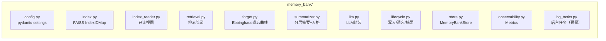

# 记忆系统

`app/memory/` — MemoryBank + 基础设施。

## MemoryBank

`memory_bank/`。基于论文 MemoryBank 实现。

### 文件

`memory/stores/` — 多store切换扩展点，当前仅re-export MemoryBankStore。

### 架构

`write()`/`write_interaction()` 直接写 FAISS entry。`finalize()` 串行遍历日期，per-date 生成 daily_summary+daily_personality → overall_summary → overall_personality。

### 数据模型 (`schemas.py`)

| 类型 | 关键字段 | 说明 |
|------|----------|------|
| MemoryEvent | id, content, type, memory_strength, last_recall_date, speaker | 语义摘要后事件 |
| InteractionRecord | event_id, query, response | 原始交互（仅测试用） |
| FeedbackData | event_id, action(accept\|ignore), type | 用户反馈 |
| SearchResult | event, score, interactions | 检索结果包装 |

### FAISS索引

- IndexIDMap(IndexFlatIP) + L2归一化 ≈ 余弦相似度
- 自适应分块 P90×3
- `save()` 持有 asyncio.Lock 防并发写入损坏

### 索引损坏恢复

`FaissIndex.load()` → `LoadResult(ok, warnings, recovery_actions)`

| 损坏 | 恢复 |
|------|------|
| metadata.json格式错 | 从id_map重建骨架 |
| extra_metadata.json损坏 | 忽略，空dict启动 |
| Count mismatch | 以index为权威补缺失 |
| index.faiss读失败 | 备份后删除重建 |
| index类型非IndexIDMap | 备份全部后重建 |

### 检索管道

1. query embedding + FAISS粗排(top_k×4)
2. BM25稀疏回退（FAISS最高分低于阈值时）
3. 遗忘条目+低分过滤（forgotten/score < min_similarity）
4. 邻居合并 + 自适应分块 + 重叠去重（并查集）
5. 说话人感知降权（无关条目 ×0.75正分/×1.25负分）
6. Ebbinghaus保留率加权：`adjusted = α×score + (1-α)×retention`

### 遗忘曲线

`retention = e^(-days / (time_scale × strength))`

- **默认关闭**：`enable_forgetting=False`，需环境变量开启
- **确定性模式**（默认）：retention < 0.3 标记 forgotten=True
- **概率性模式**：`MEMORYBANK_FORGET_MODE=probabilistic`，逐条独立掷骰
- **回忆强化**：检索命中 memory_strength += 1（上限10）
- **节流**：`FORGET_INTERVAL_SECONDS=300`

### 摘要与人格

`finalize()` 串行生成。daily/overall summary + daily/overall personality。已存在则跳过（不可变保护）。

## 异常

`MemoryBankError` 基类，分三层：

| 异常 | 性质 |
|------|------|
| TransientError / FatalError | 基类 |
| LLMCallFailedError | 瞬态可重试 |
| SummarizationEmpty | 哨兵非错误 |
| ConfigError | 永久 |
| IndexIntegrityError | 永久 |
| InvalidActionError | 独立于MemoryBankError体系（`schemas.py`） |

## 阈值

| 阈值 | 值 |
|------|-----|
| soft_forget_threshold | 0.3 |
| forget_interval_seconds | 300 |
| forgetting_time_scale | 1.0 |
| embedding_min_similarity | 0.3 |
| coarse_search_factor | 4 |
| default_chunk_size | 1500 |
| chunk_size_min/max | 200/8192 |
| save_interval_seconds | 30s |
| retrieval_alpha | 0.7 |
| max_memory_strength | 10 |
| bm25_fallback_threshold | 0.5 |
| embedding_batch_size | 100 |
| shutdown_timeout_seconds | 30s |

完整配置见 `config/AGENTS.md`。

## 基础设施

### MemoryModule

`memory.py`。Facade主实现。工厂注册表管理 store 生命周期，`_get_store()` 返回 per-user MemoryBankStore。

### 单例

`singleton.py`。线程安全双检锁。`get_memory_module()` 懒初始化。

### 多用户隔离

`_get_store(mode, user_id)` 返回 per-user 实例。每用户独立 `data/users/{user_id}/`。

### 可观测性

`observability.py`。`MemoryBankMetrics`(dataclass, 零锁)。search_count/search_latency_ms/forget_count 等。

### EmbeddingClient

`embedding_client.py`。薄代理。`encode_batch()` 含数量+维度双重校验。重试由 EmbeddingModel 内部处理。

### MemoryStore接口

`interfaces.py`。Protocol定义 write/search/get_history/update_feedback/get_event_type/write_interaction/close 七方法。

## 隐私保护

`privacy.py`。`sanitize_context()` 由 Execution 节点调用（非记忆模块自动执行）。经纬度截断2位（~1km），地址只保留街道级。
