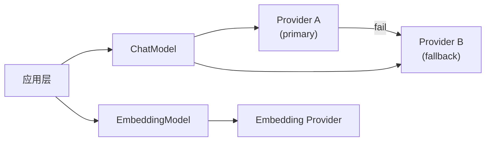

# 模型封装

`app/models/` — AI模型封装层。

## 架构

## 组件

| 文件 | 职责 |
|------|------|
| chat.py | `ChatModel` — LLM对话模型，多provider fallback、semaphore并发控制、`generate()`/`generate_stream()`（DeepSeek reasoning_content累积、tool_calls分块）、`batch_generate()`（并行批量，semaphore限流）。工厂函数 `get_chat_model()`/`get_judge_model()` |
| embedding.py | `EmbeddingModel` — 文本嵌入，OpenAI兼容远程，`encode()`/`batch_encode()`，3次指数退避重试。缓存管理：`get_cached_embedding_model()`/`clear_embedding_model_cache()`/`reset_embedding_singleton()` |
| settings.py | `LLMSettings` dataclass（`load()` / `get_model_group_providers()` / `get_embedding_provider()`），`LLMProviderConfig` dataclass（temperature/concurrency/api_key 配置），`EmbeddingProviderConfig` dataclass（provider 配置）。TOML配置加载（`@cache`，运行时改TOML不生效）。`_resolve_api_key()` 见下文 |
| model_string.py | 模型引用字符串解析（`provider/model`） |
| types.py | `ResolvedModel`/`ProviderConfig` 等基础类型 |
| exceptions.py | 基础异常；其余8个异常分散在各模块 |
| _http.py | HTTP客户端共享超时配置 |

## 关键类/接口

### ChatModel

| 方法 | 签名 |
|------|------|
| `__init__` | `(providers: list[LLMProviderConfig] \| None = None, temperature: float \| None = None) -> None` |
| `generate` | `async (prompt: str = "", system_prompt: str \| None = None, messages: list[...] \| None = None, **kwargs: object) -> str` |
| `generate_stream` | `async (prompt: str = "", system_prompt: str \| None = None, messages: list[...] \| None = None, **kwargs: object) -> AsyncIterator[str]` |
| `batch_generate` | `async (prompts: list[str], system_prompt: str \| None = None) -> list[str]` |

`kwargs` 透传：`json_mode=True` 启用 JSON mode；`extra_body`, `reasoning_effort`, `max_tokens` 等直传 openai SDK。

### EmbeddingModel

| 方法 | 签名 |
|------|------|
| `__init__` | `(provider: EmbeddingProviderConfig, batch_size: int = 32) -> None` |
| `encode` | `async (text: str) -> list[float]` |
| `batch_encode` | `async (texts: list[str]) -> list[list[float]]` |

## 缓存生命周期

| 函数 | 作用 | 位置 |
|------|------|------|
| `close_client_cache()` | 关闭所有缓存的 AsyncOpenAI 客户端（lifespan shutdown） | chat.py:56 |
| `clear_semaphore_cache()` | 清理 semaphore + 客户端缓存（测试 teardown） | chat.py:66 |
| `clear_embedding_model_cache()` | 关闭所有 EmbeddingModel 客户端并清除缓存 | embedding.py:63 |
| `reset_embedding_singleton()` | `clear_embedding_model_cache()` 别称（测试用） | embedding.py:216 |

## 自有异常

| 异常 | 父类 | 文件 | 说明 |
|------|------|------|------|
| `ChatError` | `AppError` | `chat.py:79` | LLM通用失败 |
| `NoProviderError` | `ChatError` | `chat.py:86` | provider空 |
| `AllProviderFailedError` | `ChatError` | `chat.py:95` | 全部provider失败 |
| `NoLLMConfigurationError` | `AppError` | `settings.py:45` | 无LLM配置 |
| `MissingModelFieldError` | `AppError` | `settings.py:52` | 缺model字段 |
| `NoDefaultModelGroupError` | `AppError` | `settings.py:61` | 无默认model group |
| `NoJudgeModelConfiguredError` | `AppError` | `settings.py:70` | 缺评测模型 |

| 异常 | 父类 | 文件 | 说明 |
|------|------|------|------|
| `ProviderNotFoundError` | `ValueError` | `exceptions.py:4` | provider未配置 |
| `ModelGroupNotFoundError` | `KeyError` | `exceptions.py:12` | model_group未找到 |
| `InvalidModelStringError` | `ValueError` | `model_string.py:9` | 引用格式错 |

catch 模式：provider 调用 `except (openai.APIError, OSError, ValueError, TypeError, RuntimeError)` → 下一provider fallback。全失败 → `AllProviderFailedError`。

## 阈值

| 阈值 | 值 | 位置 |
|------|----|------|
| HTTP read timeout | 12h | _http.py |
| Embedding batch(入口) | 100 | get_cached_embedding_model |
| Embedding batch(类) | 32 | `EmbeddingModel.__init__` |
| Embedding retry | 3次指数退避 | embedding.py |
