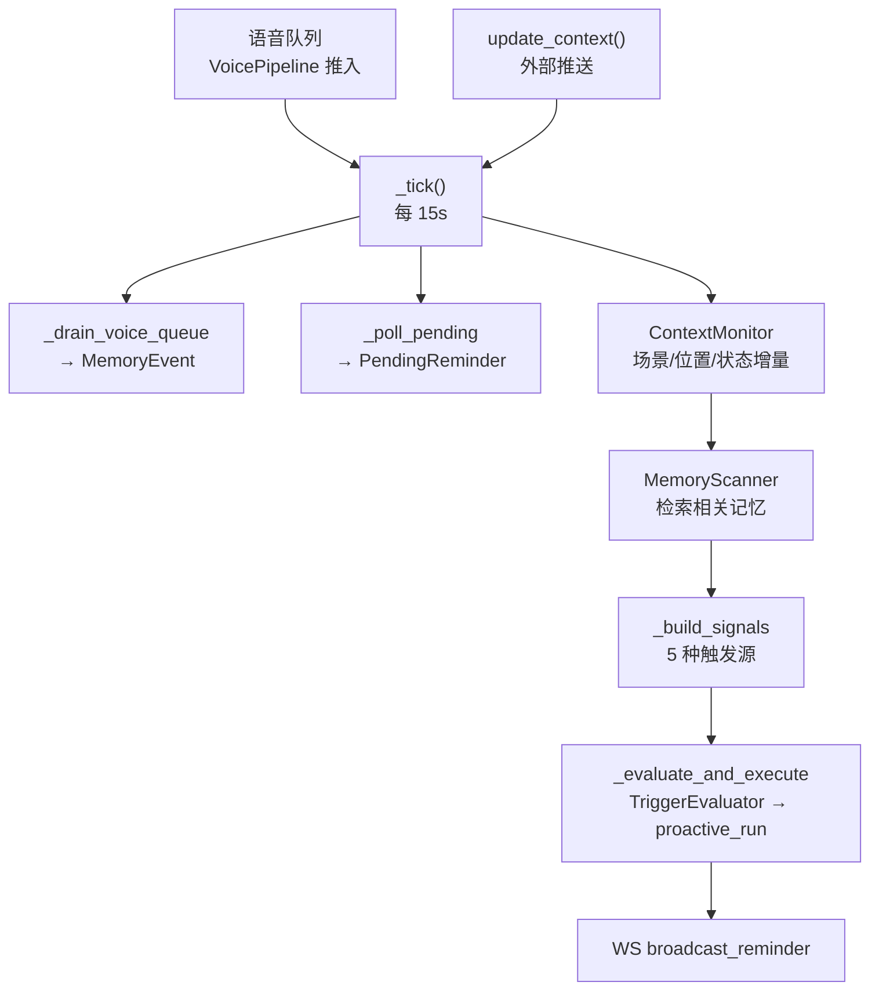

# 主动调度器

`app/scheduler/` — 后台轮询引擎。将系统从"被动响应"转为"主动触发"。

## 架构



## 组件

| 文件 | 类 | 职责 |
|------|-----|------|
| `scheduler.py` | `ProactiveScheduler` | 主循环：start/stop/run/tick。`SchedulerConfig.load()` 在 `__init__` 中加载 scheduler.toml。协调其余组件 |
| `config.py` | `SchedulerConfig` | 配置 dataclass，`load()` 类方法读取/生成 scheduler.toml，`_toml_defaults()` 从字段默认值生成 TOML 结构 |
| `context_monitor.py` | `ContextMonitor` | 缓存上次 driving_context，检测增量变化 |
| `context_monitor.py` | `ContextDelta` | 变化增量 dataclass（5 字段） |
| `memory_scanner.py` | `MemoryScanner` | 按场景/位置变化检索 MemoryBank |
| `trigger_evaluator.py` | `TriggerEvaluator` | 去抖 + 规则约束 → 决定是否触发 |
| `trigger_evaluator.py` | `TriggerSignal` | 触发信号 dataclass（source/priority/context/memory_hints）|
| `trigger_evaluator.py` | `TriggerDecision` | 触发决策 dataclass（should_trigger/reason/interrupt_level）|

## ProactiveScheduler

### 生命周期

```
start() → asyncio.create_task(run())
run():
  while running:
    _tick()
    sleep(tick_interval)
stop() → cancel task
```

### 构造函数参数

| 参数 | 类型 | 默认值 | 说明 |
|------|------|--------|------|
| `workflow` | `AgentWorkflow` | 必选 | 工作流引擎，驱动主动模式 |
| `memory_module` | `MemoryModule` | 必选 | 记忆管理模块 |
| `user_id` | `str` | `"default"` | 目标用户 ID |
| `tick_interval` | `float \| None` | config 值 / 15s | 轮询间隔（秒） |
| `debounce_seconds` | `float \| None` | config 值 / 30s | 去抖间隔（秒） |
| `ws_manager` | `WSManager \| None` | `None` | WebSocket 管理器，用于广播提醒 |

`_build_signals()` 中 state 触发源通过 `get_fatigue_threshold()`（`app/agents/rules.py:65`）获取疲劳高阈值，默认 0.7，可通过环境变量 `DRIVEPAL_FATIGUE_THRESHOLD` 配置。

### _tick() 顺序

1. `_drain_voice_queue()` — ASR 文本写 Memory（passive_voice）
2. `_poll_pending(ctx)` — PendingReminderManager.poll() + proactive_run（仅在 `ctx` 非空时执行）
3. `ContextMonitor.update(ctx)` — 检测场景/位置/状态增量
4. `_scan_context_changes(ctx, delta)` — 场景切换/位置变化时检索记忆
5. `_build_signals(ctx, delta, hints)` — 构造 TriggerSignal 列表
6. `_evaluate_and_execute(signals, ctx)` — 评估→触发→WS广播

### 5 种触发源

| 源 | 条件 | 优先级 | 说明 |
|----|------|--------|------|
| context_change | scenario 切换 | 1 | 切换后检索相关记忆 |
| location | 位置变化 > proximity | 1 | 接近记忆中的地点时 |
| pending_reminder | PendingReminder 满足 | N/A | 已在 poll 中处理 |
| state | 两阶段：先检 `delta.fatigue_increased or delta.workload_changed`（增量变化，priority=2），再检绝对值 `fatigue > 0.7 / workload=overloaded`（priority=2） | 2 | 增量变化触发 |
| periodic | `_review_hour` 前一小时最后5分钟（min≥55）+ 当前小时前5分钟（min<5），`_last_review_date` 天级防重，`_review_hour=0` 跨午夜时日期+1天 | 0 | `_review_hour` 从 `config/scheduler.toml` 的 `review_time` 解析；`_review_window_minutes=5`（半窗宽）|

注：`TriggerSignal.source` 类型标注允许的取值包括 `"context_change"`、`"location"`、`"time"`、`"state"`、`"periodic"`、`"voice"`。其中 `"time"` 和 `"voice"` 当前未被任何发射路径使用。

### 输入接口

| 方法 | 调用方 | 说明 |
|------|--------|------|
| `push_voice_text(text)` | VoicePipeline | ASR 转录文本入队列 |
| `update_context(ctx)` | ContextProvider/API | 外部驾驶上下文推送 |

## ContextMonitor

```python
@dataclass
class ContextDelta:
    scenario_changed: bool = False
    location_changed: bool = False        # 变化 > proximity_meters
    location_proximity: float | None = None  # 距离变化米
    fatigue_increased: bool = False       # 增长 > 0.1
    workload_changed: bool = False
```

- 首次 `update()` 仅缓存，返回空 delta
- `_haversine()` 与 `app/agents/pending.py` 均导入 `app.utils.haversine`，共享同一实现
- `_DEFAULT_FATIGUE_DELTA = 0.1` 疲劳增量检测默认阈值

## MemoryScanner

- `scan_by_context(ctx, top_k=10)` — 按场景+位置检索
- `scan_by_scenario_change(old, new, top_k=5)` — 场景切换检索
- 失败时返回空列表（不抛异常）

## TriggerEvaluator

- **去抖**：`debounce_seconds` 内同源触发被抑制
- **规则引擎集成**：调用 `apply_rules()` 检查 `only_urgent`/`postpone` 约束
- 高优先级（2）绕过后延约束

## 配置 (`config/scheduler.toml`)

```toml
[scheduler]
tick_interval_seconds = 15
debounce_seconds = 30
enable_periodic_review = true
review_time = "08:00"
location_proximity_meters = 500

[scheduler.context_monitor]
fatigue_delta_threshold = 0.1
```

`enable_periodic_review`、`review_time` 从配置文件读取。`review_time` 解析为 `_review_hour`（小时），分钟部分忽略。`_review_window_minutes=5`（硬编码半窗宽）：前一小时最后5分钟（min≥55）+ 当前小时前5分钟（min<5），合计10分钟窗口。`_review_hour=0` 时前一小时为 hour=23，日期+1天以正确去重。

## 异常

- 各步骤独立 `try/except`，单步失败不影响后续
- 主循环 `except Exception` 兜底防崩溃，log 后继续
- `except AppError` 捕获工作流异常，log 后不中断
- ASR 缺失时 `_drain_voice_queue` 静默消耗空字符串
- 配置加载由 `app/config.py` 的 `ensure_config()` 统一处理，`OSError`/`PermissionError`/`tomllib.TOMLDecodeError` 均日志警告并返回默认值

## 测试

`tests/scheduler/test_scheduler.py` — ContextMonitor 增量检测 + TriggerEvaluator 去抖。
