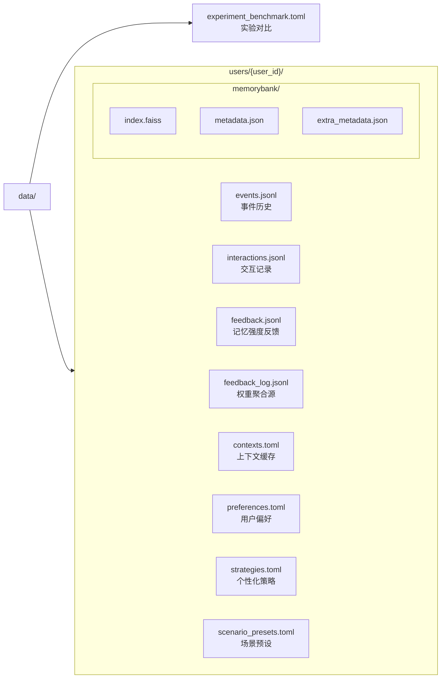

# 数据存储

`app/storage/` — 持久化引擎。

## 架构

存储分两层：项目级（`data/experiment_benchmark.toml`）+ 用户级（`data/users/{user_id}/`）。旧平铺结构由 `init_storage()` 调用 `_migrate_legacy()` 幂等迁移。迁移范围：
- jsonl: `events.jsonl`、`interactions.jsonl`、`feedback.jsonl` → `data/users/default/`（`feedback_log.jsonl` 不在迁移范围）
- toml: `contexts.toml`、`preferences.toml`、`strategies.toml`、`scenario_presets.toml` → `data/users/default/`（`experiment_benchmark.toml` 不在迁移范围）
- `data/memorybank/` → `data/users/default/memorybank/`（整体目录）
- `data/memorybank/user_{id}/` → `data/users/{id}/memorybank/`（按用户拆分）
- `data/user_{id}/`（平铺目录）→ `data/users/{id}/`（按用户拆分）

## 组件

| 文件 | 类/函数 | 职责 |
|------|---------|------|
| toml_store.py | TOMLStore | 异步锁+文件级TOML读写 |
| jsonl_store.py | JSONLinesStore | JSONL追加写入 |
| init_data.py | init_storage / init_user_dir | 数据目录初始化 + 迁移 |
| experiment_store.py | read_benchmark | 只读实验对比数据 |
| feedback_log.py | append_feedback / aggregate_weights | 策略权重反馈记录 |

## TOMLStore (`toml_store.py`)

异步锁+文件级粒度。

- **锁**：`_LOCK_REGISTRY` 每文件独立 `asyncio.Lock`
- **列表存储**：`_list` 键包裹（TOML不支持顶层组数）
- **None处理**：`_clean_for_toml()` 递归转空字符串
- **`default_factory`**：`__init__` 可选参数，控制文件不存在时写入的默认值。默认 `dict`，传 `list` 以支持列表模式
- **API**：read/write/append(列表)/update(字典)/merge_dict_key(字典)

## JSONLinesStore (`jsonl_store.py`)

JSONL追加写，用于高频写入数据(events/interactions/feedback)。

- append(obj) / read_all() / count()

## 存储初始化 (`init_data.py`)

`init_storage(data_dir=None)` 创建目录 + `_migrate_legacy()` + `init_user_dir("default")`。`data_dir` 可选，默认回退 `DATA_DIR`。
`init_user_dir(user_id)` 创建4个jsonl + 4个toml文件并写默认值。默认值：
- `preferences.toml`：`{"language": "zh-CN"}`
- `strategies.toml`：6字段 — `preferred_time_offset: 15`、`preferred_method: "visual"`、`reminder_weights: {}`、`ignored_patterns: []`、`modified_keywords: []`、`cooldown_periods: {}`
- `scenario_presets.toml`：`{"_list": []}`
`_MIGRATED_FLAG` 标记保证幂等。

## experiment_store (`experiment_store.py`)

只读。`read_benchmark()` 读 `experiment_benchmark.toml`，不存在返空dict。

## feedback_log (`feedback_log.py`)

策略权重反馈原始记录。与 `feedback.jsonl`（MemoryBank记忆强度）职责分离。

- `append_feedback(user_dir, event_id, action, feedback_type)` — 追加原始记录
- `aggregate_weights(user_dir)` — 按类型聚合（accept +0.1/ignore -0.1/modify +0.05/snooze 0.0，基值0.5，范围[0.1, 1.0]）

## 自有异常

存储层异常独立于 `AppError` 继承树，继承 `TypeError`（结构误用，非域内业务错误）。

| 异常 | 父类 | 触发 |
|------|------|------|
| `AppendError` | `TypeError` | 非列表存储调 append |
| `UpdateError` | `TypeError` | 非字典存储调 update/merge_dict_key |
