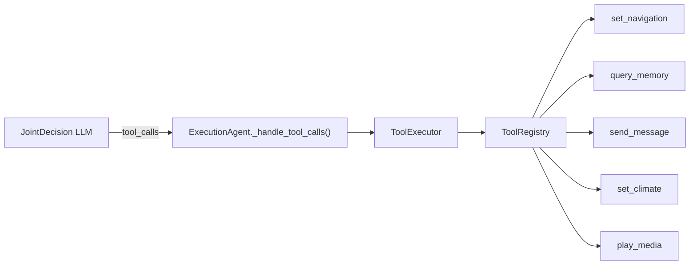

# 工具调用框架

`app/tools/` — 结构化工具定义、注册、执行。JointDecision LLM 输出 `tool_calls` 字段时触发。

## 架构



## 组件

| 文件 | 类/函数 | 职责 |
|------|---------|------|
| `registry.py` | `ToolRegistry` | 注册/发现/描述工具 |
| `registry.py` | `ToolSpec` | 工具规范 dataclass（name/description/input_schema/handler/require_confirmation_when） |
| `registry.py` | `ToolHandler` | `Callable[[dict[str, Any]], Awaitable[str]]` 类型 |
| `executor.py` | `ToolExecutor` | 参数校验 → handler 执行 → 结果文本 |
| `executor.py` | `ToolExecutionError` | 执行异常 |
| `executor.py` | `ToolConfirmationRequiredError` | 工具需用户确认（code=TOOL_CONFIRMATION_REQUIRED） |
| `config.py` | `ToolsConfig` | 配置 dataclass，`load()` 类方法读取/生成 tools.toml |
| `tools/__init__.py` | `get_default_executor()`, `register_builtin_tools()` | 注册全部内置工具到 ToolRegistry；默认单例 executor |
| `tools/navigation.py` | `navigate_to` | 导航目的地设置 |
| `tools/communication.py` | `send_message` | 消息发送 |
| `tools/vehicle.py` | `set_climate` / `play_media` | 车控预留（返回"未接入"）|
| `tools/memory_query.py` | `query_memory` | 记忆查询（使用单例 MemoryModule）|

## 关键类/接口

### ToolSpec

```python
@dataclass(frozen=True)
class ToolSpec:
    name: str                              # 唯一工具名
    description: str                       # LLM 用描述
    input_schema: dict[str, Any]           # JSON Schema
    handler: ToolHandler                   # async (dict) → str
    require_confirmation_when: str | None  # 确认条件，如 "driving"
```

### ToolRegistry

- `register(spec)` — 注册，重复名抛 `ValueError`
- `get(name)` — 按名查找，返回 `ToolSpec | None`（调用方需处理 None）
- `list_tools()` — 列出全部
- `to_llm_description()` — 格式化工具清单供 LLM prompt

### ToolExecutor

- `execute(tool_name, params, *, driving_context=None) → str` — 参数校验 → 确认检查（`require_confirmation_when`）→ handler 执行 → 结果文本。驾驶中执行需确认工具时抛 `ToolConfirmationRequiredError`
- `get_spec(name) → ToolSpec | None` — 按名称获取工具规格

### set_navigation 确认条件

`set_navigation` 注册时从 `ToolsConfig`（`config/tools.toml`）读取 `require_voice_confirmation_driving`，为 `true` 时设 `require_confirmation_when="driving"`。其他工具默认 `None`（无确认条件）。

| 工具 | 参数 | 返回 |
|------|------|------|
| `set_navigation` | `destination: str` | `"导航已设置：{dest}"` |
| `send_message` | `recipient: str`, `message: str(max max_message_length)` | `"消息已发送给 {recipient}"` |
| `query_memory` | `query: str` | 默认 5 条记忆内容（由 `tools.toml` memory_query.max_results 配置）|
| `set_climate` | `temperature: number(16-32)` | `"车控功能尚未接入"` |
| `play_media` | `name: str`, `type: music\|podcast` | `"媒体功能尚未接入"` |

### query_memory

- 使用 `get_memory_module()` 单例获取 MemoryModule
- 默认 top_k=5，读 `config/tools.toml` 的 `[tools.memory_query] max_results`
- 失败返回 `"记忆查询失败"`（不抛异常）

## 工具执行（`_handle_tool_calls`）

工具调用执行已从 `_execution_node` 提取至 `ExecutionAgent._handle_tool_calls()`（`app/agents/execution_agent.py`）。`ExecutionAgent.run()` 内流程顺序：

1. 规则后处理 `postprocess_decision()` — 强制覆盖
2. **工具调用执行** — `_handle_tool_calls()`
3. 待触发提醒创建 — `postpone`/`timing` 分支生成 PendingReminder
4. `_check_frequency_guard()` — 频次抑制

```python
async def _handle_tool_calls(self, decision: dict, state: AgentState) -> list[str]:
    tool_calls = decision.get("tool_calls", [])
    if not tool_calls or not isinstance(tool_calls, list):
        return []
    executor = get_default_executor()
    tool_results: list[str] = []
    for tc in tool_calls:
        if isinstance(tc, dict):
            t_name = tc.get("tool", "")
            t_params = tc.get("params", {})
            try:
                t_result = await executor.execute(
                    t_name, t_params, driving_context=state.get("driving_context")
                )
                tool_results.append(f"[{t_name}] {t_result}")
            except WorkflowError:
                raise
            except ToolConfirmationRequiredError as e:
                tool_results.append(f"[{t_name}] {e.message}")
            except ToolExecutionError as e:
                tool_results.append(f"[{t_name}] 失败: {e}")
            except AppError:
                raise
    if tool_results:
        logger.info("Tool call results: %s", "; ".join(tool_results))
        state["tool_results"] = tool_results
    return tool_results
```

结果写入 `state["tool_results"]`，由 `_build_done_data()` 纳入 SSE done 事件。

## 配置

值来源 `config/tools.toml`（不存在于源码——首次调用 `ToolsConfig.load()` 时由 `ensure_config()` 自动生成，内容为 dataclass 默认值）。

```toml
[tools.navigation]
enabled = true
require_voice_confirmation_driving = true

[tools.communication]
enabled = true
max_message_length = 200

[tools.vehicle]
enabled = false
temperature_min = 16
temperature_max = 32

[tools.memory_query]
enabled = true
max_results = 5
```

注册时直接检查各工具配置的 `enabled` 字段，`enabled=false` 的工具不会被注册；已注册工具执行时不再检查。

## 异常

| 异常 | 文件 | 继承 | 说明 |
|------|------|------|------|
| `ToolExecutionError` | `executor.py` | `AppError` | 参数校验/handler异常，code=TOOL_ERROR |
| `ToolConfirmationRequiredError` | `executor.py` | `AppError` | 工具需用户确认，code=TOOL_CONFIRMATION_REQUIRED |

catch 模式：`_handle_tool_calls()` 逐工具 `except ToolExecutionError` → 错误文本追加至 `tool_results`，**不抛**。

## 安全约束

工具调用受规则引擎 `postprocess_decision()` 统一管辖（`proactive_run` 路径必走规则后处理）。`ToolSpec.require_confirmation_when` 字段按工具类型声明确认条件：

| 工具 | `require_confirmation_when` | 说明 |
|------|---------------------------|------|
| `set_navigation` | `"driving"` | 驾驶中需语音确认后执行 |
| 其他 | `None` | 无额外确认 |

`ToolConfirmationRequiredError`（code=TOOL_CONFIRMATION_REQUIRED）在确认条件满足但用户未确认时抛出。

## 测试

`tests/tools/test_registry.py` — 注册 + 重复注册检测。
`tests/tools/test_executor.py` — 参数校验、确认条件、内置工具执行测试。
