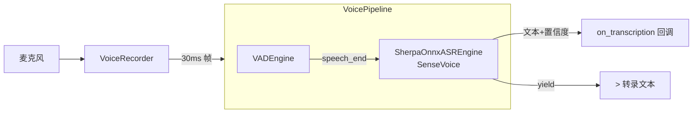

# 语音流水线

`app/voice/` — 录音 → VAD → ASR → 文本。车载麦克风持续监听，被动记录语音。

## 架构



## 组件

| 文件 | 类/函数 | 职责 |
|------|---------|------|
| `pipeline.py` | `VoicePipeline` | 编排：VAD 状态机 → ASR 转录 → yield 结果。持有 `asyncio.Queue` 接收音频帧 |
| `recorder.py` | `VoiceRecorder` | pyaudio 麦克风录音。`start(pipeline)` 在线程池运行阻塞录音循环，`run_coroutine_threadsafe` 喂帧 |
| `vad.py` | `VADEngine` | webrtcvad 封装。`process_frame(bytes)` 返回 `speech_start`/`speech`/`speech_end`/`silence` |
| `asr.py` | `ASREngine` | ASR 抽象基类，`transcribe(audio_bytes) → ASRResult` |
| `asr.py` | `SherpaOnnxASREngine` | SenseVoice 离线 ASR。`_ensure_onnx_lib()` 自动创建 onnxruntime 符号链接 |
| `constants.py` | `VADStatus`, 常量 | `VADStatus` 枚举（`SPEECH_START`/`SPEECH`/`SPEECH_END`/`SILENCE`）、`_FRAME_BYTES`、`_FRAMES_PER_CHUNK` 等常量定义 |

## VoicePipeline

```
feed_audio(chunk) → Queue → run() 循环:
  VAD.process_frame(chunk)
    speech_start → buffer = chunk
    speech → buffer += chunk
    speech_end → ASR.transcribe(buffer) → yield text (if confidence >= min_confidence)
    silence → discard
```

- `_FRAME_BYTES`（960，16kHz 16bit 30ms）定义于 `constants.py`
- `min_confidence` 默认 0.5，< 此值丢弃
- `on_transcription(text, confidence)` 可选回调（供 Scheduler 实时消费）
- `close()` — 停止循环并释放 ASR 资源
- `run()` 校验帧尺寸：`len(chunk) != _FRAME_BYTES` 时日志警告并跳过，防止尺寸异常导致 VAD 结果不可靠。`feed_audio(chunk)` 仅入队列，无校验

## VADEngine

- 封装 `webrtcvad.Vad(mode)`，mode 0-3（默认 1）
- 静音超时 17 帧（~510ms）触发 `speech_end`
- `is_speech(audio_chunk)` 底层调用
- `reset()` 手动重置状态

## SherpaOnnxASREngine

- 延迟初始化：`_ensure_loaded()` 首次调用时加载模型
- 音频格式：16kHz 16bit PCM mono
- 内部转换：`int16 → float32 / 32768.0`
- 模型：SenseVoice（支持 zh/en/ja/ko/yue）
- 置信度：有文本时 0.9（经验值），无文本 0.0
- `ASRResult`：`text` / `confidence` / `is_final`

### onnxruntime 符号链接

sherpa-onnx 依赖 `libonnxruntime.so`。`_ensure_onnx_lib()` 在模块首次使用时自动：
1. 定位 onnxruntime capi 目录下的 `.so` 文件
2. 在 sherpa-onnx 的 `lib/` 下创建符号链接
3. 用 `ctypes.CDLL` 预加载（RTLD_GLOBAL）

## 配置 (`config/voice.toml`)

```toml
[voice]
device_index = 0           # 麦克风设备 ID
sample_rate = 16000
vad_mode = 1
min_confidence = 0.5       # [0,1]
silence_timeout_ms = 500

[voice.asr]
model = "data/models/sense_voice/model.int8.onnx"
tokens = "data/models/sense_voice/tokens.txt"
num_threads = 2
language = "zh"
use_itn = true
```

## 模型下载

```bash
mkdir -p data/models
wget -qO- https://github.com/k2-fsa/sherpa-onnx/releases/download/asr-models/sherpa-onnx-sense-voice-zh-en-ja-ko-yue-2024-07-17.tar.bz2 \
  | tar -xj -C data/models/
mv data/models/sherpa-onnx-sense-voice-zh-en-ja-ko-yue-2024-07-17 data/models/sense_voice
```

## 静默降级

- ASR 模型未存在时 — `SherpaOnnxASREngine("", "")` 总是返回空文本
- onnxruntime 缺失时 — `_ensure_onnx_lib()` 日志警告并安全返回，但 `_ensure_loaded()` 中无保护的 `import sherpa_onnx`（行 172）**仍可能抛出 ImportError**。降级仅部分生效
- 不影响其他模块

## 测试

`tests/voice/test_vad.py` — VAD 单元测试（静音帧 + 错误尺寸帧）。
