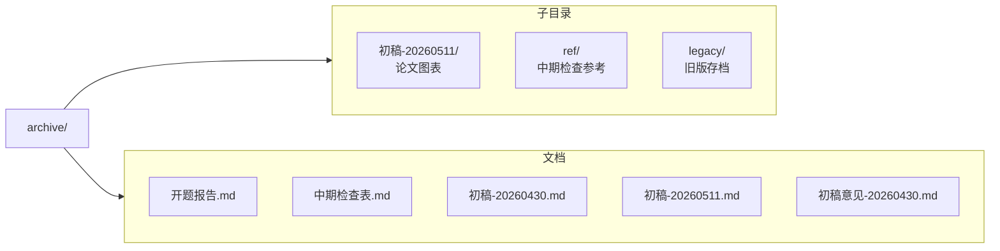

# archive/

论文写作相关文件。

## 目录

## 写作规范

- 中文论述用中文标点。引号须用“”和‘’，禁英文半角
- 代码块/英文专有名词/数学公式中引号不受限

### 禁泄露项目细节

论文面向学术读者，描述设计思路而非具体配置。

**禁**：配置文件名、环境变量名、函数名、实验运行ID、常量名、内部阈值参数
**可**：数据结构语义描述、算法逻辑与公式、参考文献框架公开接口名、公开模型名

