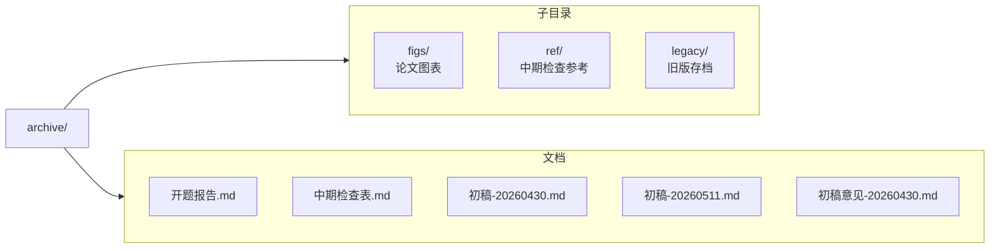

# archive/

论文写作相关文件。

## 目录

## 写作规范

- 中文论述用中文标点。引号须用“”和‘’，禁英文半角
- 代码块/英文专有名词/数学公式中引号不受限

### 禁泄露项目细节

论文面向学术读者，描述设计思路而非具体配置。

**禁**：配置文件名、环境变量名、函数名、实验运行ID、常量名、内部阈值参数
**可**：数据结构语义描述、算法逻辑与公式、参考文献框架公开接口名、公开模型名

## 参考文献 [1]-[17]

| # | 文献 |
|---|------|
| [1] | Zhong et al. MemoryBank. NeurIPS 2023 |
| [2] | Chen et al. VehicleMemBench. arXiv:2603.23840, 2026 |
| [3] | Ablaßmeier et al. Context-Aware Bayesian Networks. HCII 2007 |
| [4] | Kim et al. Physiological Indices VR. UbiComp 2023 |
| [5] | Chen et al. Emotion-aware Automobiles. CHI 2025 |
| [6] | Parwani et al. MCP. Zenodo 2025 |
| [7] | Karpukhin et al. Dense Passage Retrieval. EMNLP 2020 |
| [8] | Johnson et al. FAISS. IEEE TBD 2021 |
| [9] | Ebbinghaus. Memory. Dover 1964 (1885) |
| [10] | Lu et al. MemoChat. arXiv:2308.08239, 2023 |
| [11] | Graves et al. Neural Turing Machines. arXiv:1410.5401, 2014 |
| [12] | Xu et al. Beyond Goldfish Memory. arXiv:2107.07567, 2021 |
| [13] | Chhikara et al. Mem0. arXiv:2504.19413, 2025 |
| [14] | Li et al. MemOS. arXiv:2507.03724, 2025 |
| [15] | Endsley. Situation Awareness. Human Factors 1995 |
| [16] | Wickens. Multiple Resources. Human Factors 2008 |
| [17] | Yang et al. VehicleWorld. arXiv:2509.06736, 2025 |
