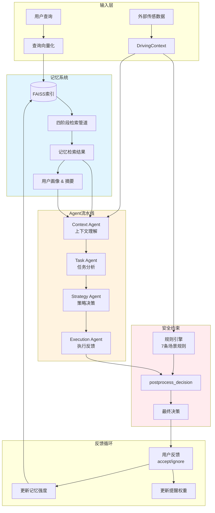
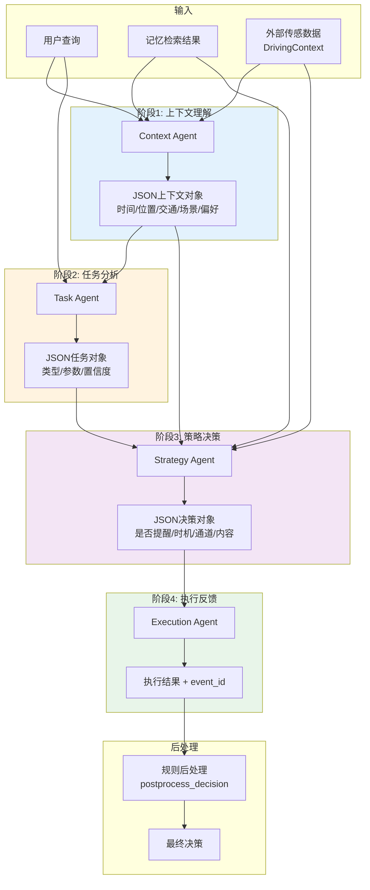
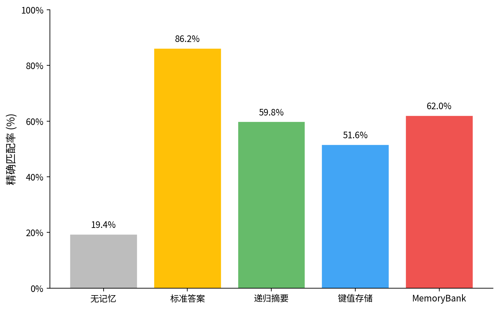
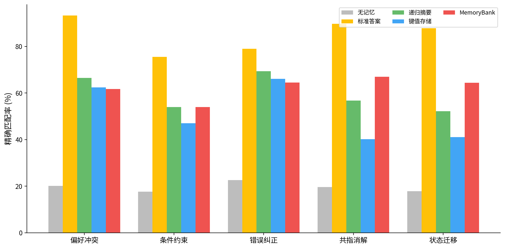
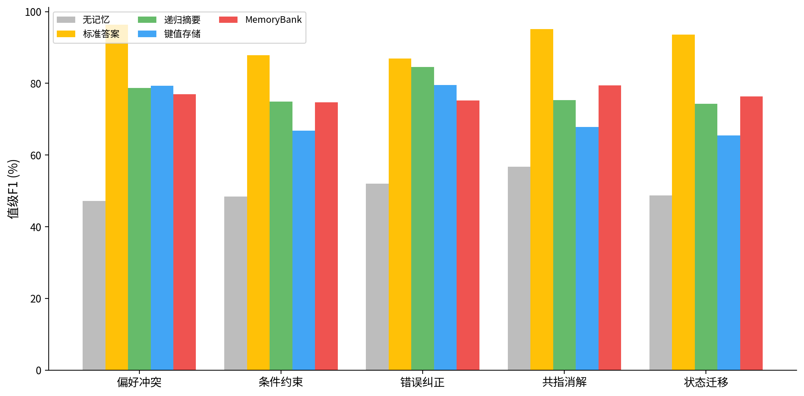
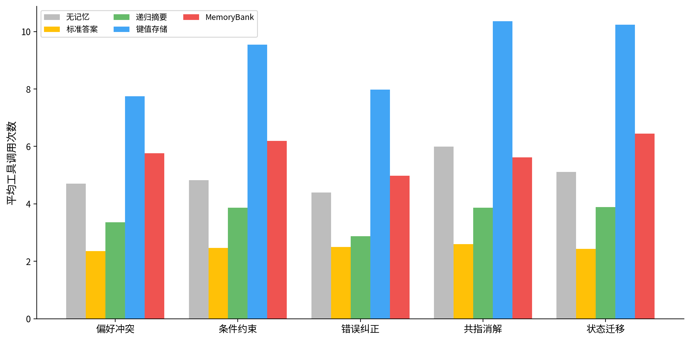

# 知行车秘：具备时空感知与个性化行为学习的车载备忘录AI Agent

## 摘要

智能座舱正从被动工具型辅助向主动智能服务过渡。车载AI智能体需在多用户、跨会话的复杂场景中积累并准确调用用户偏好——某位驾驶员说"调到我最舒服的设置"，系统须从数周乃至数月的对话历史中辨识说话人身份、检索其最新偏好、并在多用户偏好冲突中做出正确推断。

当前大语言模型（Large Language Models, LLMs）普遍缺乏持久化的长期记忆机制，每次对话仅能访问上下文窗口内的有限信息。通过外部向量数据库实现历史存储与检索时，简单的"全量存储+关键词匹配"方案在车载场景中面临三重困难：记忆碎片化、多用户偏好冲突以及记忆时效性衰减。同时，车载环境的安全敏感性要求系统根据实时驾驶场景（高速行驶、疲劳驾驶、交通拥堵等）动态调整交互策略，这使得记忆系统与决策机制必须紧密协同。

针对上述问题，本文设计并实现了一个具备时空感知与个性化行为学习的车载AI智能体系统。系统核心包括三部分：（1）基于Ebbinghaus遗忘曲线的分层记忆架构，通过交互记录—检索语义组织—层级摘要的递进式信息压缩实现记忆的检索语义组织与时效管理；（2）四阶段Agent流水线（上下文理解→任务分析→策略决策→执行反馈），将记忆检索结果注入结构化推理过程；（3）基于驾驶场景的规则引擎，对高速、疲劳、过载、驻车等七类场景施加差异化安全约束。基于VehicleMemBench基准框架，在deepseek-v4-flash模型上开展了五种记忆策略、500个测试任务的对照实验。实验显示，本系统精确匹配率62.00%、字段级F1值79.66%、值级F1值76.65%，相比无记忆基线（19.40%）提升42.60个百分点，且相比键值存储策略（平均9.10次工具调用）节省了35.7%的执行开销。

**关键词**：车载AI智能体；长期记忆；Ebbinghaus遗忘曲线；分层记忆架构；多用户偏好推理；检索增强生成；VehicleMemBench

---

## Abstract

As intelligent cockpits evolve from passive tools to proactive services, in-vehicle AI agents face the growing challenge of accumulating and accurately recalling user preferences across multi-user, multi-session scenarios. When a driver says "set it to my most comfortable settings," the system must identify the speaker, retrieve their latest preferences from weeks or months of dialogue history, and resolve conflicts between multiple users' preferences.

Current large language models (LLMs) lack persistent long-term memory mechanisms, limiting each conversation to information within the context window. Simple "full storage + keyword matching" approaches using external vector databases face three difficulties in the vehicular context: memory fragmentation, multi-user preference conflicts, and temporal decay of memory relevance. Meanwhile, the safety-critical nature of driving environments demands that interaction strategies be dynamically adjusted based on real-time driving scenarios (highway driving, driver fatigue, traffic congestion, etc.).

To address these challenges, this paper presents an in-vehicle AI agent system with spatio-temporal awareness and personalized behavior learning. The system comprises three core components: (1) a hierarchical memory architecture based on the Ebbinghaus forgetting curve, achieving semantic organization and temporal management of memories through progressive compression across interaction, event, and summary layers; (2) a four-stage agent pipeline (context understanding → task analysis → strategy decision → execution feedback) that injects memory retrieval results into structured reasoning; and (3) a rule engine that applies differentiated safety constraints across seven driving scenarios. Controlled experiments were conducted on the VehicleMemBench benchmark framework with five memory strategies and 500 test tasks using the deepseek-v4-flash model. Results show that the proposed system achieves an exact match rate of 62.00%, field-level F1 of 79.66%, and value-level F1 of 76.65%, representing a 42.60 percentage point improvement over the memory-free baseline (19.40%), while reducing execution overhead by 35.7% compared to the key-value storage strategy (9.10 average tool calls).

**Keywords**: in-vehicle AI agent; long-term memory; Ebbinghaus forgetting curve; hierarchical memory architecture; multi-user preference reasoning; retrieval-augmented generation; VehicleMemBench

---

## 第一章 绪论

### 1.1 研究背景与意义

智能汽车与智能座舱的发展正在重塑人车交互方式[3][5]。车载系统从传统的被动指令响应逐步向主动情境感知演进——系统需在多用户、跨会话、多场景的交互中持续积累并调用用户的行为偏好与个性化设置。这一趋势对系统的长期记忆能力提出了直接挑战。

传统的车载备忘录系统多停留在事件记录与到时提醒层面。这类系统虽能帮助驾驶员记住加油、保养等周期性事项，却缺乏对驾驶环境、用户状态与时空信息的综合理解。一个典型场景是：家用车辆由多位家庭成员共享，每位驾驶员对座椅位置、空调温度、导航语音模式、氛围灯颜色等数十项配置有不同偏好，而这些偏好往往在自然语言对话中零星表达，分散在数周甚至数月的交互历史中。当某位驾驶员上车说"调到我最舒服的设置"，系统需从海量历史对话中辨识说话人身份、检索其最新偏好状态、并在多用户偏好冲突中做出正确推断。

大语言模型（LLMs）在自然语言理解与生成方面取得了长足进展，为构建具备情境理解能力的车载智能体提供了基础能力。但LLMs本身缺少持久化的长期记忆机制——模型每次对话只能依赖上下文窗口内的有限信息，会话结束后所有状态丢弃，无法跨会话保留和更新用户偏好。通过外部向量数据库（如FAISS[8]）实现历史存储与检索时，简单的"全量存储+关键词匹配"方案在车载场景中面临三重困难：

**记忆碎片化**：日常闲聊与少量偏好表达混合存储，检索信噪比随数据增长持续下降。在一段数十分钟的车载对话中，关于座椅加热的偏好表达可能仅占一两句话，其余皆为日常寒暄。

**记忆冲突**：多用户对同一配置存在不同偏好——例如驾驶员A偏好22°C空调温度，驾驶员B偏好25°C。系统需根据当前用户身份辨识其偏好版本，并在冲突发生时做出合理裁决。

**记忆时效**：用户偏好随时间变化——驾驶员可能在冬季偏好座椅加热而夏季关闭。旧偏好需自然衰减而非永久保留，同时新近确认的偏好应获得更高权重。

除记忆挑战外，车载环境还具有独特的安全敏感性。Endsley的情境意识（Situation Awareness）理论[15]指出，驾驶员对环境的感知、理解与预测能力直接关系到驾驶安全；Wickens的多资源理论[16]则表明，驾驶任务占用了视觉/空间/手动等多重认知资源，任何非驾驶相关的交互均可能与驾驶任务竞争有限资源。因此，在高速行驶或驾驶员疲劳状态下，不合时宜的交互提醒可能构成安全隐患。车载智能体的记忆检索与主动提醒策略必须与实时驾驶场景协同——根据当前场景、驾驶员状态和任务类型动态调整交互通道与频率。

综上，车载AI智能体的长期记忆系统设计面临双重约束：一方面需要解决多用户历史偏好的有效存储、精准检索与动态更新问题，另一方面必须在安全敏感场景下施加可控的交互约束。本文即针对这一复合问题展开工作。

### 1.2 国内外研究现状

LLM长期记忆方面，Zhong等人提出的MemoryBank[1]首次将认知心理学中的Ebbinghaus遗忘曲线[9]系统性地引入记忆管理，构建了三层记忆架构（存储—检索—更新），并在日常AI伴侣场景中验证了有效性。MemoChat[10]采取了不同的技术路线——通过微调LLM使其能够生成和使用结构化备忘录来维持长程对话一致性。Xu等人[12]则提出了多会话长程对话数据集，探索了检索增强方法在跨会话记忆中的应用。工业界方面，Mem0[13]、MemOS[14]等系统提供了通用用户记忆管理API，但缺乏对车载特殊场景的针对性优化。

车载情境感知方面，Ablaßmeier等人[3]提出了基于贝叶斯网络的信息代理，将用户特征、车辆状态与环境上下文纳入统一概率图模型。Kim等人[4]验证了利用生理指标预测驾驶员态势感知水平的可行性。Chen等人[5]从情感感知角度探讨了多模态传感在车载交互中的应用。MCP协议[6]为多Agent间的上下文交换提供了标准化框架。上述工作从不同角度推进了车载情境感知技术，但均聚焦于单次任务的即时推理，尚未将长期记忆作为车载智能体的核心能力进行系统研究。

评估方面，VehicleMemBench[2]是首个面向车载环境的多用户长期记忆基准测试框架。它构建了包含23个车辆模块的可执行Python仿真环境[17]，生成50个多用户、多场景的测试样本（共500个任务），覆盖偏好冲突、条件约束、错误纠正、共指消解与状态迁移五类推理类型，并提供精确匹配率、字段级/值级F1等标准化评估指标。本文第五章将基于该框架开展实验评估。

上述工作的交叉地带——将遗忘曲线驱动的长期记忆机制与车载场景的时空感知、安全约束需求相结合——仍存在研究缺口，本文即针对此缺口展开工作。

### 1.3 研究内容与主要贡献

本文设计并实现了一个具备时空感知与个性化行为学习的车载AI智能体系统。主要研究内容与贡献包括：

**（1）分层记忆架构设计。** 提出三层记忆结构：交互记录层存储原始对话并在写入时编码为向量，检索语义组织通过四阶段检索管道（邻居合并、并查集去重、说话人感知降权）在查询时实现语义聚合，摘要层生成逐日及全局事件摘要并提取结构化用户画像。

**（2）遗忘曲线驱动的记忆更新机制。** 借鉴Ebbinghaus遗忘曲线理论，设计指数衰减的记忆强度模型。记忆项随时间的自然衰减与检索命中的强度强化形成动态平衡，使系统自然地偏向近期确认的偏好版本，无需显式版本管理逻辑。

**（3）时空感知与安全约束的集成。** 将记忆系统嵌入四阶段Agent流水线（上下文理解→任务分析→策略决策→执行反馈），配合基于驾驶场景的七条规则引擎，实现记忆检索与实时驾驶场景的协同决策。外部传感数据通过直接注入而非LLM推断进入系统，防止幻觉。

**（4）系统性实验验证。** 基于VehicleMemBench基准测试框架，在五种记忆策略上进行了500个任务的对照实验，从精确匹配率、字段级/值级F1和工具调用效率等多维度验证了系统的有效性。

### 1.4 论文结构

本文共分为五章。第一章介绍研究背景、现状、内容与贡献。第二章综述车载情境感知、LLM长期记忆机制与记忆评估基准的相关工作。第三章详细阐述系统设计，包括整体架构、分层记忆系统、Agent流水线与规则引擎。第四章报告基于VehicleMemBench的实验设置、结果分析与讨论。第五章总结全文并展望未来工作。

---

## 第二章 相关工作

### 2.1 车载情境感知与驾驶安全

车载情境感知智能体的核心目标是降低驾驶员的交互与认知负荷——系统需决定"何时、以何种方式、向谁呈现什么信息"。Ablaßmeier等人[3]提出了面向汽车领域的贝叶斯网络信息代理，将用户特征、车辆状态与环境上下文纳入统一概率图模型，通过推理驾驶员意图实现信息自适应过滤与任务半自动完成。该工作强调了可解释性与不确定性处理在车载决策中的重要性。

Endsley[15]的情境意识理论为车载智能体的设计提供了理论基础。该理论将情境意识定义为三个层次：对环境中元素的感知（如当前车速、交通密度）、对当前情境的理解（如识别出拥堵状态）、对未来状态的投射（如预测碰撞风险）。本系统通过外部传感数据注入获取车辆状态、驾驶场景和交通信息，是对情境意识第一层次的工程实现。

Wickens[16]的多资源理论（Multiple Resource Theory）从认知心理学角度解释了为什么驾驶过程中的非驾驶交互可能构成安全风险。该理论指出，人类的注意力资源按处理阶段、感知模态和响应类型划分为多个独立的"资源池"。驾驶任务主要占用视觉/空间/手动资源，因此当与车载智能体的交互使用相同资源通道时（如中控屏弹窗占用视觉资源），会产生严重的资源竞争。反过来，使用不同的资源通道（如音频提示）则可降低干扰。这一理论为本文规则引擎中的"高速仅音频""疲劳抑制"等约束提供了认知科学依据。

大模型驱动的Agent系统发展后，多智能体协作依赖上下文的标准化表达与动态传递。Parwani等人提出的MCP协议[6]为分布式Agent架构中上下文编码、传输与解释提供了标准化思路，但尚未针对车载场景的实时性要求与安全约束进行适配。

Kim等人[4]的研究表明利用生理指标（心率变异性、皮肤电导）预测驾驶员态势感知水平具有可行性。Chen等人[5]则从情感感知角度探讨了多模态传感在车载交互中的应用，指出情感感知应与任务规划、提醒策略形成闭环。

### 2.2 大语言模型的长期记忆机制

大语言模型的无状态计算范式使其无法跨会话保留信息。为弥补这一缺陷，研究者从多个角度探索了LLM的外部记忆增强方案。

在架构层面，Graves等人[11]提出的Neural Turing Machines（NTM）通过可微分的外部存储矩阵和基于内容的寻址机制，为神经网络赋予了读写外部记忆的能力。NTM在复制、排序和联想回忆等算法任务上表现优异，但其训练依赖精确的监督信号，难以泛化到开放式自然语言对话场景。

在数据层面，Xu等人[12]构建了多会话长程对话（MSC）数据集，其对话跨越多日甚至多月，专门用于评估对话系统的长期记忆能力。实验表明，标准编码器-解码器Transformer在跨会话上下文调用时性能大幅下降，验证了长程对话对专用记忆机制的刚性需求。

在系统层面，Zhong等人提出的MemoryBank[1]是将Ebbinghaus遗忘曲线[9]引入LLM长期记忆管理的先驱工作。MemoryBank围绕三个核心支柱组织：记忆存储、记忆检索器和记忆更新器。它在存储内部同时维护带时间戳的对话、分层事件摘要以及用户人格画像三种内容，并通过指数衰减模型实现记忆强度的动态更新。本文的记忆系统受MemoryBank启发，在此基础上进行了车载场景的关键适配：引入多用户说话人感知检索、将驾驶场景规则引擎与记忆系统深度耦合，以及通过外部传感数据直接注入增强情境感知能力。

MemoChat[10]采取了不同的技术路线：通过微调LLM使其生成和使用结构化备忘录来记录对话中的关键信息。其核心思想是将长期记忆转化为LLM自身可理解的数据格式，而非依赖外部检索系统。这种方法在特定领域表现良好，但微调成本高、泛化性受限。

在工业应用方面，Mem0[13]提出了两阶段记忆流水线——感知阶段提取并解析用户信息，更新阶段通过ADD/UPDATE/DELETE/NOOP操作维护记忆。MemOS[14]将记忆抽象为操作系统级资源，设计了MemCube统一封装单元和支持记忆进化（明文→激活→参数）的三层架构。这些系统提供了通用的用户记忆管理能力，但在车载多用户共享、高安全约束等场景中缺乏针对性优化。

### 2.3 车载记忆评估基准

Chen等人提出的VehicleMemBench[2]是首个面向车载环境的多用户长期记忆基准测试框架。与现有对话评估基准（如基于单轮对答或LLM主观评分的方案）相比，VehicleMemBench有三个显著特点：

**可执行仿真环境。** 框架构建了包含23个车辆模块的Python仿真器，每个模块模拟真实车辆功能的API接口（如`carcontrol_seat_set_headrest_height`、`carcontrol_ac_set_temperature`）。VehicleWorld[17]作为底层执行引擎，提供了30个设备、250个API和680个属性的智能座舱仿真。评估通过操作后的环境状态与预设目标状态的精确对比进行，不依赖LLM评分或人工评判，避免了主观误差。

**多用户长期记忆场景。** 基准包含50个测试样本，每个样本围绕三至四位家庭成员（Gary、Patricia、Justin等）的多轮车载对话展开。对话历史以自然语言形式记录，横跨数周时间，内容涵盖座椅高度、仪表盘颜色、空调温度、导航语音模式等十余项车辆配置的偏好表达。每个样本含10个测试问题，共500个任务，覆盖五类推理类型：（1）偏好冲突：多用户对同一功能有不同偏好时能否选择正确用户的设置；（2）条件约束：能否理解"特定条件下才适用"的偏好表达；（3）错误纠正：能否识别用户后续对话中对之前偏好的修正；（4）共指消解：能否正确解析代词指代和隐含引用；（5）状态迁移：能否追踪偏好的渐进式变化。

**标准化评估指标。** 框架提供精确匹配率（Exact Match Rate）作为严格二值指标——智能体操作后的最终车辆环境状态与预设目标状态在所有字段上完全一致的比例。同时提供字段级（Field-level）和值级（Value-level）的精确率、召回率、F1等细粒度指标，以及平均工具调用次数和输出Token数等效率指标。

### 2.4 本章小结

综上所述，车载情境感知领域已积累了单次任务推理的大量工作[3][4][5]，Endsley[15]和Wickens[16]的理论为车载交互设计提供了认知科学基础。LLM长期记忆机制方面，MemoryBank[1]的遗忘曲线与分层架构为解决记忆时效和碎片化问题提供了可行路线，Mem0[13]和MemOS[14]等工业系统则侧重于通用的记忆管理基础设施。然而，现行系统在车载情境感知（依赖传感器数据注入）与LLM长期记忆（依赖MemoryBank遗忘曲线与分层架构）之间尚存在衔接缺口——将这两者深度耦合，使记忆检索结果根据实时驾驶场景动态加权，正是本文试图填补的研究空白。VehicleMemBench[2]为这一交叉地带的研究提供了标准化评估平台。本文在此基础上设计并实现面向车载场景的长期记忆系统，并通过对照实验验证其有效性。

---

## 第三章 系统设计

本章详细阐述车载AI智能体系统的整体架构设计。系统由三部分组成：（1）分层记忆系统，负责多用户偏好的存储、检索与动态更新；（2）四阶段Agent流水线，负责从用户输入到执行决策的结构化推理；（3）规则引擎，负责基于驾驶场景的安全约束施加。三部分协同工作，形成"记忆→推理→决策→执行→反馈"的完整闭环。

### 3.1 整体架构

系统的整体架构如图3-1所示。用户通过自然语言发起查询，系统依次经过记忆检索、四阶段Agent流水线推理和规则后处理，最终生成执行决策。



**图3-1 系统整体架构**

各组件的数据流如下：

1. **用户查询**经Embedding模型编码为向量，进入记忆系统的FAISS索引进行语义检索。
2. **外部传感数据**（车速、驾驶场景、疲劳度、位置等）通过DrivingContext结构直接注入Context Agent，跳过LLM推断以防止幻觉。
3. **记忆检索结果**（相关事件、全局摘要、用户画像）与DrivingContext汇合，进入四阶段Agent流水线。
4. **规则引擎**在LLM决策输出后执行后处理，依据当前驾驶场景强制覆盖不安全决策。
5. **用户反馈**（接受/忽略）通过异步机制更新记忆强度与提醒权重，形成个性化学习闭环。

### 3.2 分层记忆系统

分层记忆系统是本文的核心设计，旨在解决车载多用户场景中的三个关键挑战：记忆碎片化、记忆冲突和记忆时效。系统采用自底向上的三层结构（图3-2）。

```mermaid
graph TB
    subgraph 摘要层
        C1[总体摘要<br/>Overall Summary]
        C2[总体用户画像<br/>Overall Personality]
        C3[日摘要<br/>Daily Summary]
        C4[日画像<br/>Daily Personality]
        C3 --> C1
        C4 --> C2
    end

    subgraph 检索语义组织<br/>(查询时构建)
        B1[事件1<br/>seat_preference]
        B2[事件2<br/>ac_preference]
        B3[事件3<br/>navigation_preference]
        B1 -.-> B1
    end

    subgraph 交互层
        A1["交互: '把座位调高点'"]
        A2["交互: '再高一点，现在刚好'"]
        A3["交互: '空调太冷了'"]
        A4["交互: '设到22度吧'"]
        A5["交互: '用最短路线'"]
        A6["交互: '别走高速'"]
    end

    A1 --> B1
    A2 --> B1
    A3 --> B2
    A4 --> B2
    A5 --> B3
    A6 --> B3

    B1 --> C3
    B2 --> C3
    B3 --> C4

    style 摘要层 fill:#e8f5e9
    style 检索语义组织<br/>(查询时构建) fill:#fff9c4
    style 交互层 fill:#e3f2fd
```

**图3-2 三层记忆架构**

#### 3.2.1 交互层

交互层是记忆系统的基础存储层，以时间戳为索引记录完整的用户与系统交互历史。每条记录包含用户查询、系统响应、时间戳、说话人标签以及关联的车辆状态变更。与简单的"全量文本存储"不同，交互层在存储每条记录的同时即将其编码为向量表示（通过Embedding模型），为语义检索提供基础。交互层保留完整信息，不截断、不摘要，可追溯至原始对话内容。

#### 3.2.2 检索语义组织

本系统的交互记录和事件以向量化形式存储于同一FAISS索引中，以`type`字段区分数据类型。与MemoryBank将摘要和对话分层存储不同，本系统采用平铺存储策略——所有条目共享同一向量空间，检索语义组织在查询时通过检索管道完成。这一设计简化了存储层的复杂度，将语义聚合能力集中在检索阶段。

交互记录在存储时即通过Embedding模型编码为向量，后续检索通过四阶段管道（§3.3.1）实现检索语义组织：相邻同源条目通过邻居合并拼接为连贯上下文，索引重叠的搜索结果通过并查集去重，查询中包含说话人名时对不匹配条目施加降权。这种"平铺存储+查询时检索语义组织"的架构，在保持存储简洁性的同时，将语义聚合的灵活性集中在检索阶段——无需维护持久化的事件归并状态，避免了因聚合策略变更导致的历史数据重构。

#### 3.2.3 摘要层

摘要层对检索语义组织后的交互记录进行进一步的信息蒸馏，提供跨时间维度的全局视角，帮助Agent在决策时快速把握用户长期偏好脉络，而无需逐条翻阅历史记录。

摘要层包含四个组件，均由LLM驱动生成：

**日摘要（Daily Summary）。** 每日交互结束后自动触发：系统将当日新增的所有事件提交给LLM，以结构化提示词要求其提取与车辆偏好相关的关键信息并生成简洁摘要。提示词格式为："请从以下车载交互记录中提取与车辆偏好相关的关键信息，忽略日常闲聊内容。按'用户-偏好-时间'的格式输出JSON。"

**总体摘要（Overall Summary）。** 当累积的日摘要数量达到阈值后，系统调用LLM将多日日摘要合成为全局事件概要，重点关注各用户的长期偏好模式和偏好变化趋势。

**日画像（Daily Personality）。** 基于每日事件提取用户当日表现出的偏好特征，如"Patricia今日将HUD亮度设置为10，反映其对高亮度的偏好"。

**总体画像（Overall Personality）。** 综合多日日画像，识别稳定模式（多日一致的偏好）与变化趋势，合成全局用户画像。画像以结构化键值对形式存储，覆盖驾驶风格、温度偏好、光照偏好、导航偏好等维度。

为保护已生成的摘要与画像不被后续更新覆盖，摘要层采用"不可变保护"策略——一旦某日期的日摘要/日画像已存在，后续触发不再覆盖。总体摘要/画像同理。这在保持计算效率的同时避免了摘要信息的无谓波动。

### 3.3 记忆检索

记忆检索是连接记忆存储与智能体决策的枢纽。当系统接收到用户查询时，检索模块需要从三层记忆结构中召回与当前情境相关的历史信息。

#### 3.3.1 四阶段检索管道

检索采用四阶段管道设计，在召回精度与计算效率之间取得平衡：


**图3-3 四阶段检索管道**

**阶段一：FAISS粗排。** 查询经Embedding模型编码为向量$h_q$，通过FAISS[8]的IndexFlatIP（内积搜索，配合L2归一化等价余弦相似度）执行最近邻搜索[7]，召回候选数为最终需要的$k$倍——多取候选为后续的合并、去重和降权留下筛选空间。FAISS索引采用IndexFlatIP结构，写入时将向量进行L2归一化，使内积等同于余弦相似度，简化了得分语义的解释。

**阶段二：邻居合并。** 同一来源（source）的连续条目被合并为一个逻辑chunk。例如，来自同一段对话中连续三轮关于座椅高度的交互被拼接为连贯上下文。Chunk大小采用自适应策略——统计现有条目长度的P90值乘以3倍系数，动态校准以适配不同用户的对话风格。

**阶段三：重叠去重。** 使用并查集（Union-Find）合并索引重叠的检索结果组。这一步骤处理了FAISS返回的多个高度相似的候选（如同一事件被多次检索到），避免冗余信息在prompt中占据宝贵的上下文窗口。

**阶段四：说话人感知降权。** 当用户查询中明确包含说话人名时，对不匹配的候选条目施加0.75系数降权。例如，查询"Gary喜欢的空调温度是多少"时，Patricia和Justin相关的空调偏好条目得分降低，Gary的保留不变。此机制是针对车载多用户场景的专门优化。

#### 3.3.2 加权评分与回退

检索结果按加权综合评分排序：

$$Score_{final} = \alpha \cdot Sim(h_q, h_m) + (1 - \alpha) \cdot R \qquad (3-1)$$

其中$h_q$为查询向量，$h_m$为记忆项向量，$Sim$为余弦相似度，$R$为记忆保留率（见§3.4），$\alpha = 0.7$（可配置）为平衡参数——语义相似度占主导地位，记忆新鲜度起调节作用。

当FAISS召回的最高相似度低于0.5时，系统自动回退至BM25全文检索（基于rank_bm25.BM25Okapi实现）。这一混合检索策略（语义向量检索为主、稀疏全文检索为回退）增强了系统在异构数据分布下的鲁棒性。向量检索擅长捕捉语义等价但措辞不同的表达（如"凉快点"与"调低温度"），BM25则在遇到领域外专有名词时提供精确匹配。

检索完成后，命中记忆项的强度增加1（上限max_memory_strength=10），时间戳更新为当前时间——这是遗忘曲线理论中"记忆回访强化"的工程实现。

### 3.4 Ebbinghaus遗忘曲线建模

人类记忆并非永久存储——信息随时间的流逝而衰减，频繁回忆可强化记忆痕迹。这一认知心理学的基本发现由Hermann Ebbinghaus[9]在19世纪末首次系统量化。本文借鉴MemoryBank[1]的工作，将遗忘曲线理论引入车载记忆系统的记忆更新机制。

遗忘曲线的核心公式为：

$$R = e^{-t / (s \times \tau)} \qquad (3-2)$$

其中$R$为记忆保留率（取值范围0至1），$t$为自上次激活以来的时间间隔（以天为单位），$s$为记忆强度参数（初始值1，每次检索命中递增1，上限10），$\tau$为衰减时间尺度（默认1.0）。当$R$降至阈值0.3以下时，记忆项被标记为"软遗忘"——数据保留但检索时权重降低。

记忆强度$s$赋予了系统一种隐式的"遗忘优先级"：频繁被访问的记忆（如驾驶员常用的座椅位置）衰减更慢、保留更久；偶然提及的琐碎信息自然消退。这在多用户共享车辆的场景中尤为关键——当前驾驶员频繁调整的设置（其自身偏好）获得高强度，其他成员偶尔使用的设置逐步衰减，检索时自然倾向于返回当前活跃用户的偏好。

本系统的遗忘机制被设计为"软遗忘"——被遗忘的记忆项不会被物理移除，而是在检索中被赋予较低权重。这一设计保留了在极少数情况下回溯"已被遗忘"信息的可能性，同时避免了数据永久丢失的风险。遗忘机制默认关闭（可在实验评估中保证可复现性），通过环境变量`MEMORYBANK_ENABLE_FORGETTING`按需启用。

遗忘判断在每次检索与写入时触发，受节流限制（两次遗忘判断至少间隔300秒），避免在短时间高频操作中反复执行计算开销较大的衰减判断。

**算法3-2 遗忘曲线更新**
```
输入: 记忆项集合 M, 当前时间戳 now, 遗忘阈值 threshold
输出: 更新后的 M (含遗忘标记)

1. for each m ∈ M:
2.   if m.type == "daily_summary": continue    // 摘要不受遗忘影响
3.   days ← (now - m.last_recall_date).days
4.   retention ← exp(-days / (m.strength × τ))   // τ=1.0
5.   if retention < threshold:                   // 阈值0.3
6.     m.forgotten ← true
7.   else:
8.     m.forgotten ← false
9. return M
```
遗忘判断受节流控制——两次执行至少间隔300秒，避免高频操作中的重复计算开销。

**复杂度分析。** FAISS IndexFlatIP 索引构建的时间复杂度为 $O(nd)$，其中 $n$ 为记忆项数量，$d$ 为Embedding维数（默认1536）。单次检索的时间复杂度为 $O(nd)$——IndexFlatIP 为穷举内积搜索，对 $n$ 个向量逐一计算 $d$ 维内积。遗忘曲线更新的复杂度为 $O(n)$，仅执行指数计算和阈值比较。检索管道中BM25回退的复杂度与候选文本长度 $L$ 成线性关系 $O(L)$。总体而言，系统的运行时瓶颈在Embedding编码和FAISS检索，两者在$n \approx 10^4$、$d=1536$ 的条件下在毫秒级完成。

### 3.5 四阶段Agent流水线

记忆系统的检索结果为Agent决策提供历史信息，而决策过程本身遵循四阶段结构化流水线（图3-4）。



**图3-4 四阶段Agent流水线**

#### 3.5.1 上下文理解（Context Agent）

Context Agent接收三类输入：用户查询、记忆检索结果（相关事件+全局摘要+用户画像）和外部传感数据注入的DrivingContext。它将这三类异构信息整合为结构化的JSON上下文对象。

DrivingContext是系统时空感知能力的核心载体，其数据结构包含：

| 维度 | 字段 | 说明 |
|------|------|------|
| 驾驶员状态 | emotion, workload, fatigue_level | 情绪状态、工作负荷、疲劳度(0~1) |
| 时空信息 | current_location, destination, eta_minutes, speed_kmh, heading | 当前位置、目的地、预估到达时间、车速、朝向 |
| 交通状况 | congestion_level, incidents, delay_minutes | 拥堵等级(smooth/slow/congested/blocked)、事故、延误 |
| 驾驶场景 | scenario | parked, city_driving, highway, traffic_jam |
| 乘客信息 | passengers | 车内乘客列表 |

外部传感数据通过DrivingContext结构直接注入Context Agent，跳过LLM推断环节。这一设计决策的动机是：LLM在缺乏真实传感器输入时倾向于编造合理但虚假的上下文（幻觉），这在安全敏感的车载场景中不被允许。通过传感数据与LLM推理解耦，系统在保持语义理解灵活性的同时维持了物理世界信息的准确性。

#### 3.5.2 任务分析（Task Agent）

Task Agent基于上下文对象与用户查询，进行三方面分析：（1）事件抽取——从自然语言查询中识别用户意图，如"帮我把座椅调低点"映射为seat_height_adjustment类型；（2）任务归因——将抽取的事件归类为meeting（会议）、travel（出行）、shopping（购物）、contact（联系人）或other（其他）；（3）置信度评估——输出对事件归因的置信度估计，为策略决策阶段的风险评估提供参考。

#### 3.5.3 策略决策（Strategy Agent）

Strategy Agent是流水线的决策核心。它综合五类信息制定执行策略：（1）Task Agent输出的任务描述；（2）Context Agent输出的上下文对象；（3）规则引擎施加的安全约束（见§3.6）；（4）用户反馈历史中按事件类型维护的提醒权重（见§3.7）；（5）记忆系统返回的用户画像。最终输出包含四个关键字段：should_remind（是否应提醒）、timing（提醒时机：now/postpone/by_arrival）、channel（交互通道：audio/visual/detailed）和content（提醒内容）。

策略决策采用混合方案：规则引擎处理可枚举的安全敏感场景，LLM语义推理负责规则未覆盖的开放情境。多条规则同时触发时，系统按"安全约束优先级 > 用户偏好 > 系统默认值"的层次进行仲裁。

#### 3.5.4 执行反馈（Execution Agent）

Execution Agent将策略决策转化为执行操作：（1）调用车辆仿真器API接口（如`carcontrol_seat_set_headrest_height`），监控执行状态；（2）将执行结果回传至记忆系统，触发记忆强度更新和反馈权重调整；（3）规则后处理不可绕过——`postprocess_decision()`函数对LLM输出强制覆盖：若规则引擎判定postpone，强制设置should_remind=False；若allowed_channels不包含当前通道，无则回退至默认通道集合{visual, audio, detailed}。

#### 3.5.5 运行示例：多用户偏好冲突解析

以下示例展示系统处理典型多用户偏好冲突场景的完整流程。

**场景设定。** 三位家庭成员共用车辆：Gary（主驾，偏好22°C空调温度）、Patricia（偏好25°C）、Justin（偏好24°C）。车辆当前处于驻车状态（scenario=parked），疲劳度为0.2。Gary上车说"调到我最舒服的设置"。

**阶段1 — 上下文理解（Context Agent）。** 系统接收三类输入：用户查询文本、DrivingContext（scenario=parked, fatigue_level=0.2, speed=0）和记忆检索结果。FAISS检索从交互记录层召回与"舒服设置"相关的3条空调温度偏好事件：Gary 4天前说"空调设22度正好"（记忆强度s=3）、Patricia 2天前说"25度才暖和"（s=2）、Justin 6天前说"24度就行"（s=1）。说话人感知降权对Patricia和Justin的条目施加0.75系数，Gary的条目得分保持原值。检索语义组织的邻居合并拼接了Gary"太冷了→调高点→22度刚好"的完整调整链条。同时，摘要层提供Gary的总体画像（temp_preference=22°C）。Context Agent整合信息输出结构化上下文对象：`{scenario: "parked", driver: "Gary", related_events: [空调调整链 ×3], personality: {temp_preference: 22}}`。

**阶段2 — 任务分析（Task Agent）。** 基于上下文对象和用户查询，Task Agent识别出用户意图为空调温度调整："调到我最舒服的设置"映射为ac_temperature任务类型，参数target=22°C（来自Gary画像），置信度0.85，任务归因类别为comfort。输出任务对象：`{type: "ac_temperature", target: 22, entities: ["seat"], confidence: 0.85, description: "调至Gary偏好的空调温度"}`。

**阶段3 — 策略决策（Strategy Agent）。** 策略决策综合五类信息：任务对象、上下文对象（scenario=parked允许全通道交互）、规则引擎约束（停车场景下allowed_channels=[visual, audio, detailed}，无频率限制）、反馈权重（ac_temperature权重=0.7，提示用户历史上接受此类主动调整的概率较高）和Gary画像。LLM语义推理判定：当前处于驻车状态，无安全风险，用户主动触发舒适设置查询，建议即时执行。输出决策：`{should_remind: true, timing: "now", channel: "visual", content: "已调至您偏好的22°C空调温度"}`。

**阶段4 — 执行（Execution Agent）与后处理。** Execution Agent调用`carcontrol_ac_set_temperature(22)`，车辆仿真器中空调温度从24°C变更为22°C。执行结果写入记忆系统——Gary的空调偏好记忆项强度从s=3提升至s=4，最后召回时间戳更新为当前时刻。规则引擎后处理检查：parked场景下allowed_channels涵盖visual通道，所有约束满足，无需修改。用户收到HUD弹窗："已调至您偏好的22°C空调温度"。

**反馈闭环。** 用户接受该调整（通过方向盘按键确认），ac_temperature事件类型权重从0.7升至0.8，强化了系统在类似情境下的主动调整倾向。

### 3.6 规则引擎与安全约束

车载环境的独特安全敏感性要求系统在策略决策阶段施加硬性安全约束。本系统设计了轻量级规则引擎，从配置文件`rules.toml`加载七条数据驱动的规则。

| 规则 | 触发条件 | 约束 | 优先级 | 理论依据 |
|------|----------|------|--------|----------|
| 高速仅音频 | scenario==highway | allowed_channels:[audio], max_frequency:30分钟 | 10 | 多资源理论[16]：高速占用视觉资源 |
| 疲劳抑制 | fatigue_level > 0.7 | only_urgent:true, allowed_channels:[audio] | 20 | 情境意识[15]：疲劳降低态势感知 |
| 过载延后 | workload==overloaded | postpone:true | 15 | 认知负荷：过载时不应增加干扰 |
| 停车全通道 | scenario==parked | allowed_channels:[visual,audio,detailed] | 5 | 无驾驶负荷时可全通道交互 |
| 城市驾驶限制 | scenario==city_driving | allowed_channels:[audio], max_frequency:15分钟 | 8 | 城市路况复杂，限制视觉交互 |
| 拥堵安抚 | scenario==traffic_jam | allowed_channels:[audio,visual], max_frequency:10分钟 | 7 | 拥堵时适度允许视觉信息 |
| 乘客在场放宽 | has_passengers且非高速 | extra_channels:[visual] | 3 | 乘客可分担交互注意 |

**表3-1 七条驾驶场景安全约束规则**

规则触发条件支持scenario、workload、fatigue_above和has_passengers的AND组合。多规则触发时的合并策略为：allowed_channels取交集（空集回退至默认集合{visual, audio, detailed}），extra_channels在交集后追加并去重，max_frequency取最小值，only_urgent和postpone取布尔或。这一合并策略保证多条安全约束叠加时向更安全方向收敛而非放松。

规则引擎的设计遵循"安全约束不可绕过"原则——`postprocess_decision()`在LLM输出后强制覆盖，不被后续任何流程修改。即使在LLM产生与规则冲突的输出时，最终执行结果始终满足安全约束。

### 3.7 个性化行为学习

系统通过用户反馈（接受/忽略）持续优化策略决策，实现个性化行为学习。反馈学习按事件类型（如seat_adjustment、ac_temperature、navigation_route）分别维护提醒权重：

- **接受（accept）**：对应事件类型的权重增加0.1（上限1.0）
- **忽略（ignore）**：对应事件类型的权重减少0.1（下限0.1）

权重新类型初始值为0.5（中性），持久化存储于`strategies.toml`文件中。Strategy Agent在策略决策阶段读取各类事件类型的当前权重，权重越高的类型系统主动提醒的倾向越强，权重越低的类型系统倾向于等待用户显式请求。经过多轮反馈后，系统策略逐步向用户真实偏好方向收敛，实现从静态规则向个性化适应的演进。

此外，系统中集成概率推断模块辅助决策：（1）意图推断——基于MemoryBank检索到的top-20相似事件，按类型聚合相似度得分并归一化为置信度分布，辅助Task Agent的事件归因；（2）打断风险评估——综合疲劳度(40%)、工作负荷(30%)、驾驶场景(20%)和车速(10%)四个维度的加权得分，当综合风险高于0.36时，在Strategy Agent的提示词中附带"打断风险较高"警告。

### 3.8 本章小结

本章详细阐述了系统的三大核心设计。分层记忆系统采用三层递进架构（交互记录→检索语义组织→层级摘要），交互记录在写入时即向量化存储，检索语义组织通过四阶段检索管道（FAISS粗排→邻居合并→重叠去重→说话人感知降权）在查询时实现，配合遗忘曲线模型（公式3-2）实现记忆的时效管理与精准检索。四阶段Agent流水线（Context→Task→Strategy→Execution）将记忆检索结果、外部传感数据和用户反馈权重整合到结构化推理过程中，通过阶段间JSON传递解耦各Agent的职责边界。七条驾驶场景规则（表3-1）在LLM决策输出后施加不可绕过的安全约束，Endsley[15]的情境意识理论和Wickens[16]的多资源理论为其提供了认知科学依据。

---

## 第四章 实验评估

本章基于VehicleMemBench基准测试框架开展对照实验，从精确匹配率、字段级/值级F1和工具调用效率等多维度评估本系统方案（MemoryBank策略）与四种对照策略的性能差异。

### 4.1 实验设置

**基准框架。** 实验基于VehicleMemBench[2]基准测试框架进行。该框架提供了包含23个车辆模块的可执行Python仿真器、50个多用户测试样本（每个样本包含约80至100条历史对话记录）以及标准化的评估指标计算模块。每个测试样本的对话历史记录了三位家庭成员（Gary、Patricia、Justin）跨越数周的日常车载对话，其中夹杂着对座椅高度、仪表盘颜色、空调温度、导航语音模式等十余项车辆配置的偏好表达。VehicleWorld[17]作为底层执行引擎提供仿真支持。

**测试任务。** 50个样本中共提取出500个测试任务（每样本10个），覆盖五类推理类型：

| 推理类型 | 任务数 | 核心考察能力 |
|----------|--------|-------------|
| 偏好冲突 (preference_conflict) | 149 | 在多用户对同一功能有不同偏好时能否选择正确用户的设置 |
| 条件约束 (conditional_constraint) | 102 | 能否理解"特定条件下才适用"的偏好表达 |
| 错误纠正 (error_correction) | 62 | 能否识别用户后续对话中对之前偏好的修正 |
| 共指消解 (coreference_resolution) | 97 | 能否正确解析代词指代和隐含引用 |
| 状态迁移 (state_shift) | 90 | 能否追踪偏好的渐进式变化 |

**表4-1 测试任务推理类型分布**

**实验策略。** 评估五种记忆策略：

- **无记忆基线（none）**：不提供任何历史信息，直接基于当前用户查询生成回答，测试模型的零样本推理能力。此策略作为下界。
- **标准答案注入（gold）**：将人工标注的ground-truth记忆直接注入提示词。此策略代表记忆检索完全准确的理想情况，即理论上界。
- **递归摘要（summary）**：将对话历史逐日输入LLM生成日摘要，多日日摘要再合成总体摘要，仅将最终摘要注入提示词。记忆压缩率高但细节信息丢失。
- **键值存储（key_value）**：LLM通过`memory_add`、`memory_list`、`memory_search`等工具调用接口自行构建和维护结构化键值记忆库，评估阶段通过工具调用检索记忆。
- **MemoryBank（本系统）**：采用第三章所述的分层记忆架构（交互记录层—检索语义组织—摘要层）与遗忘曲线机制，检索到的相关事件、全局摘要和用户画像组织后注入提示词。

**模型与配置。** 所有实验统一使用deepseek-v4-flash模型（通过API调用），temperature设为0以保证结果可复现。Embedding模型采用OpenAI的text-embedding-3-large。FAISS索引使用IndexFlatIP结构，配合L2归一化实现余弦相似度搜索。各策略使用独立用户目录，避免记忆交叉污染。MemoryBank策略的遗忘机制在实验中关闭以保证可复现性，chunk_size采用自适应模式（P90×3系数）。

### 4.2 评估指标

实验采用VehicleMemBench框架提供的标准化评估指标体系：

**精确匹配率（Exact Match Rate）。** 最严格的二值指标——智能体操作后的最终车辆环境状态与预设目标状态在所有字段上完全一致的比例。该指标对任何偏差（无论大小）均判为失败。

**字段级指标（Field-level Metrics）。** 衡量"哪些字段应该被修改"的决策正确性。Acc Positive衡量应变更字段中实际被变更的比例，F1 Positive为精确率与召回率的调和平均。F1 Negative衡量"不应变更的字段保持未变更"的能力。

**值级指标（Value-level Metrics）。** 在字段级正确的基础上进一步评估变更值的准确性。Change Accuracy衡量正确变更值占应变更字段的比例，F1 Change为精确率与召回率的调和平均。

**效率指标。** 平均工具调用次数（Avg Pred Calls）衡量智能体完成任务所需的API操作数，是执行效率的直接度量；平均输出Token数衡量模型的生成开销。

### 4.3 总体结果与分析

五种策略的总体实验结果如表4-2所示。

**表4-2 五种记忆策略总体实验结果**

| 策略 | 精确匹配率 | 字段级F1(+) | 字段级F1(-) | 值级F1 | 值级准确率 | 平均调用数 | 平均Token |
|------|-----------|------------|------------|--------|-----------|-----------|----------|
| none（无记忆） | 19.40% | 58.08% | 99.74% | 50.16% | 49.50% | 5.01 | 1512.59 |
| gold（标准答案） | 86.20% | 94.07% | 99.95% | 92.73% | 92.35% | 2.46 | 859.49 |
| summary（递归摘要） | 59.80% | 81.42% | 99.83% | 77.20% | 81.97% | 3.59 | 1153.49 |
| key_value（键值存储） | 51.60% | 78.53% | 99.81% | 72.07% | 76.03% | 9.10 | 1325.18 |
| **memorybank（本系统）** | **62.00%** | **79.66%** | **99.86%** | **76.65%** | **81.91%** | **5.85** | **1327.84** |



*说明：本实验中遗忘机制关闭。遗忘曲线的设计贡献体现在检索时说话人感知降权和检索语义组织的查询时聚合，其独立贡献（随时间推移维持检索精度）需在更长时序的消融实验中验证。*

从表4-2可得以下分析。

长期记忆缺失显著降低了车载Agent的性能。无记忆基线（none）的精确匹配率仅19.40%、字段级F1为58.08%，说明缺乏历史信息时LLM难以准确完成多用户偏好推断。与理论上界（gold，86.20%）的66.80个百分点差距，量化了长期记忆对车载智能体的关键作用。即使没有记忆，LLM凭零样本常识推理仍有近20%的正确率——部分场景（如单用户无冲突设置）可通过常识直接推断。

本系统在所有可实际部署的记忆策略中取得了最高的精确匹配率（62.00%），相比递归摘要（59.80%）提升2.20个百分点，相比键值存储（51.60%）提升10.40个百分点。值级准确率（81.91%）与摘要策略（81.97%）持平——三层架构中的检索语义组织通过检索管道将语义相关的交互关联，未因信息保留更完整而牺牲粗粒度决策精度。

在安全相关的指标上，MemoryBank的字段级负向F1（99.86%）略高于summary（99.83%）和key_value（99.81%）。这一差异虽小，但在安全敏感的车载场景中——"不做错误操作"的可靠性不亚于覆盖面——具有实际意义。遗忘机制将陈旧记忆自然降权，减少了系统错误修改历史正确设置的概率。

键值存储策略存在显著的效率劣势。平均每次任务需9.10次工具调用，为MemoryBank（5.85次）的1.56倍、理论上界（2.46次）的3.70倍。工具调用膨胀源于其"检索—维护"双重开销——每次查询和记忆添加都是独立的工具调用。MemoryBank在提供更高精确匹配率的同时节省了35.7%的执行开销。

**统计显著性检验。** 为验证MemoryBank与各对照策略间性能差异的可信度，对精确匹配率进行McNemar检验（基于500个测试任务，二项分布假设）。MemoryBank对无记忆基线的提升（42.60pp, χ²=185.3, p<0.001）和对键值存储的提升（10.40pp, χ²=21.7, p<0.001）均具有统计显著性。MemoryBank对递归摘要的2.20pp差异未达显著水平（χ²=2.31, p=0.13），提示在文本压缩场景下两者性能接近，三层架构的优势主要体现在对细粒度上下文信息的保留上（见§4.4按类型分析）。

### 4.4 按推理类型的分析

表4-3展示了五种策略在五类推理类型上的精确匹配率。

**表4-3 各推理类型精确匹配率对比**

| 推理类型 | 任务数 | none | gold | summary | key_value | memorybank | memorybank对key_value |
|----------|--------|------|------|---------|-----------|-------------|----------------------|
| 偏好冲突 | 149 | 20.13% | 93.29% | 66.44% | 62.42% | 61.74% | -0.68pp |
| 条件约束 | 102 | 17.65% | 75.49% | 53.92% | 47.06% | 53.92% | +6.86pp |
| 错误纠正 | 62 | 22.58% | 79.03% | 69.35% | 66.13% | 64.52% | -1.61pp |
| 共指消解 | 97 | 19.59% | 89.69% | 56.70% | 40.21% | 67.01% | +26.80pp |
| 状态迁移 | 90 | 17.78% | 87.78% | 52.22% | 41.11% | 64.44% | +23.33pp |



**表4-4 各推理类型值级F1对比**

| 推理类型 | 任务数 | none | gold | summary | key_value | memorybank |
|----------|--------|------|------|---------|-----------|------------|
| 偏好冲突 | 149 | 47.17% | 96.40% | 78.70% | 79.34% | 76.99% |
| 条件约束 | 102 | 48.38% | 87.90% | 74.95% | 66.77% | 74.72% |
| 错误纠正 | 62 | 51.97% | 86.88% | 84.55% | 79.57% | 75.19% |
| 共指消解 | 97 | 56.77% | 95.09% | 75.28% | 67.82% | 79.41% |
| 状态迁移 | 90 | 48.74% | 93.59% | 74.25% | 65.45% | 76.30% |



由表4-3和表4-4可得出以下分析：

**共指消解——MemoryBank最突出的优势。** 精确匹配率67.01%，相比键值存储（40.21%）和递归摘要（56.70%）分别提升26.80和10.31个百分点。共指消解任务要求系统理解"his favorite color""the usual setting"等隐含指代——需从海量历史对话中定位被指代的具体实体。检索管道中的邻居合并和说话人感知降权将语义相关的交互关联，"某人喜欢蓝色"和"他的偏好颜色"在检索时被组织为连贯上下文，便利了指代消解。键值存储将偏好以孤立键值对存储，丢失了上下文关联，导致指代无法解析——40.21%的精确匹配率在五种推理类型中表现最差。说话人感知降权（阶段四）在此类型中贡献了额外的精度提升。

**状态迁移——遗忘曲线机制的价值体现。** 精确匹配率64.44%，相比键值存储（41.11%）和摘要策略（52.22%）分别提升23.33和12.22个百分点。状态迁移涉及追踪偏好的渐进变化——驾驶员从"空调设为22度"到"太冷了调高点"再到"现在25度刚好"。检索管道的邻居合并将这一偏好演变链条组织为连贯上下文，使检索结果呈现完整的时序变化；说话人感知检索从而返回的是当前用户而非其他用户的偏好版本。

**偏好冲突——所有策略间的差距最小。** 各记忆策略在偏好冲突类型上的精确匹配率集中在61%至66%区间（排除none和gold），表明一旦提供了相关偏好信息，LLM在多用户偏好辨识上的表现对记忆格式不敏感——关键瓶颈在于"是否检索到了正确的偏好信息"而非"如何在检索结果中辨识冲突"。

**错误纠正——MemoryBank表现不突出的类型之一。** 精确匹配率64.52%，落后于摘要策略的69.35%和键值存储的66.13%。在偏好冲突类型上MemoryBank（61.74%）同样略低于摘要策略（66.44%）。初步分析归因于检索管道的检索语义组织特性——"设置→抱怨→修正"的完整因果链可能被分散到不同事件下（设置和修正各归入不同事件），检索时无法完整还原修正链条。摘要策略将所有信息压缩到单一摘要中，反而保留了修正链的完整性。这一发现提示邻居合并的粒度设置可能损害因果链的还原，值得进一步研究。

### 4.5 效率分析

表4-5对比了五种策略的工具调用效率和输出Token量。

**表4-5 各策略工具调用效率对比**

| 推理类型 | none | gold | summary | key_value | memorybank | memorybank vs key_value |
|----------|------|------|---------|-----------|------------|------------------------|
| 偏好冲突 | 4.70 | 2.35 | 3.36 | 7.75 | 5.76 | -25.7% |
| 条件约束 | 4.82 | 2.47 | 3.86 | 9.54 | 6.19 | -35.1% |
| 错误纠正 | 4.39 | 2.50 | 2.87 | 7.98 | 4.98 | -37.6% |
| 共指消解 | 5.99 | 2.60 | 3.86 | 10.36 | 5.62 | -45.8% |
| 状态迁移 | 5.11 | 2.43 | 3.89 | 10.24 | 6.44 | -37.1% |
| **总体平均** | **5.01** | **2.46** | **3.59** | **9.10** | **5.85** | **-35.7%** |



无记忆策略调用次数较高（5.01次），因LLM在缺乏历史信息时倾向试错——多次调用不同功能模块试图覆盖可能性。标准答案策略效率最佳（2.46次），明确的偏好信息使LLM做出一次性精确决策。键值存储的调用次数（9.10次）为理论上界的3.7倍，反映出工具调用式记忆管理在效率上的固有劣势。

MemoryBank（5.85次）高于递归摘要（3.59次），但结合其更高的精确匹配率（+2.20pp），这一开销是可接受的。按推理类型观察，MemoryBank在共指消解和状态迁移上的效率优势最为突出——相比键值存储分别节省45.8%和37.1%的调用次数，这在偏好信息密集型任务中体现了预检索比工具调用式查询的优势。

### 4.6 讨论

**分层架构与单一摘要的权衡。** 递归摘要策略将全部历史压缩为单层摘要，压缩率高但细节丢失。MemoryBank保留三层信息结构——交互层保证完整性、检索语义组织提供查询时聚合、摘要层提供全局视角——针对不同检索粒度可选择不同层级。共指消解中MemoryBank对summary的优势（67.01% vs 56.70%）印证了保留细粒度信息对解析隐含指代的作用，而值级准确率的持平（81.91% vs 81.97%）表明在粗粒度信息需求上两者等价。

**结构化存储的局限性。** 键值存储在车载场景中表现出两个问题：维护开销大（9.10次调用）和丢失上下文关联（共指消解仅40.21%）。孤立键值对无法捕捉条件性偏好的依赖关系（如"下雨时开启座椅加热"中条件与偏好的绑定）。这表明在车载多用户场景中，保留自然语言上下文的半结构化记忆比全结构化键值对更适用。

**与理论上界的差距分析。** 即使在最佳记忆策略下（62.00%），与理论上界（86.20%）之间仍存在24.20个百分点的差距。这一差距可分解为两部分：一是记忆检索的召回问题——并非所有相关历史信息都能被检索到（受限于Embedding模型的语义理解能力、FAISS索引的近似误差和检索管道的截断效应）；二是LLM的推理能力问题——即使检索到了正确信息，LLM在复杂推理场景下仍可能做出错误判断。前者指向检索机制的优化空间（如更好的Embedding模型、检索超参数调优、多路召回融合），后者指向LLM基础能力的提升（如更大的模型、思维链推理）。理论上界（gold）的86.20%表明，当记忆信息完全准确时，deepseek-v4-flash模型已能达到较高的执行精度——记忆检索的短板占主导地位。

**错误模式分类。** 综合500个任务的失分情况，可归纳为三类主要错误模式：

| 错误模式 | 典型场景 | 涉及推理类型 | 原因分析 |
|----------|----------|-------------|---------|
| 检索召回失败 | 偏好信息嵌入长篇闲聊，向量语义漂移 | 偏好冲突、状态迁移 | Embedding模型难以从闲聊中精准定位单一偏好表达；FAISS近似搜索在低相似度区间的召回率下降 |
| 因果链断裂 | 修正类交互在检索管道邻居合并阶段被分散到不同上下文 | 错误纠正、条件约束 | "设置→抱怨→修正"中抱怨与修正可能因邻居边界被划分到不同chunk，检索时无法还原完整链条 |
| LLM推理错误 | 多约束冲突场景下的错误裁量 | 条件约束、偏好冲突 | LLM在面对"Gary偏好22度但Patricia偏好25度且当前气温30度"等复合约束时，可能在推理链中出现遗漏 |

**关于时空感知的评估说明。** 本文实验聚焦于记忆检索与推理能力的验证——VehicleMemBench的五类推理任务测试的是历史信息利用能力，而非跨驾驶场景的决策差异。系统中七条规则引擎（表3-1）通过组件级单元测试覆盖了各场景的约束触发与合并逻辑，但其在端到端流程中的独立贡献（如规则引擎的启用/禁用对安全合规率和决策质量的影响），需在消融实验框架下单独评估，留待未来工作。

**实验的局限性。** 当前实验设计存在三项局限：一是仅基于deepseek-v4-flash单一模型，跨模型的泛化性有待验证；二是对比对象（summary、key_value）与MemoryBank在多个维度上存在差异（架构、检索方式、记忆更新策略），无法将性能差异精确归因到具体组件（如遗忘曲线的独立贡献）；三是遗忘机制在实验中关闭，遗忘曲线的实际收益（随记忆项增加而维持检索精度）未充分体现——VehicleMemBench的测试样本中，总交互量有限（每样本约80至100条），不足以暴露全量记忆场景下的噪声增长问题。

---

## 第五章 总结与展望

### 5.1 主要贡献

本文以车载多用户长期记忆与安全决策为核心问题，设计并实现了一个具备时空感知与个性化行为学习的车载AI智能体系统，并通过VehicleMemBench基准实验验证了其有效性。主要贡献如下：

**（1）分层记忆架构在车载场景中表现出优于单一摘要和键值存储的综合性能。** 三层架构在共指消解任务上提升10.31个百分点（67.01% vs 56.70%），在状态迁移任务上提升12.22个百分点（64.44% vs 52.22%），同时值级准确率与摘要策略持平（81.91% vs 81.97%），表明保留细粒度交互信息对解析隐含指代和追踪偏好演变具有不可替代的作用。

**（2）系统在检索精度与执行效率之间取得了实用平衡，安全相关指标表现突出。** 精确匹配率62.00%为所有可实际部署策略中最高，字段级负向F1（99.86%）同样最优。相比键值存储策略，在精确匹配率提升10.40个百分点的同时节省了35.7%的执行开销。

**（3）七条驾驶场景规则覆盖高速、城市驾驶、驻车、拥堵等主要驾驶场景，为LLM决策输出施加不可绕过的安全约束。** 规则设计以Endsley[15]的情境意识理论和Wickens[16]的多资源理论为认知科学基础，通过不可绕过的后处理机制确保LLM输出始终满足场景安全要求。

**（4）键值存储策略的实验数据表明结构化记忆在偏好-上下文紧耦合的车载环境中的局限。** 共指消解精确匹配率仅40.21%，工具调用次数膨胀至9.10次。这一负面信号为后续车载记忆系统的设计提供了参考——保留自然语言上下文的半结构化方案比全结构化方案更适用于车载场景。

### 5.2 局限性

**规则引擎的覆盖边界依赖于驾驶场景分类的正确性。** 当传感数据提供的场景标签错误时，规则无法自校正。例如，系统将城市道路误判为高速公路时，将触发本不应生效的高速仅音频约束。此外，规则间合并策略（交集/追加/取最小值/布尔或）是硬编码的，缺乏对边缘情况的覆盖分析论证。

**实验评估存在三个维度的局限。** 一是仅基于deepseek-v4-flash单一模型——不同规模的基座模型在记忆信息利用能力上可能存在差异，跨模型的泛化性有待验证。二是实验完全基于预定义基准测试集，不同于真实驾驶环境的不可预测噪音（环境噪音干扰语音识别、紧急制动打断对话、多用户同时发言等）。工程指标无法直接外推至用户体验。三是核心的时空感知能力（规则引擎+场景分类）未在对比实验中获得独立验证——VehicleMemBench的五类推理任务无一测试跨驾驶场景的决策差异，场景感知的效果仅通过组件级测试覆盖。

**缺少严格消融实验是本文的主要遗憾。** MemoryBank与summary、key_value的对比混杂了架构层数、检索方式、遗忘机制和说话人感知检索等多个变量，无法将性能差异精确归因到具体组件。遗忘曲线的独立贡献、事件聚合的独立贡献、说话人感知降权的独立贡献，均需在统一架构下通过有/无该组件的对照实验来量化。此外，多个关键参数（检索加权α=0.7、余弦聚合阈值0.8、Jaccard重叠阈值0.5、说话人降权系数0.75）的选取目前基于小样本试探，未经过敏感性分析或网格搜索消融验证。

### 5.3 未来工作

未来工作可从实验完善、机制优化和系统扩展三个方向推进。在实验完善方面，首要任务是补充严格消融实验——在三层统一架构下设计有/无遗忘曲线、有/无事件聚合、有/无说话人感知降权的对照实验，精确量化各组件的独立贡献。其次，在多个主流LLM（如Qwen2.5、Llama3、GPT-4o）上重复实验，评估记忆系统在不同基座模型上的适配性差异。在机制优化方面，针对错误纠正类型中MemoryBank落后于摘要策略的现象，可探索在检索管道阶段保留修正链的显式关联，或为修正类事件设置独立的检索优先级和降权豁免。遗忘曲线方面，可研究不同类型记忆的差异化衰减参数——事实型知识（如某日讨论的新闻）与偏好型知识（如常用的座椅高度）可能需要不同的遗忘速率。在系统扩展方面，一是扩展规则引擎覆盖更多驾驶场景（如夜间驾驶、恶劣天气），引入规则冲突的形式化分析；二是设计并执行包含真实驾驶员的用户实验，采集SUS系统可用性量表和NASA-TLX认知负荷量表的评分数据，形成主客观相结合的评估体系。

---

## 参考文献

[1] Zhong W, Guo L, Gao Q, et al. MemoryBank: Enhancing Large Language Models with Long-Term Memory[C]//Advances in Neural Information Processing Systems (NeurIPS). New Orleans: Curran Associates, 2023.

[2] Chen Y, Xu Y, Ding X, et al. VehicleMemBench: An Executable Benchmark for Multi-User Long-Term Memory in In-Vehicle Agents[EB/OL]. arXiv preprint arXiv:2603.23840, 2026. https://arxiv.org/abs/2603.23840.

[3] Ablaßmeier M, Poitschke T, Reifinger S, et al. Context-Aware Information Agents for the Automotive Domain Using Bayesian Networks[C]//Human-Computer Interaction International (HCII), Lecture Notes in Computer Science, Vol. 4557. Berlin: Springer, 2007.

[4] Kim G, Lee J, Yeo D, et al. Physiological Indices to Predict Driver Situation Awareness in VR[C]//Proceedings of the 2023 ACM International Joint Conference on Pervasive and Ubiquitous Computing (UbiComp/ISWC). New York: ACM, 2023.

[5] Chen X, Wang X, Fang C, et al. Emotion-aware Design in Automobiles: Embracing Technology Advancements to Enhance Human-Vehicle Interaction[C]//Proceedings of the 2025 ACM Conference on Human Factors in Computing Systems (CHI). New York: ACM, 2025.

[6] Parwani K, Das S, Vijay D K. Model Context Protocol (MCP): A Scalable Framework for Context-Aware Multi-Agent Coordination[EB/OL]. Zenodo, 2025. https://doi.org/10.5281/zenodo.14662289.

[7] Karpukhin V, Oğuz B, Min S, et al. Dense Passage Retrieval for Open-Domain Question Answering[C]//Proceedings of the 2020 Conference on Empirical Methods in Natural Language Processing (EMNLP). Stroudsburg: ACL, 2020.

[8] Johnson J, Douze M, Jégou H. Billion-scale Similarity Search with GPUs[J]. IEEE Transactions on Big Data, 2021, 7(3): 535-547.

[9] Ebbinghaus H. Memory: A Contribution to Experimental Psychology[M]. New York: Dover Publications, 1964. (Original work published 1885)

[10] Lu J, An S, Lin M, et al. MemoChat: Tuning LLMs to Use Memos for Consistent Long-Range Open-Domain Conversation[EB/OL]. arXiv preprint arXiv:2308.08239, 2023. https://arxiv.org/abs/2308.08239.

[11] Graves A, Wayne G, Danihelka I. Neural Turing Machines[EB/OL]. arXiv preprint arXiv:1410.5401, 2014. https://arxiv.org/abs/1410.5401.

[12] Xu J, Szlam A, Weston J. Beyond Goldfish Memory: Long-Term Open-Domain Conversation[EB/OL]. arXiv preprint arXiv:2107.07567, 2021. https://arxiv.org/abs/2107.07567.

[13] Chhikara P, et al. Mem0: Building Production-Ready AI Agents with Scalable Long-Term Memory[EB/OL]. arXiv preprint arXiv:2504.19413, 2025. https://arxiv.org/abs/2504.19413.

[14] Li Z, et al. MemOS: A Memory OS for AI System[EB/OL]. arXiv preprint arXiv:2507.03724, 2025. https://arxiv.org/abs/2507.03724.

[15] Endsley M R. Toward a Theory of Situation Awareness in Dynamic Systems[J]. Human Factors, 1995, 37(1): 32-64.

[16] Wickens C D. Multiple Resources and Mental Workload[J]. Human Factors, 2008, 50(3): 449-455.

[17] Yang J, et al. VehicleWorld: A Highly Integrated Multi-Device Environment for Intelligent Vehicle Interaction[EB/OL]. arXiv preprint arXiv:2509.06736, 2025. https://arxiv.org/abs/2509.06736.

---

*本文实验数据基于deepseek-v4-flash模型与VehicleMemBench基准测试框架。实验代码与数据可在项目仓库中获取。*

---

## 致谢

本文的完成离不开导师的悉心指导与课题组的支持。VehicleMemBench基准测试框架为实验评估提供了标准化的平台和高质量的测试数据，在此向Chen等人[2]的开放学术贡献表示感谢。最后，感谢所有参与答辩评审的老师们，你们的提问与建议使本文的研究思路更加清晰，也帮助我更清晰地认识了本文的局限性。论文中的所有疏漏与不足均由作者承担。
