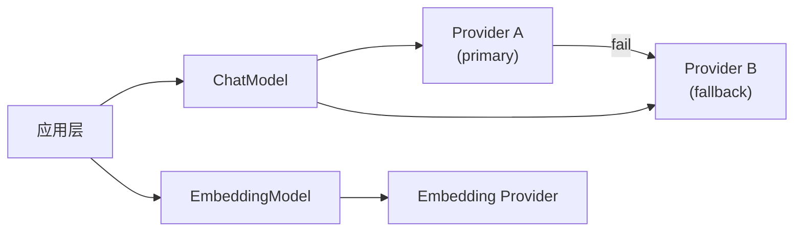

# AGENTS.md 全量重组 实现计划

> **面向 AI 代理的工作者：** 必需子技能：使用 `subagent-driven-development` 逐任务实现此计划。步骤使用复选框（`- [ ]`）语法来跟踪进度。

**目标：** 重组 14 个 AGENTS.md 文档，消除冗余（app/AGENTS.md、schemas/AGENTS.md 合并）、统一模块文档模板、异常描述去重。

**范围：** 纯文档修改，不涉及代码实现变更。mermaid 图内容不变（仅调整位置）。

**技术栈：** Markdown，mermaid。

**设计文档：** `docs/superpowers/specs/2026-05-16-agents-md-restructure-design.md`

---

### 任务 1：合并 app/AGENTS.md → root

**文件：**
- 修改：`AGENTS.md`
- 删除：`app/AGENTS.md`

- [ ] **步骤 1：读两文件确认当前内容**

```bash
Read AGENTS.md 行 113-141（结构节）
Read app/AGENTS.md 全文件
```

- [ ] **步骤 2：将 app/AGENTS.md 的模块职责表合并入 root 的"结构"节**

root 当前"结构"节（行 113-141）含 mermaid。将 app/AGENTS.md 的模块职责表（`| 子目录 | 职责 | 详文 |`）追加在该 mermaid 下方。mermaid 中的目录名称节点（如 `A5["api/ → AGENTS.md"]`）保留不动——职责表提供了 mermaid 无法表达的详细职责说明，两者互补不冗余。

注意：app/AGENTS.md 的 `config.py` / `exceptions.py` / `utils.py` 描述也移入 root 结构节下方。

编辑后结构节变为：
```
## 结构

[mermaid 保持不动]

| 子目录 | 职责 | 详文 |
|--------|------|------|
| ... | ... | ... |

`config.py` — 应用级配置（数据目录路径等）
`exceptions.py` — 全局异常基类 `AppError` 定义（`code + message`）
`utils.py` — 共享工具函数，含 `haversine()`（两点间球面距离，米）
```

- [ ] **步骤 3：删除 app/AGENTS.md**

```bash
git rm /home/miyakomeow/Codes/DrivePal/.worktrees/align-agents-md/app/AGENTS.md
```

- [ ] **步骤 4：验证**

Read root AGENTS.md 确认结构节完整，mermaid 路径未断链。

- [ ] **步骤 5：Commit**

```bash
git add AGENTS.md app/AGENTS.md
git commit -m "docs: merge app/AGENTS.md into root structure section"
```

---

### 任务 2：合并 schemas/AGENTS.md → api

**文件：**
- 修改：`app/api/AGENTS.md`
- 删除：`app/schemas/AGENTS.md`

- [ ] **步骤 1：读两文件确认内容**

Read app/schemas/AGENTS.md 全文件
Read app/api/AGENTS.md 全文件

- [ ] **步骤 2：在 api/AGENTS.md 新增"数据模型"节**

在 api/AGENTS.md 末尾（或"v1 端点"节后）新增"## 数据模型"节，内容来自 schemas/AGENTS.md：

```
## 数据模型

### 驾驶上下文 (`context.py`)

- **DriverState**: emotion(neutral/anxious/fatigued/calm/angry), workload(low/normal/high/overloaded), fatigue_level(0~1)
- **GeoLocation**: latitude(ge=-90,le=90), longitude(ge=-180,le=180), address, speed_kmh(ge=0)
- **SpatioTemporalContext**: current_location, destination, eta_minutes(ge=0), heading(0~360)
- **TrafficCondition**: congestion_level(smooth/slow/congested/blocked), incidents(list[str]), estimated_delay_minutes(ge=0)
- **DrivingContext**: driver + spatial + traffic + scenario(parked/city_driving/highway/traffic_jam) + passengers
- **ScenarioPreset**: id(uuid hex[:12]), name, context, created_at

### 查询Schema (`query.py`)

- **ProcessQueryRequest**: query, context(DrivingContext|None), session_id
- **ProcessQueryResult**: status(delivered/pending/suppressed), event_id, session_id, result, pending_reminder_id, trigger_text, reason, cancelled
```

- [ ] **步骤 3：删除 app/schemas/AGENTS.md**

```bash
git rm /home/miyakomeow/Codes/DrivePal/.worktrees/align-agents-md/app/schemas/AGENTS.md
```

- [ ] **步骤 4：检查全局 cross-ref**

搜索 repo 中所有文件对 `app/schemas/AGENTS.md` 或 `schemas/AGENTS.md` 的引用。检查 root AGENTS.md、archive/AGENTS.md、tests/AGENTS.md、experiments/AGENTS.md 等，全部改为 `app/api/AGENTS.md`。

root 的"结构"节 mermaid 中 `A8["schemas/ → AGENTS.md"]` 改为 `A5["api/ → AGENTS.md"]`（或删除该节点——api 已在 mermaid 中）。

- [ ] **步骤 5：Commit**

```bash
git add app/api/AGENTS.md app/schemas/AGENTS.md
git commit -m "docs: merge schemas/AGENTS.md into api"
```

---

### 任务 3：重组 agents/AGENTS.md（模板化 + 异常去重）

**文件：**
- 修改：`app/agents/AGENTS.md`

- [ ] **步骤 1：读当前文件**

Read app/agents/AGENTS.md 全文件

- [ ] **步骤 2：按模板重排章节**

当前章节顺序：工作流 → SSE事件 → 快捷指令 → 多轮对话 → 输出路由 → 待触发提醒 → 隐私脱敏 → 状态 → 提示词 → 输出鲁棒性 → 规则引擎 → 概率推断 → 异常 → 状态输出

目标顺序：
1. # Agent 系统（header 保持）
2. ## 架构（现有"工作流"节，含 mermaid）
3. ## 组件（从"工作流"节提取 Agent 表）
4. ## 关键类/接口（提取 AgentWorkflow / WorkflowStages / AgentState / ShortcutResolver / ConversationManager / PendingReminderManager / OutputRouter 的公开接口签名。当前分布在"工作流"、"快捷指令"、"输出路由"节中，合并至此新节——不要漏方法签名或类名）
5. ## 快捷指令（保持）
6. ## 多轮对话（保持）
7. ## 输出路由（保持）
8. ## 待触发提醒（保持）
9. ## 规则引擎（保持）
10. ## 概率推断（保持）
11. ## 提示词（保持）
12. ## 自有异常（精简，删 AppError 全局描述，仅保留 WorkflowError + catch 模式具体内容）
13. ## 阈值（保持现有"输出鲁棒性"别名表作为"输出鲁棒性"子节，频次约束合并入此节）
14. ## 配置（从现有"规则引擎"节中提取 TOML 加载描述，新建"配置"节说明 config/rules.toml / config/shortcuts.toml 结构）
15. ## 测试<br>（保持现有测试引用行，如缺失则补充 `tests/agents/` 目录路径）

**异常去重：** 用户 agents 异常中删 `AppError(catch)` 整行。只留 WorkflowError 表例的 `WorkflowError` → `AppError` 一行和下面的 catch 模式具体代码。

- [ ] **步骤 3：验证内容完整**

逐节对比原内容，确认未遗漏任何技术信息。

- [ ] **步骤 4：Commit**

```bash
git add app/agents/AGENTS.md
git commit -m "docs: reorganize agents/AGENTS.md with standard template"
```

---

### 任务 4：重组 memory/AGENTS.md（模板化 + 异常去重）

**文件：**
- 修改：`app/memory/AGENTS.md`

- [ ] **步骤 1：读当前文件**

Read app/memory/AGENTS.md 全文

- [ ] **步骤 2：按模板重排章节 + 异常去重**

当前章节：MemoryBank → 文件mermaid → 架构 → 数据模型 → FAISS索引 → 索引损坏恢复 → 检索管道 → 遗忘曲线 → 摘要人格 → 异常 → 阈值 → 基础设施 → MemoryModule → 单例 → 多用户隔离 → 可观测性 → EmbeddingClient → 工具函数 → MemoryStore接口 → 隐私保护

目标顺序：
1. # 记忆系统（header 保持）
2. ## 架构（合并"文件mermaid"+"架构"+"基础设施"为一个整体架构图）
3. ## 组件（"文件"表作为组件表）
4. ## 关键类/接口（MemoryModule 接口、MemoryStore 协议、MemoryBankMetrics、FaissIndex、EmbeddingClient）
5. ## 数据模型（schemas 部分）
6. ## 检索管道（保持）
7. ## 遗忘曲线（保持）
8. ## 摘要与人格（保持）
9. ## 隐私脱敏（保持）
10. ## 配置（从现有"阈值"节中提取 TOML 环境变量名，补充说明 config 由 pydantic-settings 管理）
11. ## 自有异常（删 Transient/Fatal 继承树 mermaid + AppError→MemoryBankError→Transient/Fatal 行。保留 MemoryBankError + SummarizationEmpty + InvalidActionError + catch 模式）
12. ## 阈值（保持）
13. ## 测试（若提及）

- [ ] **步骤 3：验证内容完整**

- [ ] **步骤 4：Commit**

```bash
git add app/memory/AGENTS.md
git commit -m "docs: reorganize memory/AGENTS.md with standard template"
```

---

### 任务 5：重组 scheduler/AGENTS.md（模板化 + 异常去重）

**文件：**
- 修改：`app/scheduler/AGENTS.md`

- [ ] **步骤 1：读当前文件**

- [ ] **步骤 2：按模板重排 + 异常去重**

当前顺序：架构 → 组件 → ProactiveScheduler → 生命周期 → 构造参数 → _tick 顺序 → 5 种触发源 → 输入接口 → ContextMonitor → MemoryScanner → TriggerEvaluator → 配置 → 异常 → 测试

目标顺序基本一致。唯一需调整：
- **异常去重：** 删"不跨层原则"段落开头句（"Scheduler 为 **不跨层原则** 典型"），改为直接描述 tick 内异常处理行为。保留各 try/except 具体描述。

- [ ] **步骤 3：验证**

- [ ] **步骤 4：Commit**

---

### 任务 6：重组 tools/AGENTS.md（模板化 + 异常去重）

**文件：**
- 修改：`app/tools/AGENTS.md`

- [ ] **步骤 1：读当前文件**

- [ ] **步骤 2：按模板重排 + 异常去重**

当前顺序：架构 mermaid → 组件 → ToolSpec → ToolRegistry → 内置工具 → query_memory → 工具执行 → 配置 → 异常 → 安全约束 → 测试

基本符合模板。调整：
- "ToolSpec"、"ToolRegistry"、"内置工具"合并入"关键类/接口"节
- **异常去重：** 删 catch 模式中 "WorkflowError/AppError 透传" 的解释文字。保留 ToolExecutionError 表 + 具体 catch 代码。

- [ ] **步骤 3：验证**

- [ ] **步骤 4：Commit**

---

### 任务 7：重组 voice/AGENTS.md（模板化）

**文件：**
- 修改：`app/voice/AGENTS.md`

- [ ] **步骤 1：读当前文件**

- [ ] **步骤 2：按模板重排**

当前顺序：架构 → 组件 → VoicePipeline → VADEngine → SherpaOnnxASREngine → onnxruntime → 配置 → 模型下载 → 静默降级 → 测试

基本符合模板。微调：
- "onnxruntime 符号链接"合并入"SherpaOnnxASREngine"小节（作为其子节）
- "模型下载"移入"配置"节作为子节
- "静默降级"保持独立（跨模块关注点）

Voice 无常提及阈值异常需修改。

- [ ] **步骤 3：验证**

- [ ] **步骤 4：Commit**

---

### 任务 8：重组 api/AGENTS.md（模板化 + 异常去重 + schemas 内容整合）

**文件：**
- 修改：`app/api/AGENTS.md`（任务 2 已合并 schemas）

- [ ] **步骤 1：读当前文件**

- [ ] **步骤 2：按模板重排 + 异常去重**

当前顺序：v1 端点 → WebSocket → 异常处理（桥梁 + Code→HTTP + safe_call + 响应信封）→ 中间件 → 服务入口 → 反馈学习

目标顺序：
1. # API 层（header 保持）
2. ## 架构（新增短 mermaid 或文字描述）
3. ## 组件（文件表）
4. ## v1 端点（保持，含 WebSocket）
5. ## 数据模型（任务 2 已合并的 schemas 内容）
6. ## 异常处理（删 AppError 全局范式段落，只保留 safe_call 映射 + HTTP Code 映射 + 响应信封）
7. ## 中间件（保持）
8. ## 服务入口（保持）
9. ## 反馈学习（保持）

**异常去重：** 删"多重继承桥接"节中 AppError 全局描述（"BaseAppError（app.exceptions.AppError）+ HTTPException（FastAPI）。双重视角——业务流程见 AppError，HTTP 管道见 HTTPException。"）。仅保留具体映射表。

- [ ] **步骤 3：验证**

- [ ] **步骤 4：Commit**

---

### 任务 9：重组 models/AGENTS.md（模板化 + 补架构图）

**文件：**
- 修改：`app/models/AGENTS.md`

- [ ] **步骤 1：读当前文件**

- [ ] **步骤 2：按模板重排 + 补架构 mermaid**

当前顺序：LLM 特性 → 模块 → 缓存生命周期 → 异常 → 阈值

目标顺序：
1. # 模型封装（header 保持）
2. ## 架构（新增 mermaid，描述 provider fallback 流程）
3. ## 组件（现有"模块"表）
4. ## 关键类/接口（ChatModel / EmbeddingModel 接口签名）
5. ## 缓存生命周期（保持）
6. ## 自有异常（删 AppError 全局说明，只保留异常表 + 独立异常表）
7. ## 阈值（保持）

新增架构 mermaid：


- [ ] **步骤 3：验证**

- [ ] **步骤 4：Commit**

---

### 任务 10：重组 storage/AGENTS.md（模板化 + 补架构图）

**文件：**
- 修改：`app/storage/AGENTS.md`

- [ ] **步骤 1：读当前文件**

- [ ] **步骤 2：按模板重排 + 补架构 mermaid**

当前顺序：数据目录 mermaid → 迁移 → TOMLStore → JSONLinesStore → init_data → experiment_store → feedback_log

目标顺序：
1. # 数据存储（header 保持）
2. ## 架构（数据目录 mermaid 保持）
3. ## 组件（新增文件/职责表）
4. ## TOMLStore（保持）
5. ## JSONLinesStore（保持）
6. ## init_data（保持，改名为"存储初始化"）
7. ## experiment_store（保持）
8. ## feedback_log（保持）
9. ## 自有异常（AppendError / UpdateError）

新增组件表：
```
| 文件 | 类/函数 | 职责 |
|------|---------|------|
| toml_store.py | TOMLStore | 异步锁+文件级TOML读写 |
| jsonl_store.py | JSONLinesStore | JSONL追加写入 |
| init_data.py | init_storage / init_user_dir | 数据目录初始化 + 迁移 |
| experiment_store.py | read_benchmark | 只读实验对比数据 |
| feedback_log.py | append_feedback / aggregate_weights | 策略权重反馈记录 |
```

- [ ] **步骤 3：验证**

- [ ] **步骤 4：Commit**

---

### 任务 11：root AGENTS.md 异常节验证

**文件：**
- 修改：`AGENTS.md`

- [ ] **步骤 1：读 root AGENTS.md 的"异常处理范式"节**

检查去重后剩下的内容是否自洽。

- [ ] **步骤 2：确认 root 是全局异常范式的唯一来源**

确保所有模块级异常描述中不再出现 AppError 基类/Transient/Fatal 二分/API 桥接/哨兵/不跨层 的重复描述。

若发现某模块仍有残留的全局范式描述，在该步骤内直接编辑该模块 AGENTS.md 删除残留内容，不另开任务。

- [ ] **步骤 2b：验证各模块 mermaid 引用路径未断链**

检查每个模块 AGENTS.md 的 mermaid 图中是否引用了已删除的文件路径。特别检查 root mermaid 的 `A8["schemas/ → AGENTS.md"]` 是否已更新或移除。

- [ ] **步骤 2c：验证所有 cross-ref 文本引用**

搜索 repo 中对已删除文件（app/AGENTS.md、app/schemas/AGENTS.md）的文本引用。包括但不限于：
- `→ app/AGENTS.md`
- `→ schemas/AGENTS.md` 或 `→ app/schemas/AGENTS.md`
- `详文见 app/AGENTS.md`

全部更新为指向合并后的目标文件。

- [ ] **步骤 3：更新 root 中已删除文件的 cross-ref**

删除 `app/AGENTS.md` 和 `app/schemas/AGENTS.md` 后，root 中指向这两个文件的引用需更新：
- root 的"结构"节 mermaid 中 `schemas/ → AGENTS.md` → `api/ → AGENTS.md`
- root 的"各模块异常 → 对应 AGENTS.md" 提示更新

- [ ] **步骤 4：Commit**

```bash
git add AGENTS.md
git commit -m "docs: finalize root exception section and cross-refs"
```

---

### 任务 12：最终校验

**文件：** 无修改

- [ ] **步骤 1：确认删除文件**

```bash
ls app/AGENTS.md app/schemas/AGENTS.md 2>&1
# 预期：ls: cannot access ...: No such file or directory
```

- [ ] **步骤 2：运行 ruff 检查**

```bash
uv run ruff check --fix && uv run ruff format --check
```

- [ ] **步骤 3：运行类型检查**

```bash
uv run ty check
```

- [ ] **步骤 4：运行测试**

```bash
uv run pytest --tb=short -q
```

预期：全部通过

- [ ] **步骤 5：确认全部通过**

所有命令输出报"PASSED"/"All checks passed"。无需再次 commit——各任务已各自提交。
