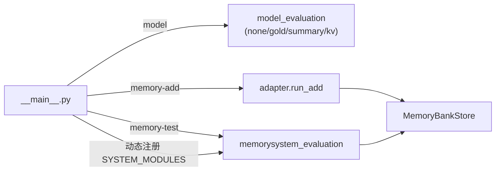

# VehicleMemBench 集成

`experiments/vehicle_mem_bench/` — DrivePal × VehicleMemBench 评估适配器。

## 测试组

| 组 | 子命令 | 说明 | 评估框架 |
|----|--------|------|----------|
| **none** | `model --memory-type none` | 无记忆，LLM 裸答查询 | VehicleMemBench model_evaluation |
| **gold** | `model --memory-type gold` | 注入 gold_memory 作为上界 | VehicleMemBench model_evaluation |
| **summary** | `model --memory-type summary` | LLM 逐日递归摘要，最终摘要注入 prompt | VehicleMemBench model_evaluation |
| **key_value** | `model --memory-type key_value` | LLM 维护 KV 存储，查询时搜索 | VehicleMemBench model_evaluation |
| **drivepal** | `memory-add` + `memory-test` | DrivePal MemoryBank（FAISS + Ebbinghaus） | VehicleMemBench memorysystem_evaluation |

## 架构



- `model` 子命令直接调用 VehicleMemBench 的 `model_evaluation()`，不涉及 DrivePal 记忆模块
- `memory-add` 将历史对话写入 DrivePal MemoryBankStore（FAISS 索引）
- `memory-test` 将适配器注入 VehicleMemBench 注册表，委托给 `memorysystem_evaluation()` 做带外部队列搜索的评测

## 模型配置

`--api-base` / `--api-key` / `--model` 可选，不传时从 DrivePal `config/llm.toml` 读取。
`--model-group` 切换模型组（默认 `"default"`），对应 `[model_groups]` 下的键名。

| config/llm.toml | CLI 默认值 |
|-----------------|-----------|
| `model_groups.default.models[0]` → provider | `--model-group default` |
| `providers[0].base_url` | `--api-base` |
| `providers[0].api_key` | `--api-key` |
| `providers[0].model` | `--model` |

示例：定义独立 benchmark 模型组

```toml
# config/llm.toml
[model_groups]
vmb = { models = ["openrouter/anthropic/claude-sonnet-4?temperature=0.0"] }
```

```bash
python -m experiments.vehicle_mem_bench model --memory-type summary --model-group vmb
```

## 适配器接口

`adapter.py` 实现 VehicleMemBench 的记忆系统合约（8 函数）：

| 函数 | 职责 |
|------|------|
| `validate_add_args` | 校验 history_dir 存在 |
| `validate_test_args` | 校验 benchmark_dir 存在 |
| `run_add` | history → MemoryBankStore |
| `build_test_client` | 每文件创建 DrivePalMemClient |
| `init_test_state` | 创建数据目录 |
| `close_test_state` | 关闭所有客户端 |
| `is_test_sequential` | False（per-file 隔离） |
| `format_search_results` | SearchResult → (text, count) |

### DrivePalMemClient

- 每实例持独立 asyncio 事件循环（`new_event_loop()`）
- 内部 EmbeddingModel 按需创建，不共享 AsyncOpenAI client
- 线程安全，通过 `loop.run_until_complete()` 桥接

### 数据隔离

- 每 benchmark file → `drivepal_{n}` → `data/vehicle_mem_bench/drivepal_{n}/`
- 可 `VMB_DATA_DIR` 环境变量覆盖

## 结果目录结构

命名与原项目一致：`{prefix}_{model}_{timestamp}/` 和 `{prefix}_{system}_{model}_{timestamp}/`。

```text
data/vehicle_mem_bench/
├── drivepal_model_eval_none_deepseek-v4-flash_20260101_120000/
│   ├── metric.json       # 聚合指标（exact_match_rate, F1, 等）
│   ├── report.txt        # 可读报告
│   ├── results.json      # 逐条结果
│   └── config.json
├── drivepal_model_eval_gold_{model}_{timestamp}/
├── drivepal_model_eval_summary_{model}_{timestamp}/
├── drivepal_model_eval_key_value_{model}_{timestamp}/
└── drivepal_memory_eval_drivepal_{model}_{timestamp}/
    ├── metric.json
    ├── report.txt
    ├── all_results.json
    └── config.json
```

## 用法

```bash
# ── 全量运行（5 组，推荐）──
python -m experiments.vehicle_mem_bench run-all

# ── 单组模型评测 ──
python -m experiments.vehicle_mem_bench model --memory-type none
python -m experiments.vehicle_mem_bench model --memory-type gold
python -m experiments.vehicle_mem_bench model --memory-type summary
python -m experiments.vehicle_mem_bench model --memory-type key_value

# ── DrivePal MemoryBank 评测（两阶段）──
python -m experiments.vehicle_mem_bench memory-add \
    --history-dir ../VehicleMemBench/benchmark/history
python -m experiments.vehicle_mem_bench memory-test \
    --benchmark-dir ../VehicleMemBench/benchmark/qa_data

# ── 自定 VehicleMemBench 路径 ──
python -m experiments.vehicle_mem_bench run-all --vmb-root /path/to/vmb
export VMB_ROOT=/path/to/vmb && python -m experiments.vehicle_mem_bench run-all
```

## VehicleMemBench 代码来源

默认查找同级目录 `../VehicleMemBench`。可通过以下方式覆写：

| 方式 | 示例 |
|------|------|
| CLI `--vmb-root` | `--vmb-root /path/to/VehicleMemBench` |
| env `VMB_ROOT` | `export VMB_ROOT=/path/to/VehicleMemBench` |

```bash
python -m experiments.vehicle_mem_bench model --memory-type none --vmb-root /custom/path
```

实现：`adapter.py` 的 `_get_vmb_root()` 优先检查 `_VMB_ROOT_OVERRIDE`（由 `set_vmb_root()` 设置），再回退默认同级目录。

## 依赖

- `app.memory.memory_bank.store.MemoryBankStore` — DrivePal 记忆存储
- `VehicleMemBench/evaluation/` — 跨项目评测框架（运行时加入 sys.path）

## 文件

| 文件 | 职责 |
|------|------|
| `__init__.py` | 包文档 |
| `__main__.py` | CLI 入口（model / memory-add / memory-test） |
| `adapter.py` | DrivePalBank 适配器实现 |
| `AGENTS.md` | 本文档 |
