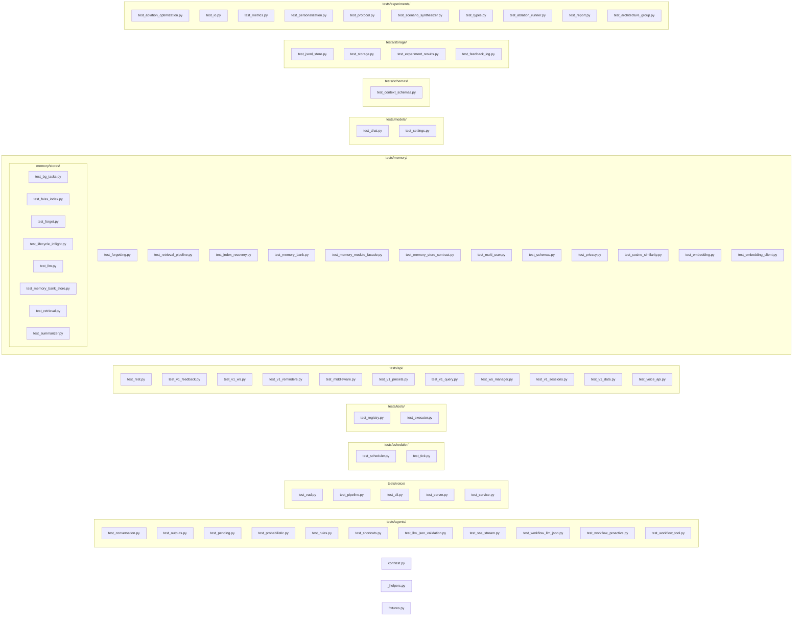

# 测试

按 `app/` 模块结构镜像。

## 运行

```
uv run pytest tests/ -v
uv run pytest tests/ -v --test-llm        # 真实LLM
uv run pytest tests/ -v --test-embedding  # 真实embedding
uv run pytest tests/ -v --run-integration  # 完整服务
```

pytest.ini：testpaths=tests, asyncio_mode=auto, asyncio_default_fixture_loop_scope=function, timeout=30, addopts=-n auto, filterwarnings ignore:builtin type Swig:DeprecationWarning + ignore::DeprecationWarning:webrtcvad。

conftest.py 注册 integration/llm/embedding 三个 marker，未提供对应选项时跳过标记者。

## 目录



## CI

`.github/workflows/python.yml`。push/PR到main触发，四并行job：

| Job | 命令 |
|-----|------|
| lint | `uv run ruff check .` |
| format | `uv run ruff format --check .` |
| typecheck | `uv run ty check .` |
| test | `uv run pytest -v` |

额外 `no-suppressions.yml`：3 个独立 job（noqa / type-ignore / ty-ignore），各自扫描一种注释类型。
